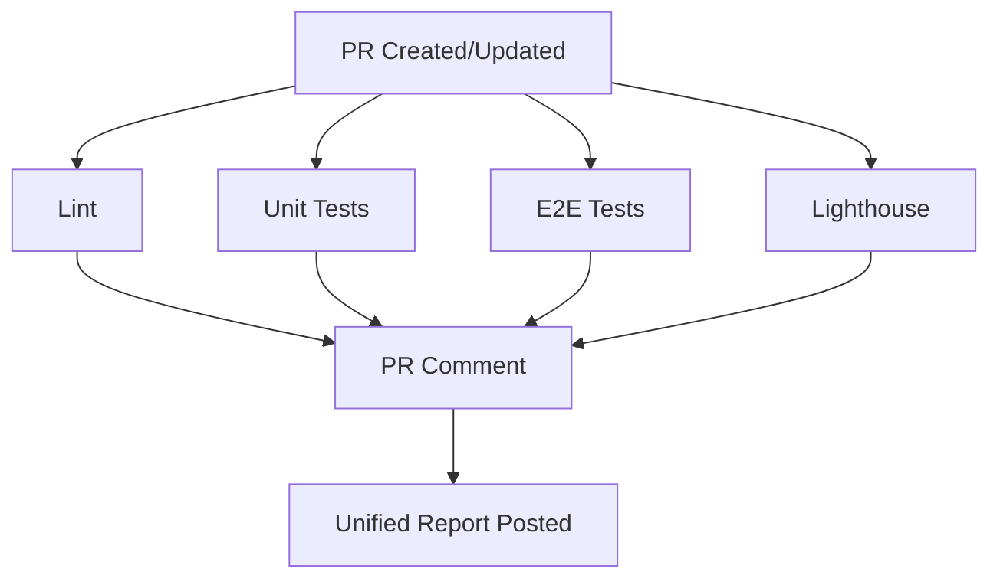

# CI/CD Workflows

This directory contains GitHub Actions workflows for automated quality checks on pull requests.

## Workflows Overview

### 1. Lint (`lint.yml`)

**Purpose**: Enforce code quality standards using ESLint

**Triggers**: Pull request events (opened, synchronize, reopened), manual dispatch

**Timeout**: 10 minutes

**Key Features**:

- Runs ESLint with JSON and stylish reporters
- Fails on errors, allows warnings
- Uploads lint results as artifacts
- Tracks workflow duration

**Artifacts**:

- `lint-results-{run_number}`: JSON and text lint results
- `duration-lint-{run_number}`: Duration metrics

---

### 2. Unit Tests (`unit-tests.yml`)

**Purpose**: Execute Vitest unit tests with coverage reporting

**Triggers**: Pull request events (opened, synchronize, reopened), manual dispatch

**Timeout**: 15 minutes

**Key Features**:

- Runs Vitest with coverage collection
- Checks 70% coverage threshold (warning only)
- Fails on test failures
- Uploads coverage and test results
- Tracks workflow duration

**Artifacts**:

- `coverage-reports-{run_number}`: Coverage reports (HTML, JSON, text)
- `unit-test-results-{run_number}`: Test execution results
- `duration-unit-tests-{run_number}`: Duration metrics

---

### 3. E2E Tests (`e2e-tests.yml`)

**Purpose**: Execute Playwright end-to-end tests with coverage

**Triggers**: Pull request events, push to main, manual dispatch

**Timeout**: 30 minutes

**Key Features**:

- Conditional execution (skips if only documentation changed)
- Builds and starts Next.js application
- Runs Playwright tests with mock mode
- Captures screenshots/videos on failure
- Generates coverage reports
- Posts results as PR comment
- Tracks workflow duration

**Conditional Execution**:

- Skips when only `.md` files, `docs/`, or `README` files change

**Artifacts**:

- `test-artifacts-{run_number}`: Screenshots and failure artifacts
- `test-results-{run_number}`: Test reports (JSON, JUnit, HTML)
- `coverage-reports-{run_number}`: E2E coverage data
- `duration-e2e-tests-{run_number}`: Duration metrics

---

### 4. Lighthouse (`lighthouse.yml`)

**Purpose**: Audit accessibility, best practices, and SEO

**Triggers**: Pull request events (opened, synchronize, reopened), manual dispatch

**Timeout**: 20 minutes

**Key Features**:

- Conditional execution (skips if only test files changed)
- Audits key pages: home, analyzer, dashboard, login
- Runs 3 audits per page for averaging
- Fails if accessibility score < 90
- Uploads HTML reports and aggregated results
- Tracks workflow duration

**Conditional Execution**:

- Skips when only `.test.*`, `.spec.*` files, or `tests/` directory changes

**Pages Audited**:

- `/` (Home page)
- `/analyzer` (Analyzer page)
- `/dashboard` (Dashboard page)
- `/login` (Login page)

**Artifacts**:

- `lighthouse-reports-{run_number}`: HTML reports and JSON results
- `duration-lighthouse-{run_number}`: Duration metrics

---

### 5. PR Comment Report (`pr-comment.yml`)

**Purpose**: Generate unified status report for all CI checks

**Triggers**: Completion of Lint, Unit Tests, E2E Tests, or Lighthouse workflows

**Key Features**:

- Downloads artifacts from all workflows
- Parses results from each check type
- Generates unified markdown report
- Updates existing PR comment (no duplicates)
- Includes actionable recommendations
- Displays workflow duration metrics

**Report Sections**:

1. Summary (total checks passed/failed)
2. Code Quality (ESLint)
3. Unit Tests (with coverage)
4. E2E Tests
5. Accessibility (Lighthouse)
6. Workflow Performance (duration metrics)
7. Recommendations

---

## Parallel Execution Strategy

All check workflows (Lint, Unit Tests, E2E Tests, Lighthouse) run **in parallel** when triggered by pull request events. This minimizes total CI time.

**Expected Timing** (parallel execution):

- Lint: 1-2 minutes
- Unit Tests: 3-5 minutes
- E2E Tests: 8-12 minutes
- Lighthouse: 5-7 minutes
- **Total (parallel)**: 8-12 minutes

The PR Comment workflow runs after any workflow completes and aggregates results from all completed workflows.

---

## Performance Optimizations

### Caching

All workflows implement caching to reduce execution time:

1. **NPM Dependencies**: Cached via `setup-node` action with `cache: 'npm'`
2. **Playwright Browsers**: Cached in E2E workflow (`~/.cache/ms-playwright`)
3. **Next.js Build**: Cached in E2E and Lighthouse workflows (`.next/cache`)

### Conditional Execution

Workflows skip unnecessary steps based on changed files:

- **Lighthouse**: Skips when only test files changed
- **E2E Tests**: Skips when only documentation files changed

This reduces CI time for documentation-only or test-only changes.

### Duration Monitoring

All workflows track execution time and:

- Log duration in workflow summary
- Warn if duration exceeds 15 minutes
- Upload duration metrics for PR comment
- Display performance metrics in unified report

---

## Workflow Dependencies



---

## Artifacts Retention

All artifacts are retained for **30 days** except:

- Test failure artifacts (E2E): **7 days**

---

## Environment Variables

### Build Environment

- `FF_USE_MOCK_API`: Enable mock mode for testing
- `NEXT_PUBLIC_FF_USE_MOCK_API`: Client-side mock mode flag
- `FF_MOCK_SCENARIO`: Mock scenario (success/error)
- `FF_SIMULATE_LATENCY`: Simulate API latency
- `NODE_ENV`: Node environment (test/production)

### Supabase (Mock Values for CI)

- `NEXT_PUBLIC_SUPABASE_URL`: http://localhost:54321
- `NEXT_PUBLIC_SUPABASE_ANON_KEY`: dummy-key-for-build

---

## Troubleshooting

### Workflow Fails to Start

- Check if workflow file syntax is valid (YAML)
- Verify trigger conditions match event type
- Check repository permissions

### Caching Issues

- Clear cache by updating `package-lock.json`
- Check cache key patterns in workflow files
- Verify cache paths exist

### Conditional Execution Not Working

- Verify `fetch-depth: 0` in checkout step
- Check file pattern matching in changed files detection
- Review git diff command output in workflow logs

### Duration Warnings

- Review workflow logs for slow steps
- Check for network issues or timeouts
- Consider optimizing test suite or build process

### PR Comment Not Posting

- Verify PR Comment workflow has correct permissions
- Check that source workflows completed successfully
- Ensure artifacts were uploaded correctly
- Review PR Comment workflow logs for errors

---

## Local Testing

### Run Checks Locally Before Pushing

```bash
# Lint
npm run lint

# Unit tests with coverage
npm run test:coverage

# E2E tests (requires built app)
npm run build
npm start &
npm run test:e2e

# Lighthouse (requires built app)
npm run build
npm start &
npx lhci autorun
```

### Test Workflow Files Locally

Use [act](https://github.com/nektos/act) to run GitHub Actions locally:

```bash
# Install act
brew install act  # macOS
# or download from https://github.com/nektos/act/releases

# Run specific workflow
act pull_request -W .github/workflows/lint.yml

# Run all workflows
act pull_request
```

---

## Maintenance

### Updating Workflows

1. Make changes to workflow files
2. Test locally with `act` if possible
3. Create PR to test in CI environment
4. Monitor workflow runs for issues
5. Update this README if behavior changes

### Updating Dependencies

- Update action versions in workflow files
- Test thoroughly before merging
- Update documentation if new features are used

### Adjusting Thresholds

- Coverage threshold: Update in `unit-tests.yml`
- Accessibility threshold: Update in `.lighthouserc.json`
- Duration threshold: Update in duration monitoring steps (currently 900s = 15min)

---

## Related Documentation

- [Playwright Configuration](../../playwright.config.ts)
- [Vitest Configuration](../../vitest.config.ts)
- [Lighthouse Configuration](../../.lighthouserc.json)
- [ESLint Configuration](../../.eslintrc.json)

---

Last updated: November 15, 2025
