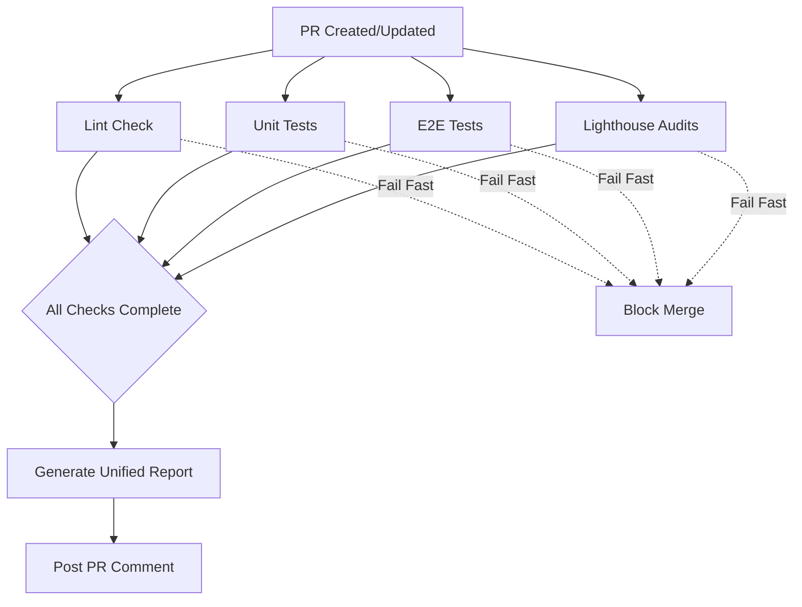

# CI/CD Enhancement Design Document

## Overview

This design document outlines the architecture and implementation approach for enhancing the existing GitHub Actions CI/CD pipeline. The current pipeline only runs Playwright E2E tests. This enhancement will add comprehensive automated quality checks including unit tests, Lighthouse accessibility audits, and ESLint code quality checks, creating a complete quality gate for pull requests.

The design prioritizes parallel execution for performance, unified reporting for developer experience, and fail-fast strategies to minimize CI time on problematic PRs.

## Architecture

### Workflow Structure

The enhanced CI/CD pipeline will consist of multiple GitHub Actions workflows organized for optimal performance and maintainability:

```
.github/workflows/
├── ci.yml                    # Main orchestrator workflow
├── unit-tests.yml           # Vitest unit tests with coverage
├── e2e-tests.yml            # Playwright E2E tests (existing, to be fixed)
├── lighthouse.yml           # Accessibility audits
├── lint.yml                 # ESLint code quality checks
└── pr-comment.yml           # Unified PR status reporting
```

**Design Decision**: Separate workflows for each check type allows for:

- Independent execution and debugging
- Reusability across different trigger events
- Easier maintenance and updates
- Parallel execution by default

### Execution Flow



**Design Decision**: Lint runs independently but fails fast. Other checks run in parallel to minimize total CI time. All checks must complete before the unified report is generated.

## Components and Interfaces

### 1. Lint Workflow (`lint.yml`)

**Purpose**: Enforce code quality standards using ESLint before running expensive tests.

**Trigger**: Pull request events (opened, synchronize, reopened)

**Key Steps**:

1. Checkout code
2. Setup Node.js with dependency caching
3. Install dependencies
4. Run ESLint with JSON reporter
5. Parse results and fail on errors
6. Upload lint results as artifact

**Outputs**:

- `lint-results.json`: Detailed ESLint output
- `lint-summary.txt`: Human-readable summary
- Exit code: 0 (pass) or 1 (fail)

**Configuration**:

```yaml
- name: Run ESLint
  run: |
    npm run lint -- --format json --output-file lint-results.json || true
    npm run lint -- --format stylish > lint-summary.txt
```

**Design Decision**: Run ESLint twice - once for JSON output (machine-readable) and once for stylish output (human-readable). The `|| true` prevents early exit so we can capture results before failing the job.

### 2. Unit Tests Workflow (`unit-tests.yml`)

**Purpose**: Execute Vitest unit tests with coverage reporting.

**Trigger**: Pull request events (opened, synchronize, reopened)

**Key Steps**:

1. Checkout code
2. Setup Node.js with dependency caching
3. Install dependencies
4. Run Vitest with coverage
5. Generate coverage reports (JSON, HTML, text)
6. Upload coverage artifacts
7. Parse coverage percentage
8. Fail if coverage < 70% (with warning, not blocking)

**Outputs**:

- `coverage/`: Coverage reports directory
- `coverage-summary.json`: Coverage metrics
- `test-results.json`: Test execution results
- Exit code: 0 (pass) or 1 (fail)

**Configuration**:

```yaml
- name: Run Unit Tests
  run: npm run test:coverage -- --reporter=json --outputFile=test-results.json

- name: Check Coverage Threshold
  run: |
    COVERAGE=$(jq '.total.lines.pct' coverage/coverage-summary.json)
    if (( $(echo "$COVERAGE < 70" | bc -l) )); then
      echo "::warning::Coverage is below 70% ($COVERAGE%)"
    fi
```

**Design Decision**: Coverage threshold is enforced as a warning rather than a hard failure to allow flexibility during rapid development. Teams can adjust this threshold in the workflow file.

### 3. E2E Tests Workflow (`e2e-tests.yml`)

**Purpose**: Execute Playwright end-to-end tests with proper error handling and reporting.

**Trigger**: Pull request events (opened, synchronize, reopened)

**Key Steps**:

1. Checkout code
2. Setup Node.js with dependency caching
3. Install dependencies
4. Install Playwright browsers
5. Build Next.js application
6. Start test server in background
7. Wait for server readiness
8. Run Playwright tests
9. Capture screenshots/videos on failure
10. Upload test artifacts (reports, traces, screenshots)

**Outputs**:

- `playwright-report/`: HTML test report
- `test-results/`: Test execution artifacts
- `screenshots/`: Failure screenshots
- `videos/`: Test execution videos
- Exit code: 0 (pass) or 1 (fail)

**Configuration**:

```yaml
- name: Start Test Server
  run: npm run build && npm start &
  env:
    PORT: 3000

- name: Wait for Server
  run: npx wait-on http://localhost:3000 --timeout 60000

- name: Run Playwright Tests
  run: npx playwright test
  env:
    CI: true
```

**Design Decision**: Build and start the actual Next.js server rather than using dev mode for more realistic testing. Use `wait-on` to ensure server is ready before running tests.

**Fix Strategy for Existing Tests**:

1. Review current Playwright test failures in CI logs
2. Add proper wait conditions and selectors
3. Implement retry logic for flaky tests
4. Add test isolation and cleanup
5. Configure proper timeouts for CI environment

### 4. Lighthouse Workflow (`lighthouse.yml`)

**Purpose**: Audit accessibility, performance, and best practices using Lighthouse CI.

**Trigger**: Pull request events (opened, synchronize, reopened)

**Key Steps**:

1. Checkout code
2. Setup Node.js with dependency caching
3. Install dependencies
4. Install Lighthouse CI
5. Build Next.js application
6. Start production server
7. Run Lighthouse audits on key pages
8. Generate HTML reports
9. Parse accessibility scores
10. Upload Lighthouse artifacts

**Pages to Audit**:

- `/` (Home page)
- `/analyzer` (Analyzer page)
- `/dashboard` (Dashboard page)
- `/login` (Login page)

**Outputs**:

- `lighthouse-reports/`: HTML reports for each page
- `lighthouse-results.json`: Aggregated scores
- Exit code: 0 (pass) or 1 (fail if accessibility < 90)

**Configuration**:

```yaml
- name: Run Lighthouse CI
  run: |
    lhci autorun --config=.lighthouserc.json
  env:
    LHCI_BUILD_CONTEXT__CURRENT_HASH: ${{ github.sha }}
```

**Lighthouse Configuration** (`.lighthouserc.json`):

```json
{
  "ci": {
    "collect": {
      "url": [
        "http://localhost:3000/",
        "http://localhost:3000/analyzer",
        "http://localhost:3000/dashboard",
        "http://localhost:3000/login"
      ],
      "numberOfRuns": 3,
      "settings": {
        "preset": "desktop",
        "onlyCategories": ["accessibility", "best-practices", "seo"]
      }
    },
    "assert": {
      "assertions": {
        "categories:accessibility": ["error", { "minScore": 0.9 }],
        "categories:best-practices": ["warn", { "minScore": 0.8 }]
      }
    },
    "upload": {
      "target": "temporary-public-storage"
    }
  }
}
```

**Design Decision**: Run Lighthouse 3 times per page and average results to account for variability. Focus on accessibility, best practices, and SEO categories. Performance is informational only since CI environments have variable performance characteristics.

### 5. PR Comment Workflow (`pr-comment.yml`)

**Purpose**: Generate and post a unified status report to the pull request.

**Trigger**: Workflow completion events from other workflows

**Key Steps**:

1. Download all workflow artifacts
2. Parse results from each check
3. Generate unified markdown report
4. Find existing bot comment (if any)
5. Update or create PR comment

**Report Structure**:

```markdown
## 🤖 CI/CD Quality Report

### Summary

✅ All checks passed | ❌ 2 checks failed

---

### 📝 Code Quality (ESLint)

✅ **Passed** - No errors found
⚠️ 3 warnings

[View Details](link-to-artifact)

---

### 🧪 Unit Tests

✅ **Passed** - 145/145 tests
📊 Coverage: 78.5%

[View Coverage Report](link-to-artifact)

---

### 🎭 E2E Tests

❌ **Failed** - 12/15 tests passed

- ❌ `analyzer.spec.ts > should analyze idea`
- ❌ `dashboard.spec.ts > should load analyses`
- ✅ 12 other tests passed

[View Test Report](link-to-artifact)

---

### ♿ Accessibility (Lighthouse)

✅ **Passed** - All pages meet standards

- Home: 95/100
- Analyzer: 92/100
- Dashboard: 94/100
- Login: 91/100

[View Lighthouse Reports](link-to-artifact)

---

### 🔧 Recommendations

1. Fix failing E2E tests before merging
2. Address ESLint warnings for code quality
3. Consider improving test coverage (target: 80%)
```

**Design Decision**: Use emoji indicators for quick visual scanning. Include actionable recommendations based on results. Update existing comment to avoid cluttering the PR with multiple bot comments.

**Implementation**:

```yaml
- name: Find Comment
  uses: peter-evans/find-comment@v2
  id: fc
  with:
    issue-number: ${{ github.event.pull_request.number }}
    comment-author: "github-actions[bot]"
    body-includes: "CI/CD Quality Report"

- name: Create or Update Comment
  uses: peter-evans/create-or-update-comment@v3
  with:
    comment-id: ${{ steps.fc.outputs.comment-id }}
    issue-number: ${{ github.event.pull_request.number }}
    body-path: comment-body.md
    edit-mode: replace
```

## Data Models

### Workflow Artifacts Structure

```typescript
interface LintResults {
  results: Array<{
    filePath: string;
    messages: Array<{
      ruleId: string;
      severity: number; // 1 = warning, 2 = error
      message: string;
      line: number;
      column: number;
    }>;
    errorCount: number;
    warningCount: number;
  }>;
  errorCount: number;
  warningCount: number;
}

interface TestResults {
  numTotalTests: number;
  numPassedTests: number;
  numFailedTests: number;
  testResults: Array<{
    name: string;
    status: "passed" | "failed" | "skipped";
    duration: number;
    failureMessage?: string;
  }>;
}

interface CoverageResults {
  total: {
    lines: { total: number; covered: number; pct: number };
    statements: { total: number; covered: number; pct: number };
    functions: { total: number; covered: number; pct: number };
    branches: { total: number; covered: number; pct: number };
  };
}

interface LighthouseResults {
  pages: Array<{
    url: string;
    scores: {
      accessibility: number; // 0-100
      bestPractices: number;
      seo: number;
    };
    audits: Array<{
      id: string;
      title: string;
      score: number;
      description: string;
    }>;
  }>;
}

interface UnifiedReport {
  summary: {
    totalChecks: number;
    passedChecks: number;
    failedChecks: number;
  };
  lint: LintResults;
  unitTests: TestResults;
  coverage: CoverageResults;
  e2eTests: TestResults;
  lighthouse: LighthouseResults;
  recommendations: string[];
}
```

## Error Handling

### Workflow-Level Error Handling

Each workflow implements consistent error handling:

1. **Graceful Failures**: Capture results even when checks fail
2. **Artifact Upload**: Always upload artifacts, even on failure
3. **Timeout Protection**: Set reasonable timeouts for each step
4. **Retry Logic**: Implement retries for flaky operations

```yaml
- name: Run Tests
  run: npm test
  timeout-minutes: 10
  continue-on-error: false

- name: Upload Results
  if: always()
  uses: actions/upload-artifact@v3
  with:
    name: test-results
    path: test-results/
    retention-days: 30
```

### Common Failure Scenarios

| Scenario                         | Handling Strategy                      |
| -------------------------------- | -------------------------------------- |
| Dependency installation fails    | Fail fast, clear error message         |
| Lint errors found                | Fail workflow, provide detailed report |
| Unit tests fail                  | Fail workflow, upload coverage anyway  |
| E2E tests timeout                | Capture screenshots, fail workflow     |
| Lighthouse score below threshold | Fail workflow, provide detailed audit  |
| Server fails to start            | Retry 3 times, then fail with logs     |
| Artifact upload fails            | Log warning, don't fail workflow       |

### Error Recovery

**Network Issues**:

```yaml
- name: Install Dependencies
  uses: nick-fields/retry@v2
  with:
    timeout_minutes: 5
    max_attempts: 3
    command: npm ci
```

**Flaky Tests**:

```yaml
- name: Run E2E Tests
  run: npx playwright test --retries=2
```

**Server Startup**:

```yaml
- name: Start Server with Retry
  run: |
    for i in {1..3}; do
      npm start &
      sleep 5
      if curl -f http://localhost:3000; then
        break
      fi
      kill %1 || true
    done
```

## Testing Strategy

### Workflow Testing

**Local Testing**:

- Use `act` tool to run GitHub Actions locally
- Test individual workflows before integration
- Validate artifact generation and parsing

**Staging Testing**:

- Create test PRs in a staging branch
- Verify all workflows execute correctly
- Test comment generation and updates
- Validate artifact retention and access

**Production Rollout**:

1. Deploy to a test repository first
2. Run on non-critical PRs
3. Monitor for issues and performance
4. Gradually enable for all PRs

### Validation Checklist

- [ ] All workflows execute in parallel
- [ ] Artifacts are uploaded correctly
- [ ] PR comments are generated and updated
- [ ] Failed checks block PR merge
- [ ] Coverage reports are accurate
- [ ] ouse audits complete successfully
- [ ] Total CI time < 15 minutes
- [ ] Error messages are clear and actionable

## Performance Optimization

### Caching Strategy

**Node Modules Caching**:

```yaml
- name: Setup Node.js
  uses: actions/setup-node@v3
  with:
    node-version: "18"
    cache: "npm"
```

**Playwright Browsers Caching**:

```yaml
- name: Cache Playwright Browsers
  uses: actions/cache@v3
  with:
    path: ~/.cache/ms-playwright
    key: playwright-${{ runner.os }}-${{ hashFiles('package-lock.json') }}
```

**Next.js Build Caching**:

```yaml
- name: Cache Next.js Build
  uses: actions/cache@v3
  with:
    path: .next/cache
    key: nextjs-${{ runner.os }}-${{ hashFiles('package-lock.json') }}
```

### Parallel Execution

All independent checks run in parallel:

- Lint (fastest, fails fast)
- Unit tests (medium speed)
- E2E tests (slowest)
- Lighthouse audits (medium speed)

**Expected Timing**:

- Lint: 1-2 minutes
- Unit tests: 3-5 minutes
- E2E tests: 8-12 minutes
- Lighthouse: 5-7 minutes
- **Total (parallel)**: 8-12 minutes

### Optimization Techniques

1. **Conditional Execution**: Skip Lighthouse if only test files changed
2. **Incremental Builds**: Use Next.js build cache
3. **Selective Testing**: Run only affected tests (future enhancement)
4. **Resource Limits**: Set appropriate CPU/memory for runners
5. **Artifact Compression**: Compress large artifacts before upload

```yaml
- name: Check Changed Files
  id: changes
  run: |
    if git diff --name-only ${{ github.event.before }} ${{ github.sha }} | grep -E '\.(tsx?|jsx?)$'; then
      echo "code_changed=true" >> $GITHUB_OUTPUT
    fi

- name: Run Lighthouse
  if: steps.changes.outputs.code_changed == 'true'
  run: lhci autorun
```

## Security Considerations

### Secrets Management

- Use GitHub Secrets for sensitive data
- Never log secrets or tokens
- Limit secret access to necessary workflows

```yaml
env:
  SUPABASE_URL: ${{ secrets.SUPABASE_URL }}
  SUPABASE_ANON_KEY: ${{ secrets.SUPABASE_ANON_KEY }}
```

### Permissions

Workflows use minimal required permissions:

```yaml
permissions:
  contents: read
  pull-requests: write
  checks: write
```

### Artifact Security

- Set appropriate retention periods (30 days)
- Ensure artifacts don't contain secrets
- Limit artifact access to repository members

## Monitoring and Observability

### Workflow Metrics

Track key metrics for CI/CD health:

- Average workflow duration
- Success/failure rates
- Flaky test frequency
- Coverage trends over time

### Alerting

Set up notifications for:

- Workflow failures on main branch
- Consistent test failures
- Coverage drops below threshold
- CI time exceeding 15 minutes

### Logging

Each workflow includes structured logging:

```yaml
- name: Log Environment
  run: |
    echo "Node version: $(node --version)"
    echo "NPM version: $(npm --version)"
    echo "Commit: ${{ github.sha }}"
    echo "PR: ${{ github.event.pull_request.number }}"
```

## Migration Plan

### Phase 1: Fix Existing E2E Tests

1. Analyze current Playwright test failures
2. Update test selectors and wait conditions
3. Add proper error handling and retries
4. Validate tests pass consistently in CI

### Phase 2: Add Lint Workflow

1. Create `lint.yml` workflow
2. Configure ESLint JSON output
3. Test on sample PRs
4. Enable as required check

### Phase 3: Add Unit Tests Workflow

1. Create `unit-tests.yml` workflow
2. Configure Vitest coverage reporting
3. Set coverage threshold
4. Test on sample PRs
5. Enable as required check

### Phase 4: Add Lighthouse Workflow

1. Install and configure Lighthouse CI
2. Create `.lighthouserc.json` configuration
3. Create `lighthouse.yml` workflow
4. Test on sample PRs
5. Enable as required check

### Phase 5: Unified Reporting

1. Create `pr-comment.yml` workflow
2. Implement result parsing logic
3. Design comment template
4. Test comment generation and updates
5. Enable for all PRs

### Phase 6: Optimization

1. Implement caching strategies
2. Add conditional execution
3. Monitor and tune performance
4. Document best practices

## Future Enhancements

### Potential Improvements

1. **Visual Regression Testing**: Add Percy or Chromatic for visual diffs
2. **Security Scanning**: Integrate Snyk or Dependabot
3. **Performance Budgets**: Enforce performance metrics in Lighthouse
4. **Selective Testing**: Run only tests affected by changes
5. **Deployment Preview**: Auto-deploy PR previews to Vercel
6. **Slack Notifications**: Post CI results to team Slack channel
7. **Custom Metrics**: Track custom business metrics in tests
8. **A11y Testing**: Add axe-core for deeper accessibility testing

### Scalability Considerations

As the project grows:

- Consider self-hosted runners for faster execution
- Implement test sharding for parallel E2E execution
- Use matrix strategies for multi-browser testing
- Implement incremental static regeneration testing

## Appendix

### Required GitHub Actions

- `actions/checkout@v3`
- `actions/setup-node@v3`
- `actions/cache@v3`
- `actions/upload-artifact@v3`
- `actions/download-artifact@v3`
- `peter-evans/find-comment@v2`
- `peter-evans/create-or-update-comment@v3`
- `nick-fields/retry@v2`

### Required NPM Packages

- `@lhci/cli` - Lighthouse CI
- `wait-on` - Server readiness check
- `playwright` - E2E testing (already installed)
- `vitest` - Unit testing (already installed)
- `eslint` - Linting (already installed)

### Configuration Files

- `.lighthouserc.json` - Lighthouse CI configuration
- `.github/workflows/*.yml` - GitHub Actions workflows
- `playwright.config.ts` - Playwright configuration (existing)
- `vitest.config.ts` - Vitest configuration (existing)
- `.eslintrc.json` - ESLint configuration (existing)

### Useful Resources

- [GitHub Actions Documentation](https://docs.github.com/en/actions)
- [Lighthouse CI Documentation](https://github.com/GoogleChrome/lighthouse-ci)
- [Playwright CI Documentation](https://playwright.dev/docs/ci)
- [Vitest Coverage Documentation](https://vitest.dev/guide/coverage.html)
