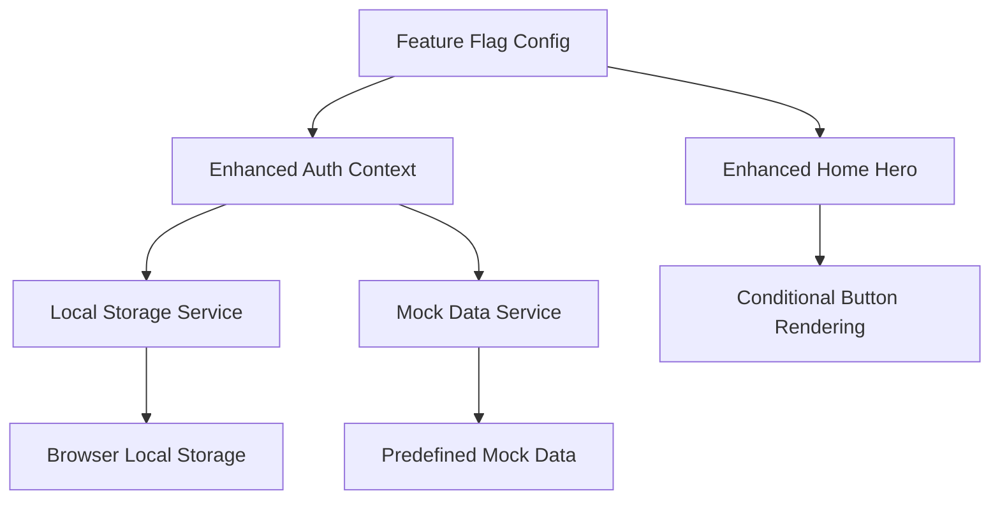

# Design Document

## Overview

The enhanced feature flags system extends the existing centralized feature flag infrastructure to provide granular control over UI elements and development workflows. The design introduces three new feature flags that integrate seamlessly with the current system while adding powerful capabilities for button visibility control and local development mode.

## Architecture

### Feature Flag Integration

The enhanced system builds upon the existing feature flag architecture in `lib/featureFlags.ts` and `lib/featureFlags.config.ts`. New flags will be registered using the existing `registerFlags` function and follow established naming conventions.

### Component Architecture



### Data Flow

1. **Flag Registration**: New flags are registered during application initialization
2. **Client-Side Evaluation**: Button visibility flags are evaluated in the browser
3. **Server-Side Evaluation**: Local dev mode flag is evaluated server-side for security
4. **Conditional Rendering**: Components conditionally render based on flag values
5. **Data Storage**: Local dev mode routes data to local storage instead of Supabase

## Components and Interfaces

### Enhanced Feature Flag Definitions

```typescript
interface EnhancedFeatureFlags {
  ENABLE_CLASSIC_ANALYZER: FeatureFlagDefinition<boolean>;
  ENABLE_KIROWEEN_ANALYZER: FeatureFlagDefinition<boolean>;
  LOCAL_DEV_MODE: FeatureFlagDefinition<boolean>;
}
```

### Local Development User Interface

```typescript
interface LocalDevUser {
  id: string;
  email: string;
  tier: UserTier;
  created_at: string;
}

interface LocalStorageService {
  saveAnalysis(analysis: SavedAnalysisRecord): Promise<void>;
  saveHackathonAnalysis(analysis: SavedHackathonAnalysis): Promise<void>;
  loadAnalyses(): Promise<UnifiedAnalysisRecord[]>;
  clearAnalyses(): Promise<void>;
}
```

### Enhanced Auth Context

The AuthContext will be enhanced to support local development mode:

```typescript
interface EnhancedAuthContextValue extends AuthContextValue {
  isLocalDevMode: boolean;
  localUser: LocalDevUser | null;
}
```

## Data Models

### Mock Data Structure

Pre-defined analysis records for local development:

```typescript
interface MockAnalysisData {
  startupAnalyses: SavedAnalysisRecord[];
  hackathonAnalyses: SavedHackathonAnalysis[];
}
```

### Local Storage Schema

Data stored in browser local storage will follow this structure:

```typescript
interface LocalStorageSchema {
  "nvnc-local-analyses": SavedAnalysisRecord[];
  "nvnc-local-hackathon-analyses": SavedHackathonAnalysis[];
  "nvnc-local-user": LocalDevUser;
}
```

## Error Handling

### Feature Flag Validation

- Validate flag configurations during application startup
- Provide fallback behavior when flags are misconfigured
- Log warnings for invalid flag combinations

### Local Storage Error Handling

- Handle quota exceeded errors gracefully
- Provide fallback to in-memory storage if local storage fails
- Clear corrupted data and reinitialize with mock data

### Button Visibility Edge Cases

- Display fallback message when all analyzer buttons are hidden
- Maintain responsive layout regardless of button visibility
- Handle navigation gracefully when target routes are disabled

## Testing Strategy

### Unit Testing

- Test feature flag registration and evaluation
- Test local storage service operations
- Test mock data generation and validation
- Test conditional rendering logic

### Integration Testing

- Test auth context behavior in local dev mode
- Test data flow between components and storage services
- Test button visibility combinations
- Test navigation behavior with different flag configurations

### End-to-End Testing

- Test complete local development workflow
- Test feature flag toggling in different environments
- Test data persistence across browser sessions
- Test fallback behaviors and error scenarios

## Implementation Details

### Feature Flag Configuration

New flags will be added to `lib/featureFlags.config.ts`:

```typescript
export function initFeatureFlags() {
  registerFlags({
    ENABLE_CLASSIC_ANALYZER: defineBooleanFlag({
      key: "ENABLE_CLASSIC_ANALYZER",
      description: "Show the classic startup idea analyzer button on home page",
      default: true,
      exposeToClient: true,
    }),
    ENABLE_KIROWEEN_ANALYZER: defineBooleanFlag({
      key: "ENABLE_KIROWEEN_ANALYZER",
      description: "Show the Kiroween hackathon analyzer button on home page",
      default: true,
      exposeToClient: true,
    }),
    LOCAL_DEV_MODE: defineBooleanFlag({
      key: "LOCAL_DEV_MODE",
      description:
        "Enable local development mode with mock auth and local storage",
      default: false,
      exposeToClient: false,
    }),
  });
}
```

### Environment Variable Configuration

```bash
# Button visibility flags (client-exposed)
NEXT_PUBLIC_FF_ENABLE_CLASSIC_ANALYZER=true
NEXT_PUBLIC_FF_ENABLE_KIROWEEN_ANALYZER=true

# Local dev mode (server-only for security)
FF_LOCAL_DEV_MODE=false
```

### Local Storage Service Implementation

A dedicated service will handle local storage operations:

- Namespace all keys to avoid conflicts
- Implement JSON serialization/deserialization
- Handle storage quota and error scenarios
- Provide migration utilities for schema changes

### Mock Data Generation

Pre-defined mock data will include:

- 2-3 realistic startup idea analyses with varying scores
- 1-2 hackathon project analyses
- Diverse analysis content to test different UI scenarios
- Consistent timestamps and user associations

### Security Considerations

- Local dev mode flag is server-only to prevent production misuse
- Mock data contains no sensitive information
- Local storage data is clearly marked as development data
- Production builds will ignore local dev mode regardless of flag value

## Performance Considerations

### Client Bundle Size

- Button visibility flags are client-exposed but minimal impact
- Local dev mode logic is conditionally loaded
- Mock data is only loaded when local dev mode is active

### Runtime Performance

- Feature flag evaluation is cached during component lifecycle
- Local storage operations are asynchronous and non-blocking
- Mock data is generated once and reused across sessions

### Memory Usage

- Mock data is kept minimal (2-3 records per type)
- Local storage cleanup utilities prevent data accumulation
- Component re-renders are optimized with proper dependency arrays

## Migration Strategy

### Backward Compatibility

- All new flags have sensible defaults
- Existing functionality remains unchanged when flags are disabled
- No breaking changes to existing APIs or components

### Rollout Plan

1. Deploy feature flag infrastructure updates
2. Enable button visibility flags in staging environment
3. Test local dev mode with development team
4. Gradually enable flags in production environments
5. Monitor performance and user feedback

### Rollback Strategy

- Feature flags can be disabled via environment variables
- Local storage data can be cleared without affecting remote data
- Component fallbacks ensure graceful degradation
- No database schema changes required for rollback
