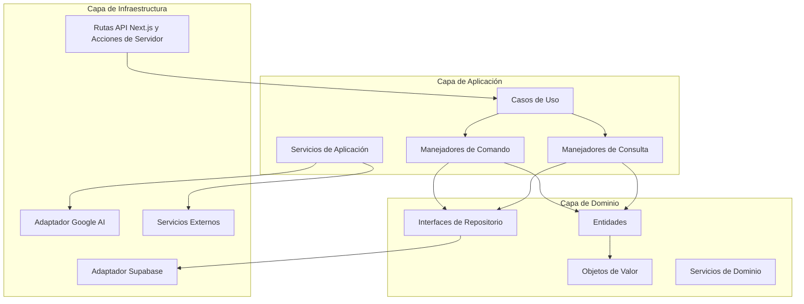

# Diseño del Refactor de Arquitectura Hexagonal

## Resumen

Este documento de diseño describe la transformación de la aplicación No Vibe No Code desde su arquitectura actual basada en características hacia una arquitectura hexagonal (patrón Puertos y Adaptadores) optimizada para Next.js y TypeScript. El refactor mantendrá toda la funcionalidad existente mientras mejora la mantenibilidad, testabilidad y separación de responsabilidades.

El diseño aprovecha el sistema de tipado fuerte de TypeScript, las capacidades del lado del servidor de Next.js y los patrones modernos de JavaScript para crear una arquitectura limpia y mantenible que separa la lógica de negocio de las preocupaciones de infraestructura.

## Arquitectura

### Diagrama de Arquitectura de Alto Nivel



### Estructura de Directorios

```
src/
├── app/                          # Next.js App Router (Infraestructura)
│   ├── api/                      # Rutas API (Adaptadores Web)
│   ├── (pages)/                  # Componentes de página
│   └── globals.css
├── domain/                       # Capa de Dominio (TypeScript Puro)
│   ├── entities/                 # Entidades de Dominio
│   │   ├── analysis/
│   │   │   ├── Analysis.ts
│   │   │   ├── AnalysisId.ts
│   │   │   └── index.ts
│   │   ├── user/
│   │   │   ├── User.ts
│   │   │   ├── UserId.ts
│   │   │   └── index.ts
│   │   └── shared/
│   │       ├── EntityId.ts
│   │       └── Entity.ts
│   ├── value-objects/            # Objetos de Valor
│   │   ├── Email.ts
│   │   ├── Score.ts
│   │   ├── Locale.ts
│   │   └── index.ts
│   ├── repositories/             # Interfaces de Repositorio (Puertos)
│   │   ├── base/
│   │   │   ├── ICommandRepository.ts
│   │   │   ├── IQueryRepository.ts
│   │   │   └── IRepository.ts
│   │   ├── IAnalysisRepository.ts
│   │   ├── IUserRepository.ts
│   │   └── index.ts
│   ├── services/                 # Servicios de Dominio
│   │   ├── AnalysisValidationService.ts
│   │   ├── ScoreCalculationService.ts
│   │   └── index.ts
│   └── types/                    # Tipos de Dominio
│       ├── errors.ts
│       ├── common.ts
│       └── index.ts
├── application/                  # Capa de Aplicación
│   ├── use-cases/               # Casos de Uso (Servicios de Aplicación)
│   │   ├── analysis/
│   │   │   ├── AnalyzeIdeaUseCase.ts
│   │   │   ├── SaveAnalysisUseCase.ts
│   │   │   └── GetAnalysisUseCase.ts
│   │   ├── hackathon/
│   │   │   ├── AnalyzeHackathonProjectUseCase.ts
│   │   │   └── SaveHackathonAnalysisUseCase.ts
│   │   └── dashboard/
│   │       ├── GetUserAnalysesUseCase.ts
│   │       └── DeleteAnalysisUseCase.ts
│   ├── handlers/                # Manejadores de Comando y Consulta
│   │   ├── commands/
│   │   │   ├── CreateAnalysisHandler.ts
│   │   │   ├── UpdateAnalysisHandler.ts
│   │   │   └── DeleteAnalysisHandler.ts
│   │   └── queries/
│   │       ├── GetAnalysisHandler.ts
│   │       ├── ListAnalysesHandler.ts
│   │       └── SearchAnalysesHandler.ts
│   ├── services/                # Servicios de Aplicación
│   │   ├── AIAnalysisService.ts
│   │   ├── AudioProcessingService.ts
│   │   └── NotificationService.ts
│   └── types/                   # Tipos de Aplicación
│       ├── commands.ts
│       ├── queries.ts
│       └── index.ts
├── infrastructure/              # Capa de Infraestructura
│   ├── database/               # Adaptadores de Base de Datos
│   │   ├── supabase/
│   │   │   ├── SupabaseClient.ts
│   │   │   ├── repositories/
│   │   │   │   ├── SupabaseAnalysisRepository.ts
│   │   │   │   └── SupabaseUserRepository.ts
│   │   │   └── mappers/
│   │   │       ├── AnalysisMapper.ts
│   │   │       └── UserMapper.ts
│   │   └── types/
│   │       ├── dao.ts
│   │       └── database.ts
│   ├── external/               # Adaptadores de Servicios Externos
│   │   ├── ai/
│   │   │   ├── GoogleAIAdapter.ts
│   │   │   ├── TextToSpeechAdapter.ts
│   │   │   └── TranscriptionAdapter.ts
│   │   └── analytics/
│   │       └── PostHogAdapter.ts
│   ├── web/                    # Adaptadores Web
│   │   ├── controllers/
│   │   │   ├── AnalysisController.ts
│   │   │   ├── HackathonController.ts
│   │   │   └── DashboardController.ts
│   │   ├── middleware/
│   │   │   ├── AuthMiddleware.ts
│   │   │   └── ValidationMiddleware.ts
│   │   └── dto/
│   │       ├── AnalysisDTO.ts
│   │       ├── HackathonDTO.ts
│   │       └── UserDTO.ts
│   ├── config/                 # Configuración
│   │   ├── database.ts
│   │   ├── ai.ts
│   │   └── environment.ts
│   └── factories/              # Fábricas de Servicios
│       ├── RepositoryFactory.ts
│       ├── ServiceFactory.ts
│       └── UseCaseFactory.ts
├── shared/                     # Utilidades Compartidas
│   ├── utils/
│   │   ├── validation.ts
│   │   ├── errors.ts
│   │   └── types.ts
│   ├── constants/
│   │   ├── locales.ts
│   │   └── features.ts
│   └── types/
│       ├── common.ts
│       └── api.ts
└── main.ts                     # Bootstrap de la Aplicación
```

## Componentes e Interfaces

### Componentes de la Capa de Dominio

#### Entidades

**Entidad Analysis**
```typescript
// src/domain/entities/analysis/Analysis.ts
export class Analysis extends Entity<AnalysisId> {
  private constructor(
    id: AnalysisId,
    private readonly idea: string,
    private readonly userId: UserId,
    private readonly score: Score,
    private readonly createdAt: Date,
    private readonly locale: Locale
  ) {
    super(id);
  }

  static create(props: AnalysisProps): Analysis {
    // Lógica de negocio para crear análisis
    // Validación y aplicación de invariantes
  }

  updateScore(newScore: Score): void {
    // Lógica de negocio para actualizar puntuación
  }

  isOwnedBy(userId: UserId): boolean {
    return this.userId.equals(userId);
  }
}
```

**Objetos de Valor**
```typescript
// src/domain/value-objects/AnalysisId.ts
export class AnalysisId extends EntityId {
  private constructor(value: string) {
    super(value);
  }

  /**
   * Crear un nuevo AnalysisId desde un valor string
   * Valida que el valor sea un UUID válido
   */
  static fromString(value: string): AnalysisId {
    if (!ValidationUtils.isValidUUID(value)) {
      throw new Error(`Formato de AnalysisId inválido: ${value}. Debe ser un UUID válido.`);
    }
    return new AnalysisId(value);
  }

  /**
   * Generar un nuevo AnalysisId aleatorio
   */
  static generate(): AnalysisId {
    // Generar un UUID v4
    const uuid = 'xxxxxxxx-xxxx-4xxx-yxxx-xxxxxxxxxxxx'.replace(/[xy]/g, function(c) {
      const r = Math.random() * 16 | 0;
      const v = c === 'x' ? r : (r & 0x3 | 0x8);
      return v.toString(16);
    });
    return new AnalysisId(uuid);
  }

  /**
   * Crear AnalysisId para reconstrucción desde persistencia
   * Asume que el valor ya está validado
   */
  static reconstruct(value: string): AnalysisId {
    return new AnalysisId(value);
  }
}
```

#### Interfaces de Repositorio

```typescript
// src/domain/repositories/IAnalysisRepository.ts
export interface IAnalysisRepository extends IRepository<Analysis, AnalysisId> {
  // Operaciones de comando
  save(analysis: Analysis): Promise<void>;
  update(analysis: Analysis): Promise<void>;
  delete(id: AnalysisId): Promise<void>;
  
  // Operaciones de consulta
  findById(id: AnalysisId): Promise<Analysis | null>;
  findByUserId(userId: UserId): Promise<Analysis[]>;
  findByUserIdPaginated(userId: UserId, page: number, limit: number): Promise<{
    analyses: Analysis[];
    total: number;
  }>;
  search(criteria: AnalysisSearchCriteria): Promise<Analysis[]>;
}
```

### Componentes de la Capa de Aplicación

#### Casos de Uso

```typescript
// src/application/use-cases/analysis/AnalyzeIdeaUseCase.ts
export class AnalyzeIdeaUseCase {
  constructor(
    private readonly aiService: IAIAnalysisService,
    private readonly analysisRepository: IAnalysisRepository,
    private readonly validationService: AnalysisValidationService
  ) {}

  async execute(command: AnalyzeIdeaCommand): Promise<AnalysisResult> {
    // 1. Validar entrada
    const validation = this.validationService.validateIdea(command.idea);
    if (!validation.isValid) {
      throw new ValidationError(validation.errors);
    }

    // 2. Realizar análisis con IA
    const aiResult = await this.aiService.analyzeIdea(command.idea, command.locale);

    // 3. Crear entidad de dominio
    const analysis = Analysis.create({
      idea: command.idea,
      userId: command.userId,
      aiResult,
      locale: command.locale
    });

    // 4. Guardar en repositorio
    await this.analysisRepository.save(analysis);

    return AnalysisResult.fromEntity(analysis);
  }
}
```

#### Manejadores de Comando y Consulta

```typescript
// src/application/handlers/commands/CreateAnalysisHandler.ts
export class CreateAnalysisHandler {
  constructor(
    private readonly analyzeIdeaUseCase: AnalyzeIdeaUseCase
  ) {}

  async handle(command: CreateAnalysisCommand): Promise<CreateAnalysisResult> {
    try {
      const result = await this.analyzeIdeaUseCase.execute(command);
      return CreateAnalysisResult.success(result);
    } catch (error) {
      return CreateAnalysisResult.failure(error);
    }
  }
}
```

### Componentes de la Capa de Infraestructura

#### Implementaciones de Repositorio

```typescript
// src/infrastructure/database/supabase/repositories/SupabaseAnalysisRepository.ts
export class SupabaseAnalysisRepository implements IAnalysisRepository {
  constructor(
    private readonly client: SupabaseClient,
    private readonly mapper: AnalysisMapper
  ) {}

  async save(analysis: Analysis): Promise<void> {
    const dao = this.mapper.toDAO(analysis);
    const { error } = await this.client
      .from('analyses')
      .insert(dao);
    
    if (error) {
      throw new DatabaseError('Error al guardar análisis', error);
    }
  }

  async findById(id: AnalysisId): Promise<Analysis | null> {
    const { data, error } = await this.client
      .from('analyses')
      .select('*')
      .eq('id', id.value)
      .single();

    if (error && error.code !== 'PGRST116') {
      throw new DatabaseError('Error al buscar análisis', error);
    }

    return data ? this.mapper.toDomain(data) : null;
  }
}
```

#### Mapeadores

```typescript
// src/infrastructure/database/supabase/mappers/AnalysisMapper.ts
export class AnalysisMapper {
  toDAO(analysis: Analysis): AnalysisDAO {
    return {
      id: analysis.id.value,
      idea: analysis.idea,
      user_id: analysis.userId.value,
      score: analysis.score.value,
      created_at: analysis.createdAt.toISOString(),
      locale: analysis.locale.value,
      // ... otros campos
    };
  }

  toDomain(dao: AnalysisDAO): Analysis {
    return Analysis.reconstruct({
      id: AnalysisId.fromString(dao.id),
      idea: dao.idea,
      userId: UserId.fromString(dao.user_id),
      score: Score.fromNumber(dao.score),
      createdAt: new Date(dao.created_at),
      locale: Locale.fromString(dao.locale),
      // ... otros campos
    });
  }

  toDTO(analysis: Analysis): AnalysisDTO {
    return {
      id: analysis.id.value,
      idea: analysis.idea,
      score: analysis.score.value,
      createdAt: analysis.createdAt.toISOString(),
      // ... otros campos para respuesta API
    };
  }
}
```

#### Controladores Web

```typescript
// src/infrastructure/web/controllers/AnalysisController.ts
export class AnalysisController {
  constructor(
    private readonly createAnalysisHandler: CreateAnalysisHandler,
    private readonly getAnalysisHandler: GetAnalysisHandler
  ) {}

  async createAnalysis(request: NextRequest): Promise<NextResponse> {
    try {
      // 1. Validar y parsear solicitud
      const dto = await this.parseAndValidateRequest(request);
      
      // 2. Convertir DTO a comando
      const command = CreateAnalysisCommand.fromDTO(dto);
      
      // 3. Ejecutar comando
      const result = await this.createAnalysisHandler.handle(command);
      
      // 4. Retornar respuesta
      if (result.isSuccess) {
        return NextResponse.json(result.data, { status: 201 });
      } else {
        return NextResponse.json({ error: result.error }, { status: 400 });
      }
    } catch (error) {
      return this.handleError(error);
    }
  }

  private async parseAndValidateRequest(request: NextRequest): Promise<CreateAnalysisDTO> {
    const body = await request.json();
    return CreateAnalysisSchema.parse(body); // Validación con Zod
  }
}
```

## Modelos de Datos

### Modelos de Dominio

```typescript
// Entidad de Dominio
interface AnalysisProps {
  id?: AnalysisId;
  idea: string;
  userId: UserId;
  score: Score;
  locale: Locale;
  createdAt?: Date;
}

// Objetos de Valor
class Score {
  constructor(private readonly _value: number) {
    if (_value < 0 || _value > 100) {
      throw new Error('La puntuación debe estar entre 0 y 100');
    }
  }
  
  get value(): number { return this._value; }
  
  static fromNumber(value: number): Score {
    return new Score(value);
  }
}
```

### Objetos de Transferencia de Datos (DTOs)

```typescript
// DTO de Entrada API
export interface CreateAnalysisDTO {
  idea: string;
  locale: string;
}

// DTO de Salida API
export interface AnalysisResponseDTO {
  id: string;
  idea: string;
  score: number;
  detailedSummary: string;
  createdAt: string;
  // ... otros campos de respuesta
}

// Esquemas Zod para validación
export const CreateAnalysisSchema = z.object({
  idea: z.string().min(10).max(5000),
  locale: z.enum(['en', 'es'])
});
```

### Objetos de Acceso a Datos (DAOs)

```typescript
// DAO de Supabase
export interface AnalysisDAO {
  id: string;
  idea: string;
  user_id: string;
  score: number;
  detailed_summary: string;
  created_at: string;
  updated_at: string;
  locale: string;
  // ... campos específicos de base de datos
}

// DAO alternativo de MongoDB (para uso futuro)
export interface AnalysisDocumentDAO {
  _id: ObjectId;
  idea: string;
  userId: ObjectId;
  score: number;
  analysis: {
    summary: string;
    criteria: Array<{
      name: string;
      score: number;
      justification: string;
    }>;
  };
  metadata: {
    createdAt: Date;
    updatedAt: Date;
    locale: string;
  };
}
```

## Manejo de Errores

### Errores de Dominio

```typescript
// src/domain/types/errors.ts
export abstract class DomainError extends Error {
  abstract readonly code: string;
  
  constructor(message: string, public readonly cause?: Error) {
    super(message);
    this.name = this.constructor.name;
  }
}

export class ValidationError extends DomainError {
  readonly code = 'VALIDATION_ERROR';
  
  constructor(
    message: string,
    public readonly validationErrors: string[]
  ) {
    super(message);
  }
}

export class BusinessRuleViolationError extends DomainError {
  readonly code = 'BUSINESS_RULE_VIOLATION';
}
```

### Errores de Infraestructura

```typescript
// src/infrastructure/types/errors.ts
export class DatabaseError extends Error {
  constructor(message: string, public readonly originalError: any) {
    super(message);
    this.name = 'DatabaseError';
  }
}

export class ExternalServiceError extends Error {
  constructor(
    message: string,
    public readonly service: string,
    public readonly originalError: any
  ) {
    super(message);
    this.name = 'ExternalServiceError';
  }
}
```

### Manejo de Errores en Next.js

```typescript
// src/infrastructure/web/middleware/ErrorMiddleware.ts
export function handleApiError(error: Error): NextResponse {
  if (error instanceof ValidationError) {
    return NextResponse.json(
      { 
        error: 'Validación fallida', 
        details: error.validationErrors 
      },
      { status: 400 }
    );
  }
  
  if (error instanceof BusinessRuleViolationError) {
    return NextResponse.json(
      { error: error.message },
      { status: 422 }
    );
  }
  
  if (error instanceof DatabaseError) {
    console.error('Error de base de datos:', error);
    return NextResponse.json(
      { error: 'Error interno del servidor' },
      { status: 500 }
    );
  }
  
  // Manejo de errores por defecto
  console.error('Error inesperado:', error);
  return NextResponse.json(
    { error: 'Error interno del servidor' },
    { status: 500 }
  );
}
```

## Estrategia de Pruebas

### Pruebas de la Capa de Dominio

```typescript
// src/domain/entities/__tests__/Analysis.test.ts
describe('Entidad Analysis', () => {
  it('debería crear análisis con datos válidos', () => {
    const analysis = Analysis.create({
      idea: 'Una gran idea de startup',
      userId: UserId.create(),
      score: Score.fromNumber(85),
      locale: Locale.fromString('en')
    });
    
    expect(analysis.id).toBeDefined();
    expect(analysis.score.value).toBe(85);
  });
  
  it('debería lanzar error para puntuación inválida', () => {
    expect(() => {
      Analysis.create({
        idea: 'Una gran idea de startup',
        userId: UserId.create(),
        score: Score.fromNumber(150), // Puntuación inválida
        locale: Locale.fromString('en')
      });
    }).toThrow();
  });
});
```

### Pruebas de la Capa de Aplicación

```typescript
// src/application/use-cases/__tests__/AnalyzeIdeaUseCase.test.ts
describe('AnalyzeIdeaUseCase', () => {
  let useCase: AnalyzeIdeaUseCase;
  let mockAIService: jest.Mocked<IAIAnalysisService>;
  let mockRepository: jest.Mocked<IAnalysisRepository>;
  
  beforeEach(() => {
    mockAIService = createMockAIService();
    mockRepository = createMockRepository();
    useCase = new AnalyzeIdeaUseCase(mockAIService, mockRepository, new AnalysisValidationService());
  });
  
  it('debería analizar idea y guardar resultado', async () => {
    const command = new AnalyzeIdeaCommand('Gran idea', UserId.create(), Locale.fromString('en'));
    mockAIService.analyzeIdea.mockResolvedValue(mockAIResult);
    
    const result = await useCase.execute(command);
    
    expect(mockAIService.analyzeIdea).toHaveBeenCalledWith('Gran idea', Locale.fromString('en'));
    expect(mockRepository.save).toHaveBeenCalled();
    expect(result.score).toBeDefined();
  });
});
```

### Pruebas de la Capa de Infraestructura

```typescript
// src/infrastructure/database/__tests__/SupabaseAnalysisRepository.test.ts
describe('SupabaseAnalysisRepository', () => {
  let repository: SupabaseAnalysisRepository;
  let mockClient: jest.Mocked<SupabaseClient>;
  
  beforeEach(() => {
    mockClient = createMockSupabaseClient();
    repository = new SupabaseAnalysisRepository(mockClient, new AnalysisMapper());
  });
  
  it('debería guardar análisis en base de datos', async () => {
    const analysis = createTestAnalysis();
    mockClient.from.mockReturnValue({
      insert: jest.fn().mockResolvedValue({ error: null })
    } as any);
    
    await repository.save(analysis);
    
    expect(mockClient.from).toHaveBeenCalledWith('analyses');
  });
});
```

### Pruebas de Integración

```typescript
// src/__tests__/integration/analysis.test.ts
describe('Pruebas de Integración de Analysis', () => {
  it('debería crear análisis de extremo a extremo', async () => {
    const response = await fetch('/api/analyze', {
      method: 'POST',
      headers: { 'Content-Type': 'application/json' },
      body: JSON.stringify({
        idea: 'Una idea revolucionaria de startup',
        locale: 'en'
      })
    });
    
    expect(response.status).toBe(201);
    const result = await response.json();
    expect(result.id).toBeDefined();
    expect(result.score).toBeGreaterThan(0);
  });
});
```

## Composición de Servicios y Configuración

### Fábrica de Servicios

```typescript
// src/infrastructure/factories/ServiceFactory.ts
export class ServiceFactory {
  private static instance: ServiceFactory;
  private services: Map<string, any> = new Map();
  
  static getInstance(): ServiceFactory {
    if (!ServiceFactory.instance) {
      ServiceFactory.instance = new ServiceFactory();
    }
    return ServiceFactory.instance;
  }
  
  createAnalysisService(): AnalyzeIdeaUseCase {
    if (!this.services.has('analysisService')) {
      const aiService = this.createAIService();
      const repository = this.createAnalysisRepository();
      const validationService = new AnalysisValidationService();
      
      this.services.set('analysisService', 
        new AnalyzeIdeaUseCase(aiService, repository, validationService)
      );
    }
    return this.services.get('analysisService');
  }
  
  private createAnalysisRepository(): IAnalysisRepository {
    const client = createSupabaseClient();
    const mapper = new AnalysisMapper();
    return new SupabaseAnalysisRepository(client, mapper);
  }
  
  private createAIService(): IAIAnalysisService {
    const config = getAIConfig();
    return new GoogleAIAnalysisService(config);
  }
}
```

### Gestión de Configuración

```typescript
// src/infrastructure/config/environment.ts
export interface AppConfig {
  database: DatabaseConfig;
  ai: AIConfig;
  features: FeatureConfig;
}

export function getAppConfig(): AppConfig {
  return {
    database: {
      supabaseUrl: process.env.NEXT_PUBLIC_SUPABASE_URL!,
      supabaseKey: process.env.NEXT_PUBLIC_SUPABASE_ANON_KEY!,
    },
    ai: {
      geminiApiKey: process.env.GEMINI_API_KEY!,
      timeout: parseInt(process.env.AI_TIMEOUT || '30000'),
    },
    features: {
      enableHackathonAnalyzer: process.env.NEXT_PUBLIC_FF_HACKATHON_ANALYZER === 'true',
      enableAudioFeatures: process.env.NEXT_PUBLIC_FF_AUDIO_FEATURES === 'true',
    }
  };
}
```

Este diseño proporciona una base sólida para el refactor de arquitectura hexagonal mientras mantiene la compatibilidad con Next.js y aprovecha las fortalezas de TypeScript. La arquitectura separa claramente las responsabilidades, permite pruebas fáciles y proporciona flexibilidad para futuras mejoras.