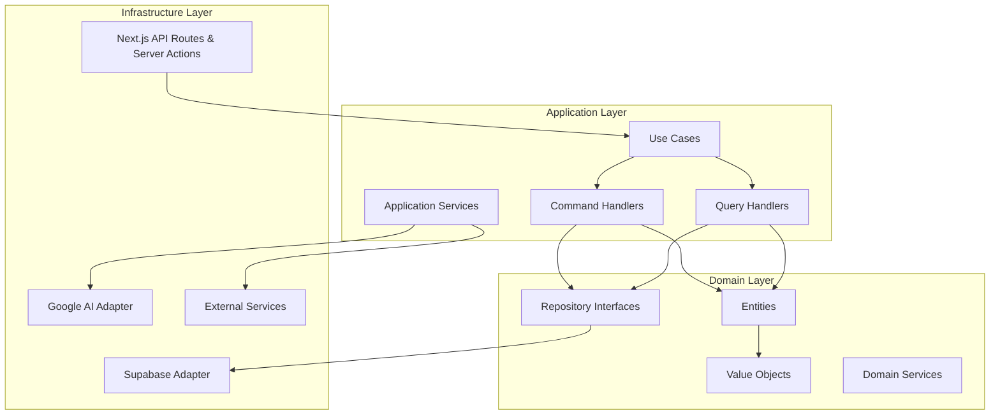

# Hexagonal Architecture Refactor Design

## Overview

This design document outlines the transformation of the No Vibe No Code application from its current feature-based architecture to a hexagonal architecture (Ports and Adapters pattern) optimized for Next.js and TypeScript. The refactor will maintain all existing functionality while improving maintainability, testability, and separation of concerns.

The design leverages TypeScript's strong typing system, Next.js server-side capabilities, and modern JavaScript patterns to create a clean, maintainable architecture that separates business logic from infrastructure concerns.

## Architecture

### High-Level Architecture Diagram



### Directory Structure

```
src/
├── app/                          # Next.js App Router (Infrastructure)
│   ├── api/                      # API Routes (Web Adapters)
│   ├── (pages)/                  # Page components
│   └── globals.css
├── domain/                       # Domain Layer (Pure TypeScript)
│   ├── entities/                 # Domain Entities
│   │   ├── analysis/
│   │   │   ├── Analysis.ts
│   │   │   ├── AnalysisId.ts
│   │   │   └── index.ts
│   │   ├── user/
│   │   │   ├── User.ts
│   │   │   ├── UserId.ts
│   │   │   └── index.ts
│   │   └── shared/
│   │       ├── EntityId.ts
│   │       └── Entity.ts
│   ├── value-objects/            # Value Objects
│   │   ├── Email.ts
│   │   ├── Score.ts
│   │   ├── Locale.ts
│   │   └── index.ts
│   ├── repositories/             # Repository Interfaces (Ports)
│   │   ├── base/
│   │   │   ├── ICommandRepository.ts
│   │   │   ├── IQueryRepository.ts
│   │   │   └── IRepository.ts
│   │   ├── IAnalysisRepository.ts
│   │   ├── IUserRepository.ts
│   │   └── index.ts
│   ├── services/                 # Domain Services
│   │   ├── AnalysisValidationService.ts
│   │   ├── ScoreCalculationService.ts
│   │   └── index.ts
│   └── types/                    # Domain Types
│       ├── errors.ts
│       ├── common.ts
│       └── index.ts
├── application/                  # Application Layer
│   ├── use-cases/               # Use Cases (Application Services)
│   │   ├── analysis/
│   │   │   ├── AnalyzeIdeaUseCase.ts
│   │   │   ├── SaveAnalysisUseCase.ts
│   │   │   └── GetAnalysisUseCase.ts
│   │   ├── hackathon/
│   │   │   ├── AnalyzeHackathonProjectUseCase.ts
│   │   │   └── SaveHackathonAnalysisUseCase.ts
│   │   └── dashboard/
│   │       ├── GetUserAnalysesUseCase.ts
│   │       └── DeleteAnalysisUseCase.ts
│   ├── handlers/                # Command & Query Handlers
│   │   ├── commands/
│   │   │   ├── CreateAnalysisHandler.ts
│   │   │   ├── UpdateAnalysisHandler.ts
│   │   │   └── DeleteAnalysisHandler.ts
│   │   └── queries/
│   │       ├── GetAnalysisHandler.ts
│   │       ├── ListAnalysesHandler.ts
│   │       └── SearchAnalysesHandler.ts
│   ├── services/                # Application Services
│   │   ├── AIAnalysisService.ts
│   │   ├── AudioProcessingService.ts
│   │   └── NotificationService.ts
│   └── types/                   # Application Types
│       ├── commands.ts
│       ├── queries.ts
│       └── index.ts
├── infrastructure/              # Infrastructure Layer
│   ├── database/               # Database Adapters
│   │   ├── supabase/
│   │   │   ├── SupabaseClient.ts
│   │   │   ├── repositories/
│   │   │   │   ├── SupabaseAnalysisRepository.ts
│   │   │   │   └── SupabaseUserRepository.ts
│   │   │   └── mappers/
│   │   │       ├── AnalysisMapper.ts
│   │   │       └── UserMapper.ts
│   │   └── types/
│   │       ├── dao.ts
│   │       └── database.ts
│   ├── external/               # External Service Adapters
│   │   ├── ai/
│   │   │   ├── GoogleAIAdapter.ts
│   │   │   ├── TextToSpeechAdapter.ts
│   │   │   └── TranscriptionAdapter.ts
│   │   └── analytics/
│   │       └── PostHogAdapter.ts
│   ├── web/                    # Web Adapters
│   │   ├── controllers/
│   │   │   ├── AnalysisController.ts
│   │   │   ├── HackathonController.ts
│   │   │   └── DashboardController.ts
│   │   ├── middleware/
│   │   │   ├── AuthMiddleware.ts
│   │   │   └── ValidationMiddleware.ts
│   │   └── dto/
│   │       ├── AnalysisDTO.ts
│   │       ├── HackathonDTO.ts
│   │       └── UserDTO.ts
│   ├── config/                 # Configuration
│   │   ├── database.ts
│   │   ├── ai.ts
│   │   └── environment.ts
│   └── factories/              # Service Factories
│       ├── RepositoryFactory.ts
│       ├── ServiceFactory.ts
│       └── UseCaseFactory.ts
├── shared/                     # Shared Utilities
│   ├── utils/
│   │   ├── validation.ts
│   │   ├── errors.ts
│   │   └── types.ts
│   ├── constants/
│   │   ├── locales.ts
│   │   └── features.ts
│   └── types/
│       ├── common.ts
│       └── api.ts
└── main.ts                     # Application Bootstrap
```

## Components and Interfaces

### Domain Layer Components

#### Entities

**Analysis Entity**
```typescript
// src/domain/entities/analysis/Analysis.ts
export class Analysis extends Entity<AnalysisId> {
  private constructor(
    id: AnalysisId,
    private readonly idea: string,
    private readonly userId: UserId,
    private readonly score: Score,
    private readonly createdAt: Date,
    private readonly locale: Locale
  ) {
    super(id);
  }

  static create(props: AnalysisProps): Analysis {
    // Business logic for creating analysis
    // Validation and invariant enforcement
  }

  updateScore(newScore: Score): void {
    // Business logic for score updates
  }

  isOwnedBy(userId: UserId): boolean {
    return this.userId.equals(userId);
  }
}
```

**Value Objects**
```typescript
// src/domain/value-objects/AnalysisId.ts
export class AnalysisId extends EntityId {
  private constructor(value: string) {
    super(value);
  }

  /**
   * Create a new AnalysisId from a string value
   * Validates that the value is a proper UUID
   */
  static fromString(value: string): AnalysisId {
    if (!ValidationUtils.isValidUUID(value)) {
      throw new Error(`Invalid AnalysisId format: ${value}. Must be a valid UUID.`);
    }
    return new AnalysisId(value);
  }

  /**
   * Generate a new random AnalysisId
   */
  static generate(): AnalysisId {
    // Generate a UUID v4
    const uuid = 'xxxxxxxx-xxxx-4xxx-yxxx-xxxxxxxxxxxx'.replace(/[xy]/g, function(c) {
      const r = Math.random() * 16 | 0;
      const v = c === 'x' ? r : (r & 0x3 | 0x8);
      return v.toString(16);
    });
    return new AnalysisId(uuid);
  }

  /**
   * Create AnalysisId for reconstruction from persistence
   * Assumes the value is already validated
   */
  static reconstruct(value: string): AnalysisId {
    return new AnalysisId(value);
  }
}
```

#### Repository Interfaces

```typescript
// src/domain/repositories/IAnalysisRepository.ts
export interface IAnalysisRepository extends IRepository<Analysis, AnalysisId> {
  // Command operations
  save(analysis: Analysis): Promise<void>;
  update(analysis: Analysis): Promise<void>;
  delete(id: AnalysisId): Promise<void>;
  
  // Query operations
  findById(id: AnalysisId): Promise<Analysis | null>;
  findByUserId(userId: UserId): Promise<Analysis[]>;
  findByUserIdPaginated(userId: UserId, page: number, limit: number): Promise<{
    analyses: Analysis[];
    total: number;
  }>;
  search(criteria: AnalysisSearchCriteria): Promise<Analysis[]>;
}
```

### Application Layer Components

#### Use Cases

```typescript
// src/application/use-cases/analysis/AnalyzeIdeaUseCase.ts
export class AnalyzeIdeaUseCase {
  constructor(
    private readonly aiService: IAIAnalysisService,
    private readonly analysisRepository: IAnalysisRepository,
    private readonly validationService: AnalysisValidationService
  ) {}

  async execute(command: AnalyzeIdeaCommand): Promise<AnalysisResult> {
    // 1. Validate input
    const validation = this.validationService.validateIdea(command.idea);
    if (!validation.isValid) {
      throw new ValidationError(validation.errors);
    }

    // 2. Perform AI analysis
    const aiResult = await this.aiService.analyzeIdea(command.idea, command.locale);

    // 3. Create domain entity
    const analysis = Analysis.create({
      idea: command.idea,
      userId: command.userId,
      aiResult,
      locale: command.locale
    });

    // 4. Save to repository
    await this.analysisRepository.save(analysis);

    return AnalysisResult.fromEntity(analysis);
  }
}
```

#### Command and Query Handlers

```typescript
// src/application/handlers/commands/CreateAnalysisHandler.ts
export class CreateAnalysisHandler {
  constructor(
    private readonly analyzeIdeaUseCase: AnalyzeIdeaUseCase
  ) {}

  async handle(command: CreateAnalysisCommand): Promise<CreateAnalysisResult> {
    try {
      const result = await this.analyzeIdeaUseCase.execute(command);
      return CreateAnalysisResult.success(result);
    } catch (error) {
      return CreateAnalysisResult.failure(error);
    }
  }
}
```

### Infrastructure Layer Components

#### Repository Implementations

```typescript
// src/infrastructure/database/supabase/repositories/SupabaseAnalysisRepository.ts
export class SupabaseAnalysisRepository implements IAnalysisRepository {
  constructor(
    private readonly client: SupabaseClient,
    private readonly mapper: AnalysisMapper
  ) {}

  async save(analysis: Analysis): Promise<void> {
    const dao = this.mapper.toDAO(analysis);
    const { error } = await this.client
      .from('analyses')
      .insert(dao);
    
    if (error) {
      throw new DatabaseError('Failed to save analysis', error);
    }
  }

  async findById(id: AnalysisId): Promise<Analysis | null> {
    const { data, error } = await this.client
      .from('analyses')
      .select('*')
      .eq('id', id.value)
      .single();

    if (error && error.code !== 'PGRST116') {
      throw new DatabaseError('Failed to find analysis', error);
    }

    return data ? this.mapper.toDomain(data) : null;
  }
}
```

#### Mappers

```typescript
// src/infrastructure/database/supabase/mappers/AnalysisMapper.ts
export class AnalysisMapper {
  toDAO(analysis: Analysis): AnalysisDAO {
    return {
      id: analysis.id.value,
      idea: analysis.idea,
      user_id: analysis.userId.value,
      score: analysis.score.value,
      created_at: analysis.createdAt.toISOString(),
      locale: analysis.locale.value,
      // ... other fields
    };
  }

  toDomain(dao: AnalysisDAO): Analysis {
    return Analysis.reconstruct({
      id: AnalysisId.fromString(dao.id),
      idea: dao.idea,
      userId: UserId.fromString(dao.user_id),
      score: Score.fromNumber(dao.score),
      createdAt: new Date(dao.created_at),
      locale: Locale.fromString(dao.locale),
      // ... other fields
    });
  }

  toDTO(analysis: Analysis): AnalysisDTO {
    return {
      id: analysis.id.value,
      idea: analysis.idea,
      score: analysis.score.value,
      createdAt: analysis.createdAt.toISOString(),
      // ... other fields for API response
    };
  }
}
```

#### Web Controllers

```typescript
// src/infrastructure/web/controllers/AnalysisController.ts
export class AnalysisController {
  constructor(
    private readonly createAnalysisHandler: CreateAnalysisHandler,
    private readonly getAnalysisHandler: GetAnalysisHandler
  ) {}

  async createAnalysis(request: NextRequest): Promise<NextResponse> {
    try {
      // 1. Validate and parse request
      const dto = await this.parseAndValidateRequest(request);
      
      // 2. Convert DTO to command
      const command = CreateAnalysisCommand.fromDTO(dto);
      
      // 3. Execute command
      const result = await this.createAnalysisHandler.handle(command);
      
      // 4. Return response
      if (result.isSuccess) {
        return NextResponse.json(result.data, { status: 201 });
      } else {
        return NextResponse.json({ error: result.error }, { status: 400 });
      }
    } catch (error) {
      return this.handleError(error);
    }
  }

  private async parseAndValidateRequest(request: NextRequest): Promise<CreateAnalysisDTO> {
    const body = await request.json();
    return CreateAnalysisSchema.parse(body); // Zod validation
  }
}
```

## Data Models

### Domain Models

```typescript
// Domain Entity
interface AnalysisProps {
  id?: AnalysisId;
  idea: string;
  userId: UserId;
  score: Score;
  locale: Locale;
  createdAt?: Date;
}

// Value Objects
class Score {
  constructor(private readonly _value: number) {
    if (_value < 0 || _value > 100) {
      throw new Error('Score must be between 0 and 100');
    }
  }
  
  get value(): number { return this._value; }
  
  static fromNumber(value: number): Score {
    return new Score(value);
  }
}
```

### Data Transfer Objects (DTOs)

```typescript
// API Input DTO
export interface CreateAnalysisDTO {
  idea: string;
  locale: string;
}

// API Output DTO
export interface AnalysisResponseDTO {
  id: string;
  idea: string;
  score: number;
  detailedSummary: string;
  createdAt: string;
  // ... other response fields
}

// Zod Schemas for validation
export const CreateAnalysisSchema = z.object({
  idea: z.string().min(10).max(5000),
  locale: z.enum(['en', 'es'])
});
```

### Data Access Objects (DAOs)

```typescript
// Supabase DAO
export interface AnalysisDAO {
  id: string;
  idea: string;
  user_id: string;
  score: number;
  detailed_summary: string;
  created_at: string;
  updated_at: string;
  locale: string;
  // ... database-specific fields
}

// Alternative MongoDB DAO (for future use)
export interface AnalysisDocumentDAO {
  _id: ObjectId;
  idea: string;
  userId: ObjectId;
  score: number;
  analysis: {
    summary: string;
    criteria: Array<{
      name: string;
      score: number;
      justification: string;
    }>;
  };
  metadata: {
    createdAt: Date;
    updatedAt: Date;
    locale: string;
  };
}
```

## Error Handling

### Domain Errors

```typescript
// src/domain/types/errors.ts
export abstract class DomainError extends Error {
  abstract readonly code: string;
  
  constructor(message: string, public readonly cause?: Error) {
    super(message);
    this.name = this.constructor.name;
  }
}

export class ValidationError extends DomainError {
  readonly code = 'VALIDATION_ERROR';
  
  constructor(
    message: string,
    public readonly validationErrors: string[]
  ) {
    super(message);
  }
}

export class BusinessRuleViolationError extends DomainError {
  readonly code = 'BUSINESS_RULE_VIOLATION';
}
```

### Infrastructure Errors

```typescript
// src/infrastructure/types/errors.ts
export class DatabaseError extends Error {
  constructor(message: string, public readonly originalError: any) {
    super(message);
    this.name = 'DatabaseError';
  }
}

export class ExternalServiceError extends Error {
  constructor(
    message: string,
    public readonly service: string,
    public readonly originalError: any
  ) {
    super(message);
    this.name = 'ExternalServiceError';
  }
}
```

### Error Handling in Next.js

```typescript
// src/infrastructure/web/middleware/ErrorMiddleware.ts
export function handleApiError(error: Error): NextResponse {
  if (error instanceof ValidationError) {
    return NextResponse.json(
      { 
        error: 'Validation failed', 
        details: error.validationErrors 
      },
      { status: 400 }
    );
  }
  
  if (error instanceof BusinessRuleViolationError) {
    return NextResponse.json(
      { error: error.message },
      { status: 422 }
    );
  }
  
  if (error instanceof DatabaseError) {
    console.error('Database error:', error);
    return NextResponse.json(
      { error: 'Internal server error' },
      { status: 500 }
    );
  }
  
  // Default error handling
  console.error('Unexpected error:', error);
  return NextResponse.json(
    { error: 'Internal server error' },
    { status: 500 }
  );
}
```

## Testing Strategy

### Domain Layer Testing

```typescript
// src/domain/entities/__tests__/Analysis.test.ts
describe('Analysis Entity', () => {
  it('should create analysis with valid data', () => {
    const analysis = Analysis.create({
      idea: 'A great startup idea',
      userId: UserId.create(),
      score: Score.fromNumber(85),
      locale: Locale.fromString('en')
    });
    
    expect(analysis.id).toBeDefined();
    expect(analysis.score.value).toBe(85);
  });
  
  it('should throw error for invalid score', () => {
    expect(() => {
      Analysis.create({
        idea: 'A great startup idea',
        userId: UserId.create(),
        score: Score.fromNumber(150), // Invalid score
        locale: Locale.fromString('en')
      });
    }).toThrow();
  });
});
```

### Application Layer Testing

```typescript
// src/application/use-cases/__tests__/AnalyzeIdeaUseCase.test.ts
describe('AnalyzeIdeaUseCase', () => {
  let useCase: AnalyzeIdeaUseCase;
  let mockAIService: jest.Mocked<IAIAnalysisService>;
  let mockRepository: jest.Mocked<IAnalysisRepository>;
  
  beforeEach(() => {
    mockAIService = createMockAIService();
    mockRepository = createMockRepository();
    useCase = new AnalyzeIdeaUseCase(mockAIService, mockRepository, new AnalysisValidationService());
  });
  
  it('should analyze idea and save result', async () => {
    const command = new AnalyzeIdeaCommand('Great idea', UserId.create(), Locale.fromString('en'));
    mockAIService.analyzeIdea.mockResolvedValue(mockAIResult);
    
    const result = await useCase.execute(command);
    
    expect(mockAIService.analyzeIdea).toHaveBeenCalledWith('Great idea', Locale.fromString('en'));
    expect(mockRepository.save).toHaveBeenCalled();
    expect(result.score).toBeDefined();
  });
});
```

### Infrastructure Layer Testing

```typescript
// src/infrastructure/database/__tests__/SupabaseAnalysisRepository.test.ts
describe('SupabaseAnalysisRepository', () => {
  let repository: SupabaseAnalysisRepository;
  let mockClient: jest.Mocked<SupabaseClient>;
  
  beforeEach(() => {
    mockClient = createMockSupabaseClient();
    repository = new SupabaseAnalysisRepository(mockClient, new AnalysisMapper());
  });
  
  it('should save analysis to database', async () => {
    const analysis = createTestAnalysis();
    mockClient.from.mockReturnValue({
      insert: jest.fn().mockResolvedValue({ error: null })
    } as any);
    
    await repository.save(analysis);
    
    expect(mockClient.from).toHaveBeenCalledWith('analyses');
  });
});
```

### Integration Testing

```typescript
// src/__tests__/integration/analysis.test.ts
describe('Analysis Integration Tests', () => {
  it('should create analysis end-to-end', async () => {
    const response = await fetch('/api/analyze', {
      method: 'POST',
      headers: { 'Content-Type': 'application/json' },
      body: JSON.stringify({
        idea: 'A revolutionary startup idea',
        locale: 'en'
      })
    });
    
    expect(response.status).toBe(201);
    const result = await response.json();
    expect(result.id).toBeDefined();
    expect(result.score).toBeGreaterThan(0);
  });
});
```

## Service Composition and Configuration

### Service Factory

```typescript
// src/infrastructure/factories/ServiceFactory.ts
export class ServiceFactory {
  private static instance: ServiceFactory;
  private services: Map<string, any> = new Map();
  
  static getInstance(): ServiceFactory {
    if (!ServiceFactory.instance) {
      ServiceFactory.instance = new ServiceFactory();
    }
    return ServiceFactory.instance;
  }
  
  createAnalysisService(): AnalyzeIdeaUseCase {
    if (!this.services.has('analysisService')) {
      const aiService = this.createAIService();
      const repository = this.createAnalysisRepository();
      const validationService = new AnalysisValidationService();
      
      this.services.set('analysisService', 
        new AnalyzeIdeaUseCase(aiService, repository, validationService)
      );
    }
    return this.services.get('analysisService');
  }
  
  private createAnalysisRepository(): IAnalysisRepository {
    const client = createSupabaseClient();
    const mapper = new AnalysisMapper();
    return new SupabaseAnalysisRepository(client, mapper);
  }
  
  private createAIService(): IAIAnalysisService {
    const config = getAIConfig();
    return new GoogleAIAnalysisService(config);
  }
}
```

### Configuration Management

```typescript
// src/infrastructure/config/environment.ts
export interface AppConfig {
  database: DatabaseConfig;
  ai: AIConfig;
  features: FeatureConfig;
}

export function getAppConfig(): AppConfig {
  return {
    database: {
      supabaseUrl: process.env.NEXT_PUBLIC_SUPABASE_URL!,
      supabaseKey: process.env.NEXT_PUBLIC_SUPABASE_ANON_KEY!,
    },
    ai: {
      geminiApiKey: process.env.GEMINI_API_KEY!,
      timeout: parseInt(process.env.AI_TIMEOUT || '30000'),
    },
    features: {
      enableHackathonAnalyzer: process.env.NEXT_PUBLIC_FF_HACKATHON_ANALYZER === 'true',
      enableAudioFeatures: process.env.NEXT_PUBLIC_FF_AUDIO_FEATURES === 'true',
    }
  };
}
```

This design provides a solid foundation for the hexagonal architecture refactor while maintaining compatibility with Next.js and leveraging TypeScript's strengths. The architecture clearly separates concerns, enables easy testing, and provides flexibility for future enhancements.