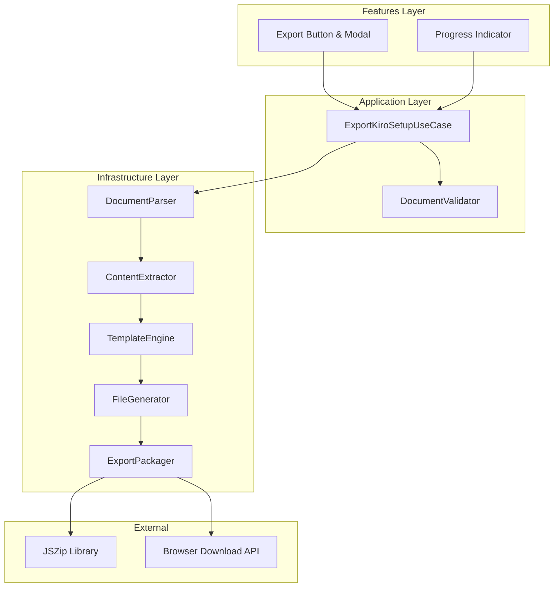
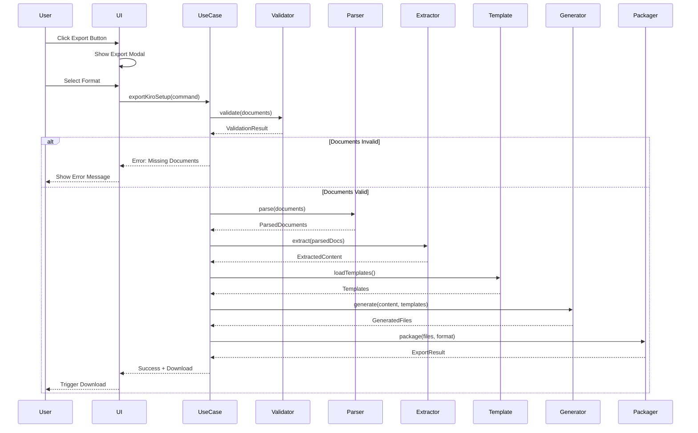

# Design Document

## Overview

The Kiro Setup Export Feature is a document transformation and packaging system that converts generated project documentation (PRD, Design Document, Tech Architecture, Roadmap) into a ready-to-use Kiro workspace setup. The system extracts relevant content from source documents, populates predefined templates, generates an example spec from the first roadmap item, and packages everything into a downloadable format (ZIP or individual files).

The feature integrates with the existing Idea Panel and Document Generation System, adding an export capability that bridges the gap between documentation and implementation. Users can export their generated documents with one click and immediately start working with Kiro using the exported steering files and specs.

## Architecture

The system follows a pipeline architecture with four main stages:

1. **Validation Stage**: Verifies all required documents exist and contain valid content
2. **Extraction Stage**: Parses source documents and extracts relevant sections
3. **Generation Stage**: Populates templates with extracted data and generates files
4. **Packaging Stage**: Bundles generated files into the selected export format

The architecture integrates with the existing hexagonal architecture:

- **Application Layer**: Export use cases and orchestration logic
- **Infrastructure Layer**: Document parsing, template engine, file generation, ZIP creation
- **Features Layer**: UI components (export button, modal, progress indicators)

### Component Diagram



## Components and Interfaces

### 1. Export Button Component

**Location**: `features/idea-panel/components/ExportToKiroButton.tsx`

**Responsibilities**:

- Display export button in Idea Panel
- Show disabled state with tooltip when documents are missing
- Open export options modal on click
- Track button click analytics

**Interface**:

```typescript
interface ExportToKiroButtonProps {
  ideaId: string;
  documents: {
    prd?: Document;
    design?: Document;
    techArchitecture?: Document;
    roadmap?: Document;
  };
  onExportComplete?: () => void;
}
```

### 2. Export Options Modal Component

**Location**: `features/idea-panel/components/ExportOptionsModal.tsx`

**Responsibilities**:

- Display export format options (ZIP or individual files)
- Show export progress during generation
- Handle user selection and initiate export
- Display success/error messages

**Interface**:

```typescript
interface ExportOptionsModalProps {
  isOpen: boolean;
  onClose: () => void;
  ideaId: string;
  ideaName: string;
  documents: RequiredDocuments;
}

type ExportFormat = "zip" | "individual";
```

### 3. ExportKiroSetupUseCase

**Location**: `src/application/use-cases/ExportKiroSetupUseCase.ts`

**Responsibilities**:

- Orchestrate the export process
- Validate document availability
- Coordinate extraction, generation, and packaging
- Track analytics events
- Handle errors and provide user feedback

**Interface**:

```typescript
interface ExportKiroSetupCommand {
  ideaId: string;
  ideaName: string;
  format: ExportFormat;
  documents: {
    prd: Document;
    design: Document;
    techArchitecture: Document;
    roadmap: Document;
  };
}

interface ExportKiroSetupResult {
  success: boolean;
  downloadUrl?: string;
  files?: ExportedFile[];
  error?: string;
}
```

### 4. DocumentValidator

**Location**: `src/application/services/DocumentValidator.ts`

**Responsibilities**:

- Validate document existence
- Check document content is not empty
- Verify document structure is valid
- Return validation results with missing document list

**Interface**:

```typescript
interface ValidationResult {
  isValid: boolean;
  missingDocuments: DocumentType[];
  emptyDocuments: DocumentType[];
}

type DocumentType = "prd" | "design" | "techArchitecture" | "roadmap";
```

### 5. DocumentParser

**Location**: `src/infrastructure/export/DocumentParser.ts`

**Responsibilities**:

- Parse markdown documents
- Extract document structure (headings, sections, content)
- Handle different document formats
- Provide structured access to document content

**Interface**:

```typescript
interface ParsedDocument {
  title: string;
  sections: DocumentSection[];
  metadata?: Record<string, any>;
}

interface DocumentSection {
  heading: string;
  level: number;
  content: string;
  subsections: DocumentSection[];
}
```

### 6. ContentExtractor

**Location**: `src/infrastructure/export/ContentExtractor.ts`

**Responsibilities**:

- Extract specific content from parsed documents
- Map document sections to template variables
- Handle missing or optional content gracefully
- Provide extracted data in template-ready format

**Interface**:

```typescript
interface ExtractedContent {
  product: ProductContent;
  tech: TechContent;
  architecture: ArchitectureContent;
  roadmap: RoadmapContent;
}

interface ProductContent {
  vision: string;
  mission: string;
  targetUsers: string;
  personas: string;
  metrics: string;
  constraints: string;
  valueProposition: string;
}

// Similar interfaces for TechContent, ArchitectureContent, RoadmapContent
```

### 7. TemplateEngine

**Location**: `src/infrastructure/export/TemplateEngine.ts`

**Responsibilities**:

- Load template files
- Populate templates with extracted content
- Handle template variables and conditionals
- Generate final file content

**Interface**:

```typescript
interface TemplateEngine {
  loadTemplate(templateName: string): string;
  populate(template: string, data: Record<string, any>): string;
  generateFile(templateName: string, data: Record<string, any>): string;
}
```

### 8. FileGenerator

**Location**: `src/infrastructure/export/FileGenerator.ts`

**Responsibilities**:

- Generate all export files (steering, specs, README, roadmap)
- Create folder structure
- Generate example spec from first roadmap item
- Ensure file references are correct

**Interface**:

```typescript
interface GeneratedFiles {
  steering: {
    "product.md": string;
    "tech.md": string;
    "architecture.md": string;
    "spec-generation.md": string;
  };
  specs: {
    [featureName: string]: {
      "requirements.md": string;
      "design.md": string;
      "tasks.md": string;
    };
  };
  docs: {
    "roadmap.md": string;
  };
  "README.md": string;
}
```

### 9. ExportPackager

**Location**: `src/infrastructure/export/ExportPackager.ts`

**Responsibilities**:

- Package generated files into selected format
- Create ZIP file using JSZip
- Generate individual file downloads
- Provide download URLs or trigger browser downloads

**Interface**:

```typescript
interface ExportPackager {
  packageAsZip(files: GeneratedFiles, filename: string): Promise<Blob>;
  packageAsIndividualFiles(files: GeneratedFiles): ExportedFile[];
  triggerDownload(blob: Blob, filename: string): void;
  triggerMultipleDownloads(files: ExportedFile[]): void;
}

interface ExportedFile {
  name: string;
  content: string;
  path: string;
}
```

### 10. RoadmapParser

**Location**: `src/infrastructure/export/RoadmapParser.ts`

**Responsibilities**:

- Parse roadmap document structure
- Extract roadmap items with descriptions and goals
- Identify first roadmap item for example spec
- Provide structured roadmap data

**Interface**:

```typescript
interface RoadmapItem {
  title: string;
  description: string;
  goals: string[];
  acceptanceCriteria?: string[];
  dependencies?: string[];
}

interface ParsedRoadmap {
  items: RoadmapItem[];
  firstItem: RoadmapItem;
}
```

## Data Models

### Document Entity

```typescript
interface Document {
  id: string;
  ideaId: string;
  type: DocumentType;
  title: string;
  content: string;
  createdAt: Date;
  updatedAt: Date;
}
```

### Export Configuration

```typescript
interface ExportConfig {
  format: ExportFormat;
  includeOriginalDocs: boolean;
  templateVersion: string;
  timestamp: Date;
}
```

### Template Data

```typescript
interface TemplateData {
  ideaName: string;
  timestamp: string;
  product: ProductContent;
  tech: TechContent;
  architecture: ArchitectureContent;
  exampleSpec: {
    featureName: string;
    userStory: string;
    acceptanceCriteria: string[];
    technicalApproach: string;
    tasks: string[];
  };
}
```

## Data Flow

### Export Process Flow



## Correctness Properties

_A property is a characteristic or behavior that should hold true across all valid executions of a system-essentially, a formal statement about what the system should do. Properties serve as the bridge between human-readable specifications and machine-verifiable correctness guarantees._

### Property Reflection

After analyzing all acceptance criteria, several properties can be consolidated to reduce redundancy:

- **Content Extraction Properties (2.2-2.5, 3.2-3.5, 4.2-4.5)**: These can be combined into a single comprehensive property that validates all content extraction from all source documents.
- **File Generation Properties (2.1, 3.1, 4.1, 5.1, 7.1, 8.1)**: These can be combined into a property that validates all required files are generated.
- **Folder Structure Properties (11.1-11.5)**: These can be combined into a single property that validates the complete folder structure.
- **Validation Properties (9.1-9.5)**: These can be combined into a comprehensive validation property.

### Core Properties

**Property 1: Complete File Generation**
_For any_ valid set of documents (PRD, Design, Tech Architecture, Roadmap), exporting should generate all required files: product.md, tech.md, architecture.md, spec-generation.md, example spec (requirements.md, design.md, tasks.md), roadmap.md, and README.md
**Validates: Requirements 2.1, 3.1, 4.1, 5.1, 6.2, 6.3, 6.4, 6.5, 7.1, 8.1**

**Property 2: Content Extraction Completeness**
_For any_ source document with defined sections (vision, mission, stack, patterns, etc.), the corresponding steering file should contain all extracted sections from the source
**Validates: Requirements 2.2, 2.3, 2.4, 2.5, 3.2, 3.3, 3.4, 3.5, 4.2, 4.3, 4.4, 4.5**

**Property 3: Roadmap Preservation (Round-trip)**
_For any_ roadmap document, copying it to the export structure should preserve all content, formatting, and structure identically
**Validates: Requirements 8.2, 8.3, 8.4**

**Property 4: Folder Structure Consistency**
_For any_ export package, the folder structure should always contain: kiro-setup/steering/, kiro-setup/specs/, kiro-setup/docs/, and README.md at root
**Validates: Requirements 11.1, 11.2, 11.3, 11.4, 11.5**

**Property 5: File Reference Validity**
_For any_ generated spec file containing file references, all referenced paths should exist in the export structure and use the correct format `#[[file:path]]`
**Validates: Requirements 12.1, 12.2, 12.3, 12.4, 12.5**

**Property 6: Validation Correctness**
_For any_ set of documents, validation should return enabled state if and only if all four required documents (PRD, Design, Tech Architecture, Roadmap) exist and are non-empty
**Validates: Requirements 9.1, 9.2, 9.4, 9.5**

**Property 7: Export Button State Consistency**
_For any_ document set, the export button enabled state should match the validation result, and when disabled, the tooltip should list exactly the missing documents
**Validates: Requirements 1.1, 1.5, 9.3**

**Property 8: Filename Pattern Compliance**
_For any_ idea name and timestamp, the generated ZIP filename should match the pattern "kiro-setup-{idea-name}-{timestamp}.zip"
**Validates: Requirements 1.4**

**Property 9: First Roadmap Item Identification**
_For any_ roadmap with multiple items, the example spec should be generated from the first item in document order
**Validates: Requirements 6.1**

**Property 10: Spec Generation Frontmatter**
_For any_ generated spec-generation.md file, it should contain frontmatter with "inclusion: manual" directive
**Validates: Requirements 5.2**

**Property 11: README Content Completeness**
_For any_ generated README.md, it should contain sections for: file listing, setup instructions, example workflows, and tips
**Validates: Requirements 7.2, 7.3, 7.4, 7.5**

**Property 12: Export Format Handling**
_For any_ export request, selecting ZIP format should produce one file, and selecting individual files should produce multiple files with folder-prefixed names
**Validates: Requirements 13.4, 13.5**

**Property 13: Analytics Event Tracking**
_For any_ export operation, the system should track "export_initiated" at start, "export_completed" on success, or "export_failed" on error, each with appropriate metadata
**Validates: Requirements 10.1, 10.2, 10.3, 10.4, 10.5**

**Property 14: Export Package Completeness**
_For any_ successful export, the package should contain all steering files, example spec files, roadmap copy, and README
**Validates: Requirements 1.2**

**Property 15: Modal Display Behavior**
_For any_ export button click, the system should display a modal with both "Download as ZIP" and "Download Individual Files" options
**Validates: Requirements 13.1, 13.2, 13.3**

## Error Handling

### Error Categories

1. **Validation Errors**

   - Missing required documents
   - Empty document content
   - Invalid document structure
   - **Handling**: Disable export button, show tooltip with specific missing documents

2. **Parsing Errors**

   - Malformed markdown
   - Missing expected sections
   - Invalid document format
   - **Handling**: Log error, show user-friendly message, allow partial export with warnings

3. **Generation Errors**

   - Template loading failure
   - Content extraction failure
   - File generation failure
   - **Handling**: Track analytics event, show error message, provide retry option

4. **Packaging Errors**

   - ZIP creation failure
   - File system errors
   - Browser download API failure
   - **Handling**: Track analytics event, show error message, offer alternative format

5. **Analytics Errors**
   - Tracking service unavailable
   - Event submission failure
   - **Handling**: Log error silently, don't block export operation

### Error Recovery Strategies

- **Graceful Degradation**: If optional content is missing, continue with available content
- **Retry Logic**: Provide retry button for transient failures
- **Alternative Formats**: If ZIP fails, offer individual file downloads
- **Detailed Error Messages**: Show specific error information to help users resolve issues
- **Error Logging**: Log all errors for debugging and monitoring

### Error Response Format

```typescript
interface ExportError {
  code: string;
  message: string;
  details?: Record<string, any>;
  recoverable: boolean;
  suggestedAction?: string;
}
```

## Testing Strategy

### Unit Testing

Unit tests will cover individual components and functions:

1. **DocumentValidator Tests**

   - Test validation with complete document sets
   - Test validation with missing documents
   - Test validation with empty documents
   - Test validation result format

2. **DocumentParser Tests**

   - Test parsing valid markdown documents
   - Test parsing documents with various structures
   - Test handling malformed markdown
   - Test section extraction

3. **ContentExtractor Tests**

   - Test extraction from PRD (vision, mission, users, metrics, constraints)
   - Test extraction from Tech Architecture (stack, dependencies, setup)
   - Test extraction from Design Document (patterns, conventions, organization)
   - Test handling missing sections gracefully

4. **TemplateEngine Tests**

   - Test template loading
   - Test variable substitution
   - Test conditional rendering
   - Test handling missing template variables

5. **FileGenerator Tests**

   - Test steering file generation
   - Test example spec generation
   - Test README generation
   - Test roadmap copying

6. **ExportPackager Tests**

   - Test ZIP file creation
   - Test individual file generation
   - Test filename generation
   - Test folder structure creation

7. **RoadmapParser Tests**
   - Test parsing roadmap with single item
   - Test parsing roadmap with multiple items
   - Test first item identification
   - Test item structure extraction

### Property-Based Testing

Property-based tests will validate universal properties across many inputs:

1. **Property Test: Complete File Generation**

   - Generate random valid document sets
   - Export and verify all required files exist
   - Run 100+ iterations with varied document content

2. **Property Test: Content Extraction Completeness**

   - Generate random documents with various section structures
   - Export and verify all sections are extracted
   - Verify no content is lost during extraction

3. **Property Test: Roadmap Preservation**

   - Generate random roadmap documents
   - Export and compare original vs copied content
   - Verify byte-for-byte equality

4. **Property Test: Folder Structure Consistency**

   - Generate random document sets
   - Export and verify folder structure matches specification
   - Verify all files are in correct locations

5. **Property Test: File Reference Validity**

   - Generate random specs with file references
   - Export and verify all references point to existing files
   - Verify reference format is correct

6. **Property Test: Validation Correctness**

   - Generate random combinations of present/missing documents
   - Verify validation results match expected state
   - Test with empty and non-empty documents

7. **Property Test: Export Button State Consistency**

   - Generate random document availability scenarios
   - Verify button state matches validation
   - Verify tooltip content matches missing documents

8. **Property Test: Filename Pattern Compliance**

   - Generate random idea names and timestamps
   - Verify filename matches pattern
   - Test with special characters in idea names

9. **Property Test: Analytics Event Tracking**

   - Perform random export operations (success and failure)
   - Verify correct events are tracked
   - Verify event metadata is complete

10. **Property Test: Export Format Handling**
    - Generate random document sets
    - Export in both formats
    - Verify ZIP produces one file, individual produces multiple
    - Verify file naming conventions

### Integration Testing

Integration tests will validate end-to-end workflows:

1. **Complete Export Flow**

   - Create idea with all documents
   - Click export button
   - Select format
   - Verify download initiated
   - Verify file contents

2. **Validation Flow**

   - Load idea panel with missing documents
   - Verify button disabled
   - Add missing documents
   - Verify button enabled

3. **Error Handling Flow**

   - Trigger various error conditions
   - Verify error messages displayed
   - Verify analytics events tracked
   - Verify recovery options available

4. **Analytics Integration**
   - Perform export operations
   - Verify events tracked in PostHog
   - Verify event metadata correct

### Test Data Generation

Use `@faker-js/faker` to generate:

- Random document content with realistic structure
- Random idea names
- Random timestamps
- Random roadmap items with descriptions and goals
- Random section content for PRD, Design, Tech Architecture

### Testing Configuration

- **Framework**: Vitest for unit and property tests
- **Property Testing**: Use faker.js with 100+ iterations per property
- **Coverage Target**: 80%+ for core export logic
- **Test Isolation**: Mock external dependencies (browser APIs, analytics)
- **Test Data**: Use generators for consistent, varied test data

## Performance Considerations

### Optimization Strategies

1. **Lazy Template Loading**: Load templates only when needed
2. **Streaming ZIP Generation**: Generate ZIP file in chunks for large exports
3. **Parallel File Generation**: Generate steering files concurrently
4. **Content Caching**: Cache parsed documents during export process
5. **Debounced Validation**: Debounce document validation on Idea Panel

### Performance Targets

- **Export Generation**: < 2 seconds for typical document set
- **Validation Check**: < 100ms
- **ZIP Creation**: < 1 second for standard export
- **UI Responsiveness**: No blocking operations, show progress indicator

### Scalability Considerations

- **Large Documents**: Handle documents up to 1MB efficiently
- **Multiple Roadmap Items**: Support roadmaps with 50+ items
- **Concurrent Exports**: Support multiple users exporting simultaneously
- **Browser Memory**: Keep memory usage under 50MB during export

## Security Considerations

### Input Validation

- Sanitize idea names for filename generation
- Validate document content before processing
- Prevent path traversal in file references
- Limit document size to prevent DoS

### Content Security

- Escape user-generated content in templates
- Validate markdown to prevent XSS
- Sanitize file references to prevent malicious paths
- Validate ZIP file structure before creation

### Access Control

- Verify user owns the idea before allowing export
- Check user permissions for document access
- Rate limit export operations per user
- Track export operations for audit

### Data Privacy

- Don't include sensitive user data in analytics events
- Respect user privacy settings
- Don't log document content
- Secure temporary files during export process

## Dependencies

### External Libraries

- **JSZip** (^3.10.1): ZIP file creation and manipulation
- **@faker-js/faker** (^10.1.0): Test data generation for property tests
- **PostHog**: Analytics tracking for export events

### Internal Dependencies

- **Document Generation System**: Source of PRD, Design, Tech Architecture, Roadmap
- **Idea Panel**: UI integration point for export button
- **Analytics System**: Event tracking infrastructure
- **Authentication System**: User verification and permissions

### Browser APIs

- **Blob API**: File creation in browser
- **Download API**: Triggering file downloads
- **File System Access API** (optional): For future direct file system access

## Future Enhancements

### Phase 2 Enhancements

1. **Interactive Roadmap Item Selection**: Allow users to select which roadmap items to generate specs for
2. **Custom Template Support**: Allow users to customize steering file templates
3. **Export History**: Track and display previous exports
4. **Export Sharing**: Generate shareable links for exports

### Phase 3 Enhancements

1. **GitHub Integration**: Create GitHub repository with exported files
2. **Automatic Hooks Generation**: Generate Kiro hooks based on tech stack
3. **Version Control**: Track changes to exported files over time
4. **Collaborative Exports**: Allow team members to collaborate on exports

### Phase 4 Enhancements

1. **Export Presets**: Save and reuse export configurations
2. **Incremental Exports**: Export only changed files
3. **Export Validation**: Validate exported files against Kiro requirements
4. **Export Analytics Dashboard**: Visualize export usage and patterns
