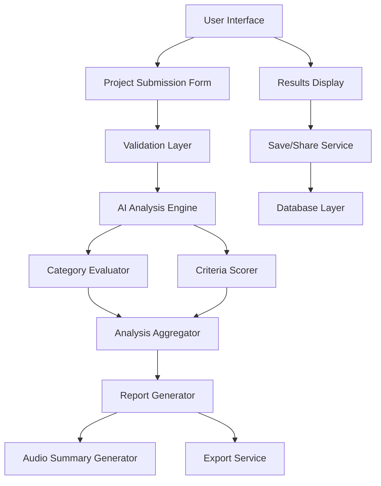

# Design Document

## Overview

The Kiroween Hackathon Analyzer is a specialized evaluation tool that adapts the existing startup idea analyzer for hackathon project assessment. It evaluates submissions against the four themed categories (Resurrection, Frankenstein, Skeleton Crew, Costume Contest) and three judging criteria (Potential Value, Implementation, Quality and Design) specific to the Kiroween competition.

The system leverages the existing analyzer architecture while introducing hackathon-specific evaluation logic, category assessment, and Halloween-themed UI elements to create an engaging and useful tool for participants.

## Architecture

### High-Level Architecture



### Component Structure

The analyzer follows the existing feature-based architecture:

```
features/kiroween-analyzer/
├── api/
│   ├── analyzeHackathonProject.ts
│   └── generateHackathonSpeech.ts
├── components/
│   ├── KiroweenAnalyzerView.tsx
│   ├── ProjectSubmissionForm.tsx
│   ├── HackathonAnalysisDisplay.tsx
│   ├── CategoryEvaluation.tsx
│   ├── CriteriaScoring.tsx
│   └── SpookyLoader.tsx
└── utils/
    ├── hackathonScoring.ts
    └── categoryMatcher.ts
```

## Components and Interfaces

### 1. Project Submission Form

**Purpose**: Collect hackathon project details for evaluation

**Key Features**:

- Project description textarea (required)
- Kiro usage explanation field
- Optional supporting materials (screenshots, demo links)
- Halloween-themed styling with spooky animations

**Note**: Category selection has been removed - the analyzer now evaluates compatibility with all four categories and displays star ratings in the results.

**Interface**:

```typescript
interface ProjectSubmission {
  description: string;
  kiroUsage: string;
  supportingMaterials?: {
    screenshots?: string[];
    demoLink?: string;
    additionalNotes?: string;
  };
}

type KiroweenCategory =
  | "resurrection"
  | "frankenstein"
  | "skeleton-crew"
  | "costume-contest";
```

### 2. Category Evaluator

**Purpose**: Assess project fit against all four Kiroween categories with star ratings

**Evaluation Logic**:

- **Resurrection**: Analyzes if project revives obsolete technology with modern innovations (0-5 stars)
- **Frankenstein**: Evaluates integration of seemingly incompatible technologies (0-5 stars)
- **Skeleton Crew**: Assesses if project provides a flexible foundation with multiple use cases (0-5 stars)
- **Costume Contest**: Reviews UI polish and spooky design elements (0-5 stars)

Each category receives a compatibility score from 0 to 5 stars, displayed similar to the existing Rubric Score section but specifically for Kiroween categories.

**Interface**:

```typescript
interface CategoryEvaluation {
  category: KiroweenCategory;
  fitScore: number; // 0-5 scale (star rating)
  explanation: string;
  improvementSuggestions: string[];
}

interface CategoryAnalysis {
  evaluations: CategoryEvaluation[];
  bestMatch: KiroweenCategory;
  bestMatchReason: string;
}
```

### 3. Criteria Scorer

**Purpose**: Score project against the three judging criteria

**Scoring Components**:

**Potential Value** (1-5 scale):

- Market uniqueness/saturation assessment
- UI intuitiveness evaluation
- Scalability and extensibility potential

**Implementation** (1-5 scale):

- Variety of Kiro features utilized
- Depth of understanding demonstrated
- Strategic integration decisions

**Quality and Design** (1-5 scale):

- Creativity and originality
- Use of unique resources/datasets
- UI polish and thoughtful design choices

**Interface**:

```typescript
interface CriteriaScore {
  name: "Potential Value" | "Implementation" | "Quality and Design";
  score: number; // 1-5 scale
  justification: string;
  subScores?: {
    [key: string]: {
      score: number;
      explanation: string;
    };
  };
}

interface CriteriaAnalysis {
  scores: CriteriaScore[];
  finalScore: number; // Average of all scores, rounded to 1 decimal
  finalScoreExplanation: string;
}
```

### 4. Hackathon Analysis Display

**Purpose**: Present evaluation results in a structured, actionable format

**Display Sections**:

1. **Final Score & Viability Summary**: Overall assessment and competitive potential
2. **Category Analysis**: Fit scores for all categories with best match highlighted
3. **Criteria Breakdown**: Detailed scoring for each judging criterion
4. **Detailed Summary**: Comprehensive analysis of strengths and weaknesses
5. **Actionable Next Steps**: Prioritized improvement recommendations
6. **Refinement Suggestions**: Interactive suggestions for project enhancement

**Interface**:

```typescript
interface HackathonAnalysis {
  finalScore: number;
  finalScoreExplanation: string;
  viabilitySummary: string;
  detailedSummary: string;
  categoryAnalysis: CategoryAnalysis;
  criteriaAnalysis: CriteriaAnalysis;
  nextSteps: NextStep[];
  improvementSuggestions: ImprovementSuggestion[];
  competitorAnalysis?: Competitor[]; // Optional hackathon-specific competitors
}
```

## Data Models

### Core Data Types

```typescript
// Extend existing Analysis type for hackathon-specific data
interface HackathonAnalysis
  extends Omit<
    Analysis,
    | "founderQuestions"
    | "swotAnalysis"
    | "currentMarketTrends"
    | "monetizationStrategies"
  > {
  categoryAnalysis: CategoryAnalysis;
  criteriaAnalysis: CriteriaAnalysis;
  hackathonSpecificAdvice: {
    categoryOptimization: string[];
    kiroIntegrationTips: string[];
    competitionStrategy: string[];
  };
}

// Database schema extension
interface SavedHackathonAnalysis {
  id: string;
  userId: string;
  projectDescription: string;
  kiroUsage: string;
  analysis: HackathonAnalysis;
  createdAt: string;
  audioBase64?: string | null;
  supportingMaterials?: ProjectSubmission["supportingMaterials"];
}
```

## Error Handling

### Validation Errors

- **Empty project description**: Display inline error with suggestion
- **Insufficient Kiro usage explanation**: Provide guidance on what to include

### API Errors

- **AI service failures**: Graceful fallback with retry option
- **Network timeouts**: Progress indicator with retry mechanism
- **Rate limiting**: Queue system with estimated wait time

### Data Persistence Errors

- **Save failures**: Local storage backup with sync retry
- **Authentication issues**: Redirect to login with return path
- **Database connection errors**: Offline mode with sync when available

## Testing Strategy

### Unit Tests

- Category evaluation logic validation
- Scoring calculation accuracy
- Data transformation functions
- Utility functions for hackathon-specific features

### Integration Tests

- AI service integration with hackathon prompts
- Database operations for hackathon analyses
- Audio generation for hackathon summaries
- Export functionality with hackathon data

### Component Tests

- Project submission form validation
- Analysis display rendering with hackathon data
- Interactive refinement suggestions
- Halloween-themed UI components

### End-to-End Tests

- Complete evaluation workflow from submission to results
- Save and share functionality
- Audio summary generation and playback
- Export to PDF with hackathon formatting

## Halloween Theme Implementation

### Visual Design Elements

- **Color Scheme**: Dark background (#0a0a0a) with orange (#ff6b35), purple (#8b5cf6), and green (#10b981) accents
- **Typography**: Spooky but readable fonts with subtle glow effects
- **Icons**: Ghost icons, spider web patterns, pumpkin graphics
- **Animations**: Floating elements, fade-in effects, subtle hover animations

### Interactive Elements

- **Loading States**: Animated ghosts or spinning pumpkins
- **Progress Indicators**: Halloween-themed progress bars
- **Buttons**: Spooky styling with hover effects
- **Form Elements**: Dark theme with orange/purple focus states

### Accessibility Considerations

- Maintain sufficient contrast ratios despite dark theme
- Ensure animations can be disabled for motion-sensitive users
- Provide alternative text for decorative Halloween elements
- Keep core functionality accessible while enhancing aesthetics

## Performance Considerations

### AI Processing Optimization

- Implement request queuing for high traffic periods
- Cache common category/criteria evaluations
- Optimize prompt engineering for faster responses
- Implement progressive loading for large analyses

### UI Performance

- Lazy load analysis sections
- Optimize Halloween animations for smooth performance
- Implement virtual scrolling for long results
- Minimize bundle size with code splitting

### Data Management

- Efficient storage of hackathon-specific data structures
- Optimize database queries for saved analyses
- Implement proper indexing for search functionality
- Cache frequently accessed evaluation templates
