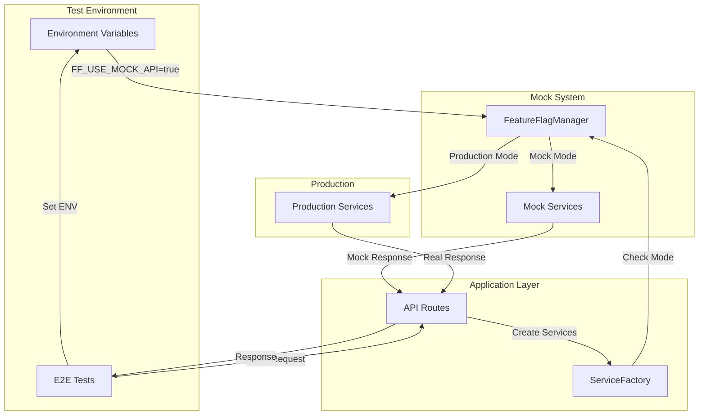

# Design Document - Mock System Integration Fix

## Overview

This document outlines the design for fixing the integration between the existing mock system infrastructure and the Next.js application layer. The mock system (FeatureFlagManager, TestDataManager, Mock Services) is fully implemented and functional, but the application doesn't properly activate it during test execution.

### Goals

- Enable E2E tests to run successfully with mock data
- Fix environment variable reading in Next.js test mode
- Ensure ServiceFactory correctly detects and uses mock mode
- Configure API routes to properly check feature flags
- Provide clear diagnostics when mock mode fails to activate

### Non-Goals

- Reimplementing the mock system (already complete)
- Adding new mock services or test scenarios
- Changing the mock system architecture
- Implementing new E2E tests (tests are already written)

## Problem Analysis

### Current State

The mock system infrastructure exists and works correctly:
- ✅ FeatureFlagManager reads environment variables
- ✅ TestDataManager loads and caches mock responses
- ✅ MockAIAnalysisService implements IAIAnalysisService
- ✅ MockFrankensteinService generates mock ideas
- ✅ E2E tests are written with proper page objects

### Integration Gaps

The application layer doesn't properly connect to the mock system:
- ❌ ServiceFactory creates mock services but may not detect test mode correctly
- ❌ API routes don't verify mock mode before using services
- ❌ E2E tests don't guarantee mock mode is active before running
- ❌ Next.js environment variables may not be available in all contexts
- ❌ No integration tests verify the connection works

## Architecture

### High-Level Integration Flow



## Components and Interfaces

### 1. Environment Configuration Module

**Purpose**: Ensure environment variables are properly loaded and available in all Next.js contexts.

**Current Issue**: Next.js has specific rules for environment variables:
- Server-side: All `process.env` variables available
- Client-side: Only `NEXT_PUBLIC_*` variables available
- Test mode: Variables must be set before Next.js starts

**Solution**:

```typescript
// lib/testing/config/test-environment.ts

/**
 * Test environment configuration
 * Ensures mock mode environment variables are properly set
 */
export class TestEnvironmentConfig {
  /**
   * Validate that required environment variables are set for test mode
   */
  static validateTestEnvironment(): {
    isValid: boolean;
    errors: string[];
    warnings: string[];
  } {
    const errors: string[] = [];
    const warnings: string[] = [];

    // Check if mock mode is enabled
    const useMockApi = process.env.FF_USE_MOCK_API;
    
    if (!useMockApi) {
      warnings.push('FF_USE_MOCK_API not set - mock mode disabled');
    }

    // Check for production environment
    if (process.env.NODE_ENV === 'production' && useMockApi === 'true') {
      errors.push('Mock mode cannot be enabled in production');
    }

    // Validate scenario if mock mode is enabled
    if (useMockApi === 'true') {
      const scenario = process.env.FF_MOCK_SCENARIO;
      const validScenarios = ['success', 'api_error', 'timeout', 'rate_limit', 'invalid_input', 'partial_response'];
      
      if (scenario && !validScenarios.includes(scenario)) {
        warnings.push(`Invalid mock scenario "${scenario}". Valid: ${validScenarios.join(', ')}`);
      }
    }

    return {
      isValid: errors.length === 0,
      errors,
      warnings,
    };
  }

  /**
   * Get current test environment configuration
   */
  static getCurrentConfig(): {
    mockMode: boolean;
    scenario: string;
    simulateLatency: boolean;
    nodeEnv: string;
  } {
    return {
      mockMode: process.env.FF_USE_MOCK_API === 'true',
      scenario: process.env.FF_MOCK_SCENARIO || 'success',
      simulateLatency: process.env.FF_SIMULATE_LATENCY === 'true',
      nodeEnv: process.env.NODE_ENV || 'development',
    };
  }

  /**
   * Log current configuration (for debugging)
   */
  static logConfiguration(): void {
    const config = this.getCurrentConfig();
    const validation = this.validateTestEnvironment();

    console.log('[TEST ENVIRONMENT]', {
      ...config,
      isValid: validation.isValid,
      errors: validation.errors,
      warnings: validation.warnings,
    });
  }
}
```

### 2. ServiceFactory Integration Fix

**Purpose**: Ensure ServiceFactory correctly detects mock mode and creates appropriate services.

**Current State**: ServiceFactory has `createAIAnalysisService()` method that checks mock mode, but it may not be called correctly from API routes.

**Solution**: Add explicit mock mode verification and logging.

```typescript
// src/infrastructure/factories/ServiceFactory.ts (additions)

export class ServiceFactory {
  // ... existing code ...

  /**
   * Verify mock mode is properly configured
   * Throws error if configuration is invalid
   */
  private verifyMockConfiguration(): void {
    if (this.mockFeatureFlagManager.isMockModeEnabled()) {
      // Verify test data manager can load mock responses
      try {
        const testDataManager = new TestDataManager();
        testDataManager.getMockResponse('analyzer', 'success');
      } catch (error) {
        throw new Error(
          `Mock mode is enabled but mock data cannot be loaded: ${(error as Error).message}`
        );
      }

      // Log mock mode activation
      if (process.env.NODE_ENV !== 'production') {
        console.log('[ServiceFactory] Mock mode verified and active', {
          scenario: this.mockFeatureFlagManager.getFlag('MOCK_SCENARIO'),
          simulateLatency: this.mockFeatureFlagManager.getFlag('SIMULATE_LATENCY'),
        });
      }
    }
  }

  /**
   * Create AI Analysis Service with verification
   * Updated to include configuration verification
   */
  createAIAnalysisService(): IAIAnalysisService {
    const cacheKey = 'aiAnalysisService';
    
    if (!this.services.has(cacheKey)) {
      // Verify configuration before creating service
      this.verifyMockConfiguration();

      if (this.mockFeatureFlagManager.isMockModeEnabled()) {
        const testDataManager = new TestDataManager();
        const mockConfig = this.getMockServiceConfig();
        const mockService = new MockAIAnalysisService(testDataManager, mockConfig);
        
        this.services.set(cacheKey, mockService);
        
        console.log('[ServiceFactory] ✅ Mock AI Analysis Service created');
      } else {
        // Production service
        throw new Error(
          'Production AI Analysis Service not yet implemented. ' +
          'Enable mock mode with FF_USE_MOCK_API=true for testing.'
        );
      }
    }

    return this.services.get(cacheKey) as IAIAnalysisService;
  }

  /**
   * Get diagnostic information about current service configuration
   */
  getDiagnostics(): {
    mockMode: boolean;
    servicesCreated: string[];
    configuration: Record<string, unknown>;
  } {
    return {
      mockMode: this.isMockModeEnabled(),
      servicesCreated: Array.from(this.services.keys()),
      configuration: this.mockFeatureFlagManager.getAllFlags(),
    };
  }
}
```

### 3. API Route Integration

**Purpose**: Ensure API routes properly check mock mode and use ServiceFactory correctly.

**Current Issue**: API routes may not be using ServiceFactory consistently, or may not be checking mock mode.

**Solution**: Create a helper function for API routes that ensures proper service creation.

```typescript
// lib/testing/api/mock-mode-helper.ts

import { ServiceFactory } from '@/src/infrastructure/factories/ServiceFactory';
import { SupabaseAdapter } from '@/src/infrastructure/integration/SupabaseAdapter';
import { TestEnvironmentConfig } from '../config/test-environment';

/**
 * Helper for API routes to ensure proper mock mode handling
 */
export class MockModeHelper {
  /**
   * Create ServiceFactory with mock mode verification
   * 
   * This ensures:
   * 1. Environment is properly configured
   * 2. ServiceFactory is created with correct Supabase client
   * 3. Mock mode is active if configured
   * 4. Diagnostics are logged for debugging
   */
  static createServiceFactory(): ServiceFactory {
    // Validate environment
    const validation = TestEnvironmentConfig.validateTestEnvironment();
    
    if (!validation.isValid) {
      console.error('[MockModeHelper] Invalid test environment:', validation.errors);
      throw new Error(`Test environment validation failed: ${validation.errors.join(', ')}`);
    }

    // Log warnings
    if (validation.warnings.length > 0) {
      console.warn('[MockModeHelper] Test environment warnings:', validation.warnings);
    }

    // Create Supabase client
    const supabase = SupabaseAdapter.getServerClient();

    // Create ServiceFactory
    const factory = ServiceFactory.create(supabase);

    // Log diagnostics in non-production
    if (process.env.NODE_ENV !== 'production') {
      const diagnostics = factory.getDiagnostics();
      console.log('[MockModeHelper] ServiceFactory created', diagnostics);
    }

    return factory;
  }

  /**
   * Check if mock mode is active
   */
  static isMockModeActive(): boolean {
    return TestEnvironmentConfig.getCurrentConfig().mockMode;
  }

  /**
   * Get mock mode status for API responses
   */
  static getMockModeStatus(): {
    mockMode: boolean;
    scenario: string;
    timestamp: string;
  } {
    const config = TestEnvironmentConfig.getCurrentConfig();
    return {
      mockMode: config.mockMode,
      scenario: config.scenario,
      timestamp: new Date().toISOString(),
    };
  }
}
```

**API Route Pattern**:

```typescript
// app/api/analyze/route.ts (example pattern)

import { NextRequest, NextResponse } from 'next/server';
import { MockModeHelper } from '@/lib/testing/api/mock-mode-helper';

export async function POST(request: NextRequest): Promise<NextResponse> {
  try {
    // Create ServiceFactory with mock mode verification
    const factory = MockModeHelper.createServiceFactory();
    
    // Get AI service (will be mock or production based on configuration)
    const aiService = factory.createAIAnalysisService();
    
    // Parse request body
    const body = await request.json();
    const { idea, locale } = body;
    
    // Call service (mock or production)
    const result = await aiService.analyzeIdea(idea, locale);
    
    if (result.success) {
      // Include mock mode status in response (for debugging)
      const response = {
        ...result.data,
        _meta: MockModeHelper.getMockModeStatus(),
      };
      
      return NextResponse.json(response);
    } else {
      return NextResponse.json(
        { error: result.error.message },
        { status: 500 }
      );
    }
  } catch (error) {
    console.error('[API /analyze] Error:', error);
    return NextResponse.json(
      { error: (error as Error).message },
      { status: 500 }
    );
  }
}
```

### 4. E2E Test Setup Enhancement

**Purpose**: Ensure E2E tests properly configure the environment before running.

**Current Issue**: Tests may start before the application is properly configured for mock mode.

**Solution**: Add setup verification in Playwright configuration and test fixtures.

```typescript
// tests/e2e/setup/mock-mode-setup.ts

/**
 * Mock mode setup for E2E tests
 * Ensures environment is properly configured before tests run
 */
export class MockModeSetup {
  /**
   * Verify mock mode is active by calling a health check endpoint
   */
  static async verifyMockModeActive(baseURL: string): Promise<{
    isActive: boolean;
    error?: string;
  }> {
    try {
      // Call a test endpoint to verify mock mode
      const response = await fetch(`${baseURL}/api/test/mock-status`, {
        method: 'GET',
      });

      if (!response.ok) {
        return {
          isActive: false,
          error: `Mock status endpoint returned ${response.status}`,
        };
      }

      const data = await response.json();
      
      if (!data.mockMode) {
        return {
          isActive: false,
          error: 'Mock mode is not active on the server',
        };
      }

      return { isActive: true };
    } catch (error) {
      return {
        isActive: false,
        error: `Failed to verify mock mode: ${(error as Error).message}`,
      };
    }
  }

  /**
   * Wait for application to be ready with mock mode active
   */
  static async waitForMockMode(
    baseURL: string,
    maxAttempts: number = 10,
    delayMs: number = 1000
  ): Promise<void> {
    for (let attempt = 1; attempt <= maxAttempts; attempt++) {
      const result = await this.verifyMockModeActive(baseURL);
      
      if (result.isActive) {
        console.log(`[MockModeSetup] ✅ Mock mode verified (attempt ${attempt}/${maxAttempts})`);
        return;
      }

      if (attempt < maxAttempts) {
        console.log(
          `[MockModeSetup] ⏳ Mock mode not ready, retrying... (${attempt}/${maxAttempts})`,
          result.error
        );
        await new Promise(resolve => setTimeout(resolve, delayMs));
      } else {
        throw new Error(
          `Mock mode failed to activate after ${maxAttempts} attempts: ${result.error}`
        );
      }
    }
  }
}
```

**Playwright Global Setup**:

```typescript
// tests/e2e/global-setup.ts

import { chromium, FullConfig } from '@playwright/test';
import { MockModeSetup } from './setup/mock-mode-setup';

async function globalSetup(config: FullConfig) {
  const baseURL = config.use?.baseURL || 'http://localhost:3000';

  console.log('[Global Setup] Starting...');
  console.log('[Global Setup] Base URL:', baseURL);
  console.log('[Global Setup] Environment:', {
    FF_USE_MOCK_API: process.env.FF_USE_MOCK_API,
    FF_MOCK_SCENARIO: process.env.FF_MOCK_SCENARIO,
    NODE_ENV: process.env.NODE_ENV,
  });

  // Verify mock mode is active
  try {
    await MockModeSetup.waitForMockMode(baseURL, 10, 2000);
    console.log('[Global Setup] ✅ Mock mode verified and active');
  } catch (error) {
    console.error('[Global Setup] ❌ Mock mode verification failed:', error);
    throw error;
  }

  console.log('[Global Setup] Complete');
}

export default globalSetup;
```

### 5. Mock Status API Endpoint

**Purpose**: Provide an endpoint for tests to verify mock mode is active.

**Implementation**:

```typescript
// app/api/test/mock-status/route.ts

import { NextResponse } from 'next/server';
import { TestEnvironmentConfig } from '@/lib/testing/config/test-environment';

/**
 * Test endpoint to verify mock mode status
 * Only available in non-production environments
 */
export async function GET() {
  // Prevent access in production
  if (process.env.NODE_ENV === 'production') {
    return NextResponse.json(
      { error: 'Not available in production' },
      { status: 403 }
    );
  }

  const config = TestEnvironmentConfig.getCurrentConfig();
  const validation = TestEnvironmentConfig.validateTestEnvironment();

  return NextResponse.json({
    mockMode: config.mockMode,
    scenario: config.scenario,
    simulateLatency: config.simulateLatency,
    nodeEnv: config.nodeEnv,
    isValid: validation.isValid,
    errors: validation.errors,
    warnings: validation.warnings,
    timestamp: new Date().toISOString(),
  });
}
```

### 6. Integration Tests

**Purpose**: Verify that the integration between mock system and application works correctly.

```typescript
// tests/integration/mock-system-integration.test.ts

import { describe, it, expect, beforeAll } from 'vitest';
import { ServiceFactory } from '@/src/infrastructure/factories/ServiceFactory';
import { SupabaseAdapter } from '@/src/infrastructure/integration/SupabaseAdapter';
import { MockAIAnalysisService } from '@/lib/testing/mocks/MockAIAnalysisService';
import { TestEnvironmentConfig } from '@/lib/testing/config/test-environment';

describe('Mock System Integration', () => {
  beforeAll(() => {
    // Set mock mode for tests
    process.env.FF_USE_MOCK_API = 'true';
    process.env.FF_MOCK_SCENARIO = 'success';
    process.env.NODE_ENV = 'test';
  });

  describe('Environment Configuration', () => {
    it('should validate test environment correctly', () => {
      const validation = TestEnvironmentConfig.validateTestEnvironment();
      
      expect(validation.isValid).toBe(true);
      expect(validation.errors).toHaveLength(0);
    });

    it('should read current configuration', () => {
      const config = TestEnvironmentConfig.getCurrentConfig();
      
      expect(config.mockMode).toBe(true);
      expect(config.scenario).toBe('success');
      expect(config.nodeEnv).toBe('test');
    });
  });

  describe('ServiceFactory Integration', () => {
    it('should create mock service when flag is enabled', () => {
      const supabase = SupabaseAdapter.getServerClient();
      const factory = ServiceFactory.create(supabase);
      
      expect(factory.isMockModeEnabled()).toBe(true);
      
      const service = factory.createAIAnalysisService();
      expect(service).toBeInstanceOf(MockAIAnalysisService);
    });

    it('should provide diagnostics', () => {
      const supabase = SupabaseAdapter.getServerClient();
      const factory = ServiceFactory.create(supabase);
      
      const diagnostics = factory.getDiagnostics();
      
      expect(diagnostics.mockMode).toBe(true);
      expect(diagnostics.configuration).toBeDefined();
    });
  });

  describe('Mock Service Functionality', () => {
    it('should return mock responses', async () => {
      const supabase = SupabaseAdapter.getServerClient();
      const factory = ServiceFactory.create(supabase);
      const service = factory.createAIAnalysisService();
      
      const result = await service.analyzeIdea('Test idea', { value: 'en' } as any);
      
      expect(result.success).toBe(true);
      expect(result.data).toBeDefined();
      expect(result.data?.score).toBeDefined();
    });
  });
});
```

## File Structure

```
lib/testing/
├── config/
│   └── test-environment.ts          # NEW: Environment validation
├── api/
│   └── mock-mode-helper.ts          # NEW: API route helper
├── mocks/
│   ├── MockAIAnalysisService.ts     # EXISTING: No changes
│   └── MockFrankensteinService.ts   # EXISTING: No changes
├── FeatureFlagManager.ts            # EXISTING: No changes
└── TestDataManager.ts               # EXISTING: No changes

tests/
├── e2e/
│   ├── setup/
│   │   └── mock-mode-setup.ts       # NEW: E2E setup verification
│   ├── global-setup.ts              # NEW: Playwright global setup
│   └── [existing test files]        # EXISTING: No changes
└── integration/
    └── mock-system-integration.test.ts  # NEW: Integration tests

app/api/
├── test/
│   └── mock-status/
│       └── route.ts                 # NEW: Mock status endpoint
├── analyze/
│   └── route.ts                     # MODIFIED: Use MockModeHelper
├── analyze-hackathon/
│   └── route.ts                     # MODIFIED: Use MockModeHelper
└── doctor-frankenstein/
    └── generate/
        └── route.ts                 # MODIFIED: Use MockModeHelper

src/infrastructure/factories/
└── ServiceFactory.ts                # MODIFIED: Add verification methods

playwright.config.ts                 # MODIFIED: Add global setup
```

## Integration Points

### 1. Playwright Configuration Update

```typescript
// playwright.config.ts (additions)

import { defineConfig } from '@playwright/test';

export default defineConfig({
  // ... existing config ...
  
  globalSetup: require.resolve('./tests/e2e/global-setup'),
  
  use: {
    baseURL: process.env.E2E_BASE_URL || 'http://localhost:3000',
    
    // Add mock mode headers for debugging
    extraHTTPHeaders: {
      'X-Test-Mode': 'true',
    },
  },
  
  // Environment variables for tests
  env: {
    FF_USE_MOCK_API: 'true',
    FF_MOCK_SCENARIO: 'success',
    FF_SIMULATE_LATENCY: 'false',
    NODE_ENV: 'test',
  },
});
```

### 2. GitHub Actions Workflow Update

```yaml
# .github/workflows/e2e-tests.yml (additions)

jobs:
  e2e-tests:
    runs-on: ubuntu-latest
    
    steps:
      # ... existing steps ...
      
      - name: Verify environment configuration
        run: |
          echo "FF_USE_MOCK_API=$FF_USE_MOCK_API"
          echo "FF_MOCK_SCENARIO=$FF_MOCK_SCENARIO"
          echo "NODE_ENV=$NODE_ENV"
        env:
          FF_USE_MOCK_API: true
          FF_MOCK_SCENARIO: success
          NODE_ENV: test
      
      - name: Start application with mock mode
        run: npm run start &
        env:
          FF_USE_MOCK_API: true
          FF_MOCK_SCENARIO: success
          FF_SIMULATE_LATENCY: false
          NODE_ENV: test
      
      - name: Wait for application
        run: npx wait-on http://localhost:3000/api/test/mock-status
      
      - name: Verify mock mode is active
        run: |
          response=$(curl -s http://localhost:3000/api/test/mock-status)
          echo "Mock status: $response"
          mockMode=$(echo $response | jq -r '.mockMode')
          if [ "$mockMode" != "true" ]; then
            echo "ERROR: Mock mode is not active!"
            exit 1
          fi
          echo "✅ Mock mode verified"
      
      - name: Run E2E tests
        run: npm run test:e2e
        env:
          E2E_BASE_URL: http://localhost:3000
          FF_USE_MOCK_API: true
```

## Error Handling

### Configuration Errors

```typescript
// Error types for configuration issues

export class MockConfigurationError extends Error {
  constructor(
    message: string,
    public readonly code: string,
    public readonly details?: Record<string, unknown>
  ) {
    super(message);
    this.name = 'MockConfigurationError';
  }
}

// Usage in TestEnvironmentConfig
if (errors.length > 0) {
  throw new MockConfigurationError(
    'Test environment validation failed',
    'INVALID_TEST_ENV',
    { errors, warnings }
  );
}
```

### Service Creation Errors

```typescript
// In ServiceFactory

try {
  this.verifyMockConfiguration();
} catch (error) {
  console.error('[ServiceFactory] Mock configuration error:', error);
  throw new MockConfigurationError(
    'Failed to create mock service',
    'MOCK_SERVICE_CREATION_FAILED',
    { originalError: (error as Error).message }
  );
}
```

## Testing Strategy

### Unit Tests

Test individual components in isolation:
- TestEnvironmentConfig validation logic
- MockModeHelper utility functions
- ServiceFactory mock mode detection

### Integration Tests

Test the connection between components:
- ServiceFactory creates correct service type based on flags
- API routes use MockModeHelper correctly
- Mock services return expected responses

### E2E Tests

Test complete workflows:
- Tests run with mock mode active
- API calls return mock responses
- No real database or API connections made

## Success Criteria

The integration is successful when:

1. ✅ E2E tests run without errors
2. ✅ Mock mode is verified active before tests start
3. ✅ API routes return mock responses consistently
4. ✅ No real database or API connections during tests
5. ✅ Clear error messages when configuration fails
6. ✅ Integration tests pass
7. ✅ CI/CD pipeline runs E2E tests successfully

## Migration Plan

### Phase 1: Core Integration (Day 1)

1. Create TestEnvironmentConfig module
2. Create MockModeHelper for API routes
3. Add verification methods to ServiceFactory
4. Create mock status API endpoint

### Phase 2: Test Setup (Day 1-2)

1. Create MockModeSetup for E2E tests
2. Add Playwright global setup
3. Update Playwright configuration
4. Create integration tests

### Phase 3: API Route Updates (Day 2)

1. Update /api/analyze route
2. Update /api/analyze-hackathon route
3. Update /api/doctor-frankenstein/generate route
4. Test each route individually

### Phase 4: CI/CD Integration (Day 2-3)

1. Update GitHub Actions workflow
2. Add mock mode verification step
3. Test CI/CD pipeline
4. Document any issues

### Phase 5: Validation (Day 3)

1. Run full E2E test suite locally
2. Run full E2E test suite in CI
3. Verify all tests pass
4. Update documentation

## Monitoring and Debugging

### Logging Strategy

```typescript
// Consistent logging format for debugging

console.log('[Component] Message', {
  mockMode: boolean,
  scenario: string,
  timestamp: string,
  ...additionalData
});

// Examples:
// [TestEnvironmentConfig] Validation complete
// [ServiceFactory] Mock service created
// [MockModeHelper] API route initialized
// [MockModeSetup] Verification successful
```

### Diagnostic Endpoints

- `GET /api/test/mock-status` - Current mock mode status
- ServiceFactory.getDiagnostics() - Service configuration
- TestEnvironmentConfig.logConfiguration() - Environment state

### Debug Mode

Enable verbose logging with environment variable:

```bash
FF_LOG_MOCK_REQUESTS=true
FF_LOG_PERFORMANCE=true
DEBUG=true
```

## Dependencies

No new dependencies required. All fixes use existing infrastructure:
- ✅ FeatureFlagManager (existing)
- ✅ TestDataManager (existing)
- ✅ Mock Services (existing)
- ✅ Playwright (existing)
- ✅ Next.js (existing)

## Security Considerations

- Mock mode is automatically disabled in production
- Test endpoints return 403 in production
- No sensitive data in mock responses
- Environment validation prevents misconfiguration

## Performance Considerations

- Minimal overhead (configuration checks only)
- Mock responses are cached
- No impact on production performance
- Test setup adds ~2-3 seconds to E2E test startup

## Future Enhancements

Out of scope for this fix, but could be added later:
- Mock mode UI indicator in development
- Mock response recording from real API calls
- Dynamic mock scenario switching during tests
- Mock data versioning and migration tools
