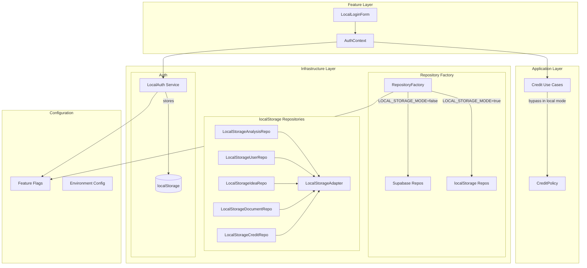
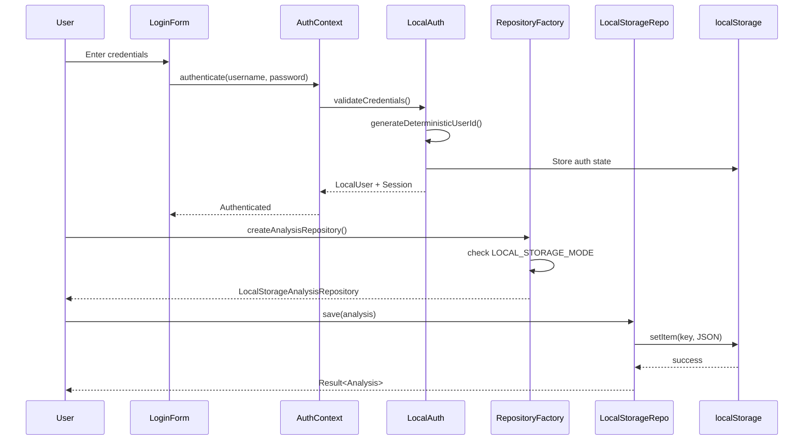

# Design Document: Open Source Mode

## Overview

Open Source Mode enables "No Vibe No Code" to run as a fully functional local-only application without requiring Supabase database setup. This feature reduces friction for open source contributors, hackathon demos, and self-hosted deployments by using browser localStorage for data persistence and simple username/password authentication.

The implementation follows the existing hexagonal architecture pattern, introducing new localStorage repository implementations that conform to existing repository interfaces. This ensures the application code remains consistent regardless of the storage backend.

## Architecture

### High-Level Architecture



### Component Interaction Flow



## Components and Interfaces

### 1. Feature Flag Configuration

**File**: `lib/featureFlags.config.ts`

```typescript
LOCAL_STORAGE_MODE: defineBooleanFlag({
  key: "LOCAL_STORAGE_MODE",
  description: "Open source mode - localStorage + simple auth, no Supabase required",
  default: resolveBooleanEnvFlag(process.env.LOCAL_STORAGE_MODE) ?? false,
  exposeToClient: true,
}),
```

### 2. Local Authentication Service

**File**: `lib/auth/localAuth.ts`

```typescript
interface LocalUser {
  id: string; // Deterministic from username hash
  username: string;
  email: string; // Generated: {username}@local.nvnc
  tier: "admin"; // Always admin in local mode
  createdAt: string;
  lastLoginAt: string;
}

interface LocalAuthState {
  isAuthenticated: boolean;
  user: LocalUser | null;
  sessionCreatedAt: string;
}

interface LocalAuthService {
  validateCredentials(username: string, password: string): boolean;
  generateUserId(username: string): string;
  createLocalUser(username: string): LocalUser;
  getAuthState(): LocalAuthState | null;
  setAuthState(state: LocalAuthState): void;
  clearAuthState(): void;
  createMockSession(user: LocalUser): Session;
}
```

**Key Implementation Details**:

- User ID generated using deterministic hash: `local-user-${hash(username)}`
- Credentials validated against `LOCAL_AUTH_USERNAME` and `LOCAL_AUTH_PASSWORD` env vars (defaults: kiro/kiro)
- Auth state stored in localStorage under key `nvnc-local-auth`
- Mock Session object compatible with Supabase Session interface

### 3. LocalLoginForm Component

**File**: `features/auth/components/LocalLoginForm.tsx`

```typescript
interface LocalLoginFormProps {
  onSuccess?: () => void;
}

// Component renders:
// - Username input field
// - Password input field
// - Submit button
// - Error message display
// - Styled to match existing UI theme
```

### 4. LocalStorage Adapter

**File**: `src/infrastructure/database/localStorage/LocalStorageAdapter.ts`

```typescript
interface LocalStorageAdapter<T> {
  readonly storageKey: string;

  getAll(): T[];
  getById(id: string): T | null;
  save(item: T): void;
  update(id: string, item: T): void;
  delete(id: string): boolean;
  deleteAll(): void;
  count(): number;
}

// Storage key constants
const STORAGE_KEYS = {
  AUTH: "nvnc-local-auth",
  USER: "nvnc-local-user",
  ANALYSES: "nvnc-local-analyses",
  HACKATHON: "nvnc-local-hackathon",
  IDEAS: "nvnc-local-ideas",
  DOCUMENTS: "nvnc-local-documents",
  CREDITS: "nvnc-local-credits",
} as const;
```

### 5. localStorage Repository Implementations

Each repository implements the corresponding domain interface:

**LocalStorageAnalysisRepository** implements `IAnalysisRepository`
**LocalStorageUserRepository** implements `IUserRepository`
**LocalStorageIdeaRepository** implements `IIdeaRepository`
**LocalStorageDocumentRepository** implements `IDocumentRepository`
**LocalStorageCreditTransactionRepository** implements `ICreditTransactionRepository`

All repositories:

- Use `LocalStorageAdapter` for CRUD operations
- Convert between domain entities and JSON-serializable objects
- Handle localStorage errors (quota, corruption)
- Return `Result<T, Error>` types consistent with existing interfaces

### 6. Updated RepositoryFactory

**File**: `src/infrastructure/factories/RepositoryFactory.ts`

```typescript
createAnalysisRepository(): IAnalysisRepository {
  if (isEnabled("LOCAL_STORAGE_MODE")) {
    return new LocalStorageAnalysisRepository();
  }
  // Existing Supabase implementation
  return new SupabaseAnalysisRepository(this.supabaseClient, mapper);
}
```

### 7. Credit System Bypass

**Files**:

- `src/application/use-cases/CheckCreditsUseCase.ts`
- `src/application/use-cases/DeductCreditUseCase.ts`
- `src/application/use-cases/GetCreditBalanceUseCase.ts`

```typescript
// In CheckCreditsUseCase
async execute(userId: UserId, requiredCredits: number): Promise<Result<boolean, Error>> {
  if (isEnabled("LOCAL_STORAGE_MODE")) {
    return Result.ok(true); // Always has enough credits
  }
  // Normal credit check logic
}

// In GetCreditBalanceUseCase
async execute(userId: UserId): Promise<Result<CreditBalance, Error>> {
  if (isEnabled("LOCAL_STORAGE_MODE")) {
    return Result.ok({ credits: 9999, tier: "admin" });
  }
  // Normal balance retrieval
}
```

## Data Models

### localStorage Data Structures

```typescript
// Stored under nvnc-local-auth
interface StoredAuthState {
  isAuthenticated: boolean;
  user: {
    id: string;
    username: string;
    email: string;
    tier: "admin";
    createdAt: string;
    lastLoginAt: string;
  } | null;
  sessionCreatedAt: string;
}

// Stored under nvnc-local-analyses
interface StoredAnalysis {
  id: string;
  userId: string;
  idea: string;
  locale: string;
  category: string;
  score: number;
  analysis: object; // Full analysis result
  createdAt: string;
  updatedAt: string;
}

// Stored under nvnc-local-ideas
interface StoredIdea {
  id: string;
  userId: string;
  ideaText: string;
  source: "manual" | "frankenstein";
  projectStatus: "idea" | "in_progress" | "completed" | "archived";
  notes: string | null;
  tags: string[];
  createdAt: string;
  updatedAt: string;
}

// Stored under nvnc-local-documents
interface StoredDocument {
  id: string;
  ideaId: string;
  userId: string;
  documentType: string;
  title: string | null;
  content: object;
  version: number;
  createdAt: string;
  updatedAt: string;
}

// Stored under nvnc-local-credits
interface StoredCreditTransaction {
  id: string;
  userId: string;
  amount: number;
  type: "deduct" | "add" | "refund" | "admin_adjustment";
  description: string;
  createdAt: string;
}
```

### Entity Mapping

Domain entities are mapped to/from stored JSON using mapper functions:

```typescript
// Example: Analysis mapping
function toStoredAnalysis(analysis: Analysis): StoredAnalysis {
  return {
    id: analysis.id.value,
    userId: analysis.userId.value,
    idea: analysis.idea,
    locale: analysis.locale.value,
    category: analysis.category.value,
    score: analysis.score.value,
    analysis: analysis.analysisResult,
    createdAt: analysis.createdAt.toISOString(),
    updatedAt: analysis.updatedAt.toISOString(),
  };
}

function toDomainAnalysis(stored: StoredAnalysis): Analysis {
  return Analysis.reconstruct({
    id: AnalysisId.fromString(stored.id),
    userId: UserId.fromString(stored.userId),
    idea: stored.idea,
    locale: Locale.fromString(stored.locale),
    category: Category.fromString(stored.category),
    score: new Score(stored.score),
    analysisResult: stored.analysis,
    createdAt: new Date(stored.createdAt),
    updatedAt: new Date(stored.updatedAt),
  });
}
```

## Correctness Properties

_A property is a characteristic or behavior that should hold true across all valid executions of a system-essentially, a formal statement about what the system should do. Properties serve as the bridge between human-readable specifications and machine-verifiable correctness guarantees._

Based on the prework analysis, the following correctness properties have been identified:

### Property 1: Repository type matches LOCAL_STORAGE_MODE configuration

_For any_ configuration state, when LOCAL_STORAGE_MODE is true, the RepositoryFactory SHALL return localStorage repository implementations, and when LOCAL_STORAGE_MODE is false, it SHALL return Supabase repository implementations.

**Validates: Requirements 1.3, 1.4, 5.1, 5.2**

### Property 2: Local authentication determinism

_For any_ username string, the generated user ID SHALL always be the same value when generated multiple times with the same input.

**Validates: Requirements 2.4**

### Property 3: Local authentication tier assignment

_For any_ successfully authenticated local user, the user's tier SHALL always be "admin".

**Validates: Requirements 2.5**

### Property 4: Valid credentials authentication success

_For any_ credentials that match the configured LOCAL_AUTH_USERNAME and LOCAL_AUTH_PASSWORD (or defaults kiro/kiro), authentication SHALL succeed and return a valid LocalUser.

**Validates: Requirements 2.2**

### Property 5: Invalid credentials authentication failure

_For any_ credentials that do not match the configured LOCAL_AUTH_USERNAME and LOCAL_AUTH_PASSWORD, authentication SHALL fail and return an error.

**Validates: Requirements 2.3**

### Property 6: Entity serialization round-trip

_For any_ domain entity (Analysis, Idea, Document, CreditTransaction), serializing to JSON and deserializing back SHALL produce an equivalent entity with all properties preserved.

**Validates: Requirements 3.6, 3.7**

### Property 7: Data persistence round-trip

_For any_ entity saved to localStorage, retrieving it by ID SHALL return an equivalent entity with all properties preserved.

**Validates: Requirements 3.1, 3.2, 3.3, 3.4**

### Property 8: Credit bypass in local mode

_For any_ credit check operation when LOCAL_STORAGE_MODE is enabled, the operation SHALL return success (sufficient credits) regardless of the actual balance.

**Validates: Requirements 4.1, 4.2, 4.3**

### Property 9: Credit balance in local mode

_For any_ credit balance query when LOCAL_STORAGE_MODE is enabled, the returned balance SHALL be 9999 with tier "admin".

**Validates: Requirements 4.1**

### Property 10: Credit enforcement in normal mode

_For any_ credit check operation when LOCAL_STORAGE_MODE is disabled, the operation SHALL enforce normal credit system rules based on actual balance.

**Validates: Requirements 4.4**

## Error Handling

### localStorage Errors

| Error Type               | Cause                       | Handling                                                 |
| ------------------------ | --------------------------- | -------------------------------------------------------- |
| `StorageQuotaError`      | localStorage quota exceeded | Display user-friendly message, suggest clearing old data |
| `StorageCorruptionError` | Invalid JSON in storage     | Clear corrupted key, return empty/default data           |
| `LocalStorageError`      | General storage failure     | Log error, display generic error message                 |

### Authentication Errors

| Error Type          | Cause                       | Handling                              |
| ------------------- | --------------------------- | ------------------------------------- |
| Invalid credentials | Username/password mismatch  | Display "Invalid credentials" message |
| Storage unavailable | localStorage not accessible | Display "Storage unavailable" message |

### Configuration Errors

| Error Type             | Cause                  | Handling                                    |
| ---------------------- | ---------------------- | ------------------------------------------- |
| Missing GEMINI_API_KEY | API key not configured | Display clear error with setup instructions |

## Testing Strategy

### Dual Testing Approach

This feature requires both unit tests and property-based tests:

- **Unit tests**: Verify specific examples, edge cases, and error conditions
- **Property-based tests**: Verify universal properties that should hold across all inputs

### Property-Based Testing Framework

**Library**: fast-check (already available in the project via @faker-js/faker patterns)

**Configuration**: Each property test runs a minimum of 100 iterations.

**Test Annotation Format**: `**Feature: open-source-mode, Property {number}: {property_text}**`

### Unit Tests

1. **LocalAuth Service Tests**

   - Test credential validation with valid/invalid inputs
   - Test user ID generation determinism
   - Test auth state persistence and retrieval
   - Test mock session creation

2. **LocalStorageAdapter Tests**

   - Test CRUD operations
   - Test error handling for quota exceeded
   - Test error handling for corrupted data
   - Test namespace prefixing

3. **localStorage Repository Tests**

   - Test each repository method
   - Test entity mapping to/from JSON
   - Test pagination and filtering

4. **RepositoryFactory Tests**

   - Test repository type selection based on feature flag
   - Test caching behavior

5. **Credit Bypass Tests**
   - Test CheckCreditsUseCase in local mode
   - Test DeductCreditUseCase in local mode
   - Test GetCreditBalanceUseCase in local mode

### Property-Based Tests

1. **Property 1**: Repository type matches configuration
2. **Property 2**: Local authentication determinism
3. **Property 3**: Local authentication tier assignment
4. **Property 4**: Valid credentials authentication success
5. **Property 5**: Invalid credentials authentication failure
6. **Property 6**: Entity serialization round-trip
7. **Property 7**: Data persistence round-trip
8. **Property 8**: Credit bypass in local mode
9. **Property 9**: Credit balance in local mode
10. **Property 10**: Credit enforcement in normal mode

### Integration Tests

1. **Full Auth Flow**

   - Login with valid credentials → dashboard access
   - Login with invalid credentials → error display
   - Sign out → auth state cleared

2. **Data Persistence Flow**

   - Create analysis → verify in localStorage
   - Refresh page → data still available
   - Delete analysis → removed from localStorage

3. **Feature Flag Toggle**
   - Enable LOCAL_STORAGE_MODE → localStorage repos used
   - Disable LOCAL_STORAGE_MODE → Supabase repos used

### E2E Tests (Playwright)

1. **Local Mode Login**

   - Navigate to login page
   - Enter default credentials (kiro/kiro)
   - Verify redirect to dashboard

2. **Analysis Creation**

   - Create new analysis
   - Verify analysis appears in dashboard
   - Refresh page, verify persistence

3. **Credit Display**
   - Verify credit counter shows 9999
   - Perform credit-consuming operation
   - Verify operation succeeds
