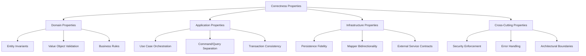

# Design Document: Property-Based Testing Framework

## Overview

This document defines the correctness properties that must hold true across the No Vibe No Code application. These properties serve as invariants that validate business rules, architectural constraints, and data integrity throughout the system's lifecycle.

Property-based testing complements traditional example-based testing by defining rules that should always be true, regardless of specific input values. This approach helps catch edge cases and ensures system behavior remains consistent as the codebase evolves.

## Architecture

### Property Categories



## Correctness Properties by Layer

### 1. Domain Layer Properties

#### Property 1.1: Entity Identity Immutability

**Statement**: Once an entity is created, its identity (ID) cannot be changed.

**Formal Definition**:

```typescript
∀ entity: Entity<TId>, ∀ id1, id2: TId
  entity.id === id1 ⇒ entity.id === id1 (always)
```

**Test Strategy**:

- Create entity with ID
- Attempt to access ID multiple times
- Verify ID remains constant
- Verify no setter exists for ID

**Implementation Location**: `src/domain/entities/shared/Entity.ts`

#### Property 1.2: Value Object Immutability

**Statement**: Value objects cannot be modified after creation.

**Formal Definition**:

```typescript
∀ vo: ValueObject, ∀ property: keyof vo
  vo[property] === initial_value ⇒ vo[property] === initial_value (always)
```

**Test Strategy**:

- Create value object with initial values
- Verify all properties are readonly
- Attempt to modify properties (should fail at compile time)
- Verify equals() method works correctly

**Implementation Location**: `src/domain/value-objects/*.ts`

#### Property 1.3: Score Bounds

**Statement**: Final score values must always be between 0 and 5 inclusive.

**Formal Definition**:

```typescript
∀ finalScore: number
  0 ≤ finalScore ≤ 5
```

**Test Strategy**:

- Test boundary values (0, 5)
- Test invalid values (-1, 6, NaN, Infinity)
- Test decimal values within range (e.g., 3.7, 4.2)
- Verify system clamps or validates scores to be within bounds
- Test ScoreGauge component with various score values

**Implementation Location**: `features/shared/components/ScoreGauge.tsx`, analysis calculation logic

#### Property 1.4: Email Format Validation

**Statement**: Email value objects must contain valid email addresses.

**Formal Definition**:

```typescript
∀ email: Email
  email.value matches /^[^\s@]+@[^\s@]+\.[^\s@]+$/
```

**Test Strategy**:

- Test valid email formats
- Test invalid formats (no @, no domain, spaces, etc.)
- Test edge cases (multiple @, special characters)
- Verify constructor throws for invalid emails

**Implementation Location**: `src/domain/value-objects/Email.ts`

#### Property 1.5: Analysis Entity Completeness

**Statement**: Analysis entities must have all required fields populated with valid values.

**Formal Definition**:

```typescript
∀ analysis: Analysis
  analysis.id is string ∧
  analysis.idea.length > 0 ∧
  analysis.userId is string ∧
  0 ≤ analysis.finalScore ≤ 5 ∧
  analysis.createdAt is valid ISO 8601 string
```

**Test Strategy**:

- Create Analysis with all required fields
- Verify each field is present and valid
- Verify finalScore is within 0-5 range
- Test factory methods enforce requirements
- Test reconstruction from persistence

**Implementation Location**: Analysis type in `lib/types.ts`, database repositories

### 2. Application Layer Properties

#### Property 2.1: Use Case Input Validation

**Statement**: Use cases must validate all inputs before executing business logic.

**Formal Definition**:

```typescript
∀ useCase: UseCase, ∀ input: Input
  useCase.execute(input) ⇒ validate(input) === true ∨ throw ValidationError
```

**Test Strategy**:

- Test use case with invalid inputs
- Verify validation occurs before any side effects
- Verify appropriate errors are thrown
- Test with boundary values

**Implementation Location**: `src/application/use-cases/*.ts`

#### Property 2.2: Use Case Transactional Consistency

**Statement**: Use cases either complete all operations successfully or leave no side effects.

**Formal Definition**:

```typescript
∀ useCase: UseCase, ∀ state: SystemState
  useCase.execute() succeeds ⇒ state' = expected_state
  useCase.execute() fails ⇒ state' = state (rollback)
```

**Test Strategy**:

- Mock repository to fail mid-operation
- Verify no partial data is persisted
- Test error handling and cleanup
- Verify idempotency where applicable

**Implementation Location**: `src/application/use-cases/*.ts`

#### Property 2.3: Command/Query Separation

**Statement**: Query operations must not modify system state; command operations may modify state.

**Formal Definition**:

```typescript
∀ query: QueryHandler, ∀ state: SystemState
  query.handle() ⇒ state' = state (no modification)

∀ command: CommandHandler, ∀ state: SystemState
  command.handle() ⇒ state' may differ from state
```

**Test Strategy**:

- Execute query handlers multiple times
- Verify system state unchanged
- Verify queries are idempotent
- Test command handlers modify state appropriately

**Implementation Location**: `src/application/handlers/queries/*.ts`, `src/application/handlers/commands/*.ts`

#### Property 2.4: Score Calculation Determinism

**Statement**: Given the same inputs, score calculations must always produce the same output within the 0-5 range.

**Formal Definition**:

```typescript
∀ criteria: ScoreCriterion[]
  finalScore = average(criteria.map(c => c.score)) ∧
  0 ≤ finalScore ≤ 5 ∧
  calculateScore(criteria) === calculateScore(criteria)
```

**Test Strategy**:

- Calculate score multiple times with same inputs
- Verify results are identical
- Test with various criteria combinations (all 1-5 range)
- Verify averaging formula consistency
- Test rounding behavior (typically to 1 decimal place)

**Implementation Location**: Analysis calculation logic in AI services and use cases

#### Property 2.5: Analysis Validation Consistency

**Statement**: Analysis validation must consistently apply business rules.

**Formal Definition**:

```typescript
∀ analysis: Analysis
  validate(analysis) === true ⇒ analysis satisfies all business rules
  validate(analysis) === false ⇒ ∃ rule: analysis violates rule
```

**Test Strategy**:

- Test validation with valid analyses
- Test validation with various invalid states
- Verify error messages are descriptive
- Test edge cases and boundary conditions

**Implementation Location**: `src/domain/services/AnalysisValidationService.ts`

### 3. Infrastructure Layer Properties

#### Property 3.1: Repository Round-Trip Fidelity

**Statement**: Saving and retrieving an entity must preserve all entity data.

**Formal Definition**:

```typescript
∀ entity: Entity, ∀ repository: Repository
  repository.save(entity) ⇒ repository.findById(entity.id) ≡ entity
```

**Test Strategy**:

- Save entity to repository
- Retrieve entity by ID
- Compare all fields for equality
- Test with various entity states

**Implementation Location**: `src/infrastructure/database/supabase/repositories/*.ts`

#### Property 3.2: Mapper Bidirectionality

**Statement**: Converting entity → DAO → entity must preserve entity data.

**Formal Definition**:

```typescript
∀ entity: Entity, ∀ mapper: Mapper
  mapper.toDomain(mapper.toDAO(entity)) ≡ entity
```

**Test Strategy**:

- Convert entity to DAO
- Convert DAO back to entity
- Verify all fields match original
- Test with complex nested structures

**Implementation Location**: `src/infrastructure/database/supabase/mappers/*.ts`

#### Property 3.3: DTO Conversion Preserves Business Data

**Statement**: Converting entity → DTO must preserve all business-critical fields.

**Formal Definition**:

```typescript
∀ entity: Entity, ∀ mapper: Mapper
  dto = mapper.toDTO(entity) ⇒
    dto.id === entity.id.value ∧
    dto.businessField === entity.businessField (for all critical fields)
```

**Test Strategy**:

- Convert entity to DTO
- Verify all business fields present
- Verify ID conversion correct
- Test with optional fields

**Implementation Location**: `src/infrastructure/database/supabase/mappers/*.ts`

#### Property 3.4: Database Error Translation

**Statement**: Infrastructure errors must be translated to domain errors.

**Formal Definition**:

```typescript
∀ operation: DatabaseOperation
  operation fails with InfrastructureError ⇒
    throw DomainError (not InfrastructureError)
```

**Test Strategy**:

- Mock database to throw errors
- Verify domain errors are thrown
- Verify error messages are meaningful
- Test various error scenarios

**Implementation Location**: `src/infrastructure/database/supabase/repositories/*.ts`

#### Property 3.5: External Service Contract Adherence

**Statement**: External service adapters must adhere to domain service interfaces.

**Formal Definition**:

```typescript
∀ adapter: ExternalAdapter, ∀ interface: DomainInterface
  adapter implements interface ⇒
    adapter.method() returns interface.ReturnType
```

**Test Strategy**:

- Verify adapter implements interface
- Test all interface methods
- Verify return types match
- Test error handling

**Implementation Location**: `src/infrastructure/external/ai/*.ts`

### 4. Cross-Cutting Properties

#### Property 4.1: Authentication Enforcement

**Statement**: Protected operations must reject unauthenticated requests.

**Formal Definition**:

```typescript
∀ operation: ProtectedOperation, ∀ user: User | null
  user === null ⇒ operation throws AuthenticationError
```

**Test Strategy**:

- Call protected operations without authentication
- Verify authentication errors thrown
- Test with expired sessions
- Test with invalid tokens

**Implementation Location**: `src/infrastructure/web/middleware/AuthMiddleware.ts`

#### Property 4.2: Authorization Enforcement

**Statement**: Users can only access their own resources.

**Formal Definition**:

```typescript
∀ user: User, ∀ resource: Resource
  resource.userId !== user.id ⇒ access denied
```

**Test Strategy**:

- Attempt to access other user's resources
- Verify authorization errors thrown
- Test with various resource types
- Test admin overrides if applicable

**Implementation Location**: `src/application/use-cases/*.ts`

#### Property 4.3: Error Code Consistency

**Statement**: Domain errors must have consistent error codes.

**Formal Definition**:

```typescript
∀ error: DomainError
  error.code matches /^[A-Z_]+$/ ∧
  error.code is unique within error type
```

**Test Strategy**:

- Verify all domain errors have codes
- Verify codes follow naming convention
- Verify codes are unique
- Test error serialization

**Implementation Location**: `src/domain/types/errors.ts`

#### Property 4.4: Logging Consistency

**Statement**: All operations must log at appropriate levels with sufficient context.

**Formal Definition**:

```typescript
∀ operation: Operation
  operation starts ⇒ log(INFO, context)
  operation succeeds ⇒ log(INFO, result)
  operation fails ⇒ log(ERROR, error + context)
```

**Test Strategy**:

- Verify logs generated for operations
- Verify log levels appropriate
- Verify context included
- Verify no sensitive data logged

**Implementation Location**: `lib/logger/*.ts`

#### Property 4.5: Hexagonal Architecture Dependency Rules

**Statement**: Dependencies must flow from outer layers to inner layers only.

**Formal Definition**:

```typescript
Domain depends on: ∅
Application depends on: Domain
Infrastructure depends on: Domain ∪ Application
Features depends on: Application ∪ Infrastructure
```

**Test Strategy**:

- Static analysis of imports
- Verify no reverse dependencies
- Test with dependency injection
- Verify interfaces in domain layer

**Implementation Location**: Project-wide

#### Property 4.6: Locale Consistency

**Statement**: All user-facing content must respect the user's locale preference.

**Formal Definition**:

```typescript
∀ user: User, ∀ content: UserFacingContent
  user.locale === 'es' ⇒ content.language === 'es'
  user.locale === 'en' ⇒ content.language === 'en'
  user.locale ∉ ['en', 'es'] ⇒ content.language === 'en' (fallback)
```

**Test Strategy**:

- Set user locale to each supported language
- Verify all content in correct language
- Test fallback behavior
- Test locale persistence

**Implementation Location**: `features/locale/*.tsx`

#### Property 4.7: Rate Limit Fairness

**Statement**: Rate limits must be applied consistently per user.

**Formal Definition**:

```typescript
∀ user: User, ∀ window: TimeWindow
  requests(user, window) ≤ limit(user.tier) ⇒ allow
  requests(user, window) > limit(user.tier) ⇒ reject with RateLimitError
```

**Test Strategy**:

- Make requests up to limit
- Verify requests allowed
- Exceed limit
- Verify rejection with clear error
- Test limit reset after window

**Implementation Location**: `src/application/services/*.ts`

#### Property 4.8: Feature Flag Evaluation

**Statement**: Feature flags must be evaluated consistently.

**Formal Definition**:

```typescript
∀ flag: FeatureFlag, ∀ context: Context
  isEnabled(flag, context) === true ⇒ execute feature
  isEnabled(flag, context) === false ⇒ skip feature
  isEnabled(flag, context) === undefined ⇒ use default value
```

**Test Strategy**:

- Test with flag enabled
- Test with flag disabled
- Test with flag undefined
- Test dynamic flag changes

**Implementation Location**: `lib/featureFlags.ts`

### 5. Hackathon-Specific Properties

#### Property 5.1: Category Evaluation Completeness

**Statement**: All hackathon projects must be evaluated against all four categories.

**Formal Definition**:

```typescript
∀ project: HackathonProject
  analyze(project).categoryAnalysis.evaluations.length === 4 ∧
  categories = ['resurrection', 'frankenstein', 'skeleton-crew', 'costume-contest']
```

**Test Strategy**:

- Analyze various projects
- Verify all four categories evaluated
- Verify each has fit score 0-5
- Verify explanations provided

**Implementation Location**: `features/kiroween-analyzer/utils/categoryMatcher.ts`

#### Property 5.2: Criteria Scoring Bounds

**Statement**: Hackathon criteria scores must be within valid ranges.

**Formal Definition**:

```typescript
∀ project: HackathonProject, ∀ criterion: CriteriaScore
  1 ≤ criterion.score ≤ 5 ∧
  0 ≤ finalScore ≤ 5
```

**Test Strategy**:

- Analyze projects
- Verify each criterion score 1-5
- Verify final score 0-5 (average of criteria)
- Test edge cases (all 1s, all 5s, mixed)
- Verify decimal precision (typically 1 decimal place)

**Implementation Location**: `features/kiroween-analyzer/utils/hackathonScoring.ts`

#### Property 5.3: Best Match Identification

**Statement**: The best-match category must be the one with the highest fit score.

**Formal Definition**:

```typescript
∀ analysis: HackathonAnalysis
  analysis.categoryAnalysis.bestMatch ===
    argmax(evaluation.fitScore for evaluation in evaluations)
```

**Test Strategy**:

- Analyze projects with clear best match
- Verify best match correctly identified
- Test ties (should pick first or have tiebreaker)
- Verify explanation provided

**Implementation Location**: `features/kiroween-analyzer/utils/categoryMatcher.ts`

## Testing Implementation Strategy

### Test Organization

```
src/
├── domain/
│   ├── entities/
│   │   └── __tests__/
│   │       ├── Analysis.properties.test.ts
│   │       └── User.properties.test.ts
│   ├── value-objects/
│   │   └── __tests__/
│   │       ├── Score.properties.test.ts
│   │       ├── Email.properties.test.ts
│   │       └── AnalysisId.properties.test.ts
│   └── services/
│       └── __tests__/
│           ├── ScoreCalculation.properties.test.ts
│           └── AnalysisValidation.properties.test.ts
├── application/
│   ├── use-cases/
│   │   └── __tests__/
│   │       ├── AnalyzeIdea.properties.test.ts
│   │       └── SaveAnalysis.properties.test.ts
│   └── handlers/
│       └── __tests__/
│           ├── CommandHandlers.properties.test.ts
│           └── QueryHandlers.properties.test.ts
└── infrastructure/
    ├── database/
    │   └── __tests__/
    │       ├── Repository.properties.test.ts
    │       └── Mapper.properties.test.ts
    └── web/
        └── __tests__/
            └── Middleware.properties.test.ts
```

### Property Test Template

```typescript
import { describe, it, expect } from "vitest";

describe("Property: [Property Name]", () => {
  describe("[Component Name]", () => {
    it("should maintain [property description]", () => {
      // Arrange: Set up test data
      const input = createTestInput();

      // Act: Perform operation
      const result = performOperation(input);

      // Assert: Verify property holds
      expect(result).toSatisfyProperty();
    });

    it("should handle edge case: [edge case description]", () => {
      // Test boundary conditions
    });

    it("should reject invalid input: [invalid case]", () => {
      // Test error cases
      expect(() => performOperation(invalidInput)).toThrow();
    });
  });
});
```

### Property-Based Test Generators

For comprehensive property testing, use generators to create varied test inputs:

```typescript
// Example: Score generator
function* scoreGenerator() {
  // Boundary values
  yield 0;
  yield 5;

  // Valid random values (0-5 with decimals)
  for (let i = 0; i < 10; i++) {
    yield Math.random() * 5;
  }

  // Common decimal values
  yield 3.7;
  yield 4.2;
  yield 2.5;

  // Invalid values (should be clamped or rejected)
  yield -1;
  yield 6;
  yield NaN;
  yield Infinity;
}

// Example: Email generator
function* emailGenerator() {
  // Valid emails
  yield "user@example.com";
  yield "test.user+tag@domain.co.uk";

  // Invalid emails
  yield "notanemail";
  yield "@example.com";
  yield "user@";
  yield "user @example.com";
}
```

## Continuous Property Verification

### CI/CD Integration

Properties should be verified in CI/CD pipeline:

```yaml
# .github/workflows/properties.yml
name: Property Tests

on: [push, pull_request]

jobs:
  property-tests:
    runs-on: ubuntu-latest
    steps:
      - uses: actions/checkout@v3
      - uses: actions/setup-node@v3
      - run: npm ci
      - run: npm run test:properties
      - run: npm run test:coverage
```

### Property Coverage Tracking

Track which properties are tested:

```typescript
// Property coverage report
interface PropertyCoverage {
  propertyId: string;
  propertyName: string;
  layer: "domain" | "application" | "infrastructure" | "cross-cutting";
  tested: boolean;
  testFile: string;
  lastVerified: Date;
}
```

## Documentation and Maintenance

### Property Documentation

Each property should be documented with:

1. **Formal statement**: Mathematical or logical definition
2. **Plain English explanation**: What the property means
3. **Why it matters**: Business or technical justification
4. **Test location**: Where the property is verified
5. **Related properties**: Dependencies or related invariants

### Property Evolution

As the system evolves:

1. **New features**: Define new properties
2. **Refactoring**: Update property tests
3. **Bug fixes**: Add properties to prevent regression
4. **Architecture changes**: Verify properties still hold

## Performance Considerations

### Property Test Optimization

- Run property tests in parallel
- Cache test fixtures
- Use fast-check or similar libraries for generative testing
- Separate slow integration property tests from fast unit property tests

### Selective Property Verification

Not all properties need verification on every commit:

- **Critical properties**: Run on every commit
- **Expensive properties**: Run nightly or on release branches
- **Integration properties**: Run on staging deployments

## Conclusion

This property-based testing framework ensures that No Vibe No Code maintains correctness across all layers of the hexagonal architecture. By defining and continuously verifying these properties, we catch bugs early, prevent regressions, and maintain system integrity as the codebase evolves.
