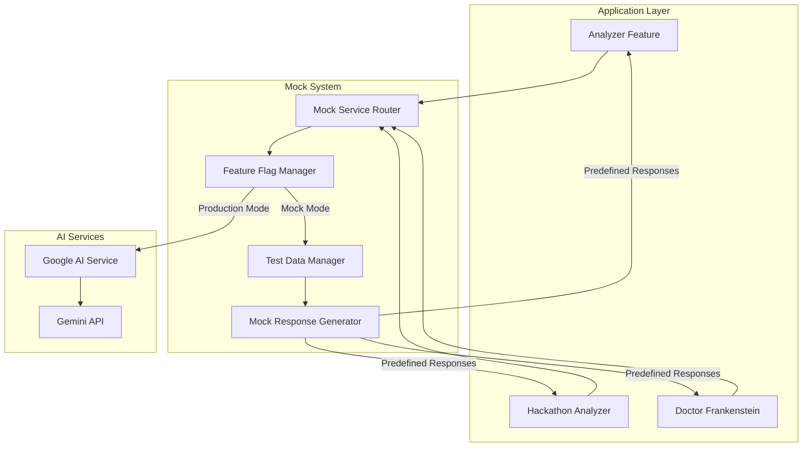

# Design Document - Testing Automation & Mock System

## Overview

This document outlines the design for a comprehensive testing automation system that includes mock API services for AI integrations and end-to-end testing capabilities. The system enables development and testing without consuming API credits, provides consistent test results, and supports offline development workflows.

### Goals

- Reduce development costs by eliminating unnecessary API calls during testing
- Improve test reliability with consistent, predictable responses
- Enable offline development and testing
- Accelerate test execution by removing network latency
- Support multiple testing scenarios (success, errors, timeouts, rate limits)

### Non-Goals

- Replace production AI services
- Provide AI model training or fine-tuning
- Implement real-time AI response generation
- Support non-Gemini AI services (out of scope for MVP)

## Architecture

### High-Level Architecture




### Component Architecture

The system follows a layered architecture with clear separation of concerns:

1. **Mock Service Layer**: Intercepts AI service calls and routes to mock or production
2. **Test Data Layer**: Manages predefined responses and scenarios
3. **E2E Testing Layer**: Provides browser automation and test orchestration
4. **Configuration Layer**: Manages feature flags and environment settings


## Components and Interfaces

### 1. Mock Service Router

**Purpose**: Intercepts AI service calls and routes them to mock or production implementations based on feature flags.

**Interface**:
```typescript
interface IMockServiceRouter {
  // Route AI analysis request to mock or production
  routeAnalysisRequest(
    request: AnalysisRequest,
    useMock: boolean
  ): Promise<AnalysisResponse>;
  
  // Check if mock mode is active
  isMockMode(): boolean;
  
  // Get current routing configuration
  getRoutingConfig(): RoutingConfig;
}

interface AnalysisRequest {
  type: 'analyzer' | 'hackathon' | 'frankenstein';
  payload: unknown;
  locale: string;
}

interface AnalysisResponse {
  success: boolean;
  data?: unknown;
  error?: Error;
}
```

**Responsibilities**:
- Read feature flag configuration
- Route requests to appropriate service (mock or production)
- Log routing decisions for debugging
- Handle service initialization


### 2. Test Data Manager

**Purpose**: Manages predefined mock responses and test scenarios.

**Interface**:
```typescript
interface ITestDataManager {
  // Get mock response for a specific scenario
  getMockResponse(
    type: 'analyzer' | 'hackathon' | 'frankenstein',
    scenario: TestScenario
  ): MockResponse;
  
  // Get random response variant
  getRandomVariant(
    type: 'analyzer' | 'hackathon' | 'frankenstein'
  ): MockResponse;
  
  // Validate mock response against schema
  validateMockResponse(
    response: MockResponse,
    schema: ResponseSchema
  ): ValidationResult;
  
  // Load custom test data
  loadCustomTestData(filePath: string): Promise<void>;
}

type TestScenario = 
  | 'success'
  | 'api_error'
  | 'timeout'
  | 'rate_limit'
  | 'invalid_input'
  | 'partial_response';

interface MockResponse {
  data: unknown;
  delay?: number; // Simulated network delay in ms
  statusCode: number;
  headers?: Record<string, string>;
}
```

**Responsibilities**:
- Store and retrieve predefined mock responses
- Support multiple response variants for variability
- Validate mock responses against schemas
- Load custom test data from files


### 3. Mock AI Service Implementation

**Purpose**: Implements the IAIAnalysisService interface with mock responses.

**Interface**:
```typescript
class MockAIAnalysisService implements IAIAnalysisService {
  constructor(
    private readonly testDataManager: ITestDataManager,
    private readonly config: MockServiceConfig
  ) {}
  
  async analyzeIdea(
    idea: string,
    locale: Locale
  ): Promise<Result<AIAnalysisResult, Error>>;
  
  async analyzeHackathonProject(
    projectName: string,
    description: string,
    kiroUsage: string,
    locale: Locale
  ): Promise<Result<AIAnalysisResult, Error>>;
  
  async getImprovementSuggestions(
    idea: string,
    currentScore: Score,
    locale: Locale
  ): Promise<Result<string[], Error>>;
  
  async healthCheck(): Promise<Result<HealthStatus, Error>>;
}

interface MockServiceConfig {
  defaultScenario: TestScenario;
  enableVariability: boolean;
  simulateLatency: boolean;
  minLatency: number;
  maxLatency: number;
  logRequests: boolean;
}
```

**Responsibilities**:
- Implement all IAIAnalysisService methods with mock data
- Simulate network latency when configured
- Return appropriate responses based on scenario
- Log mock requests for debugging


### 4. Mock Frankenstein Service

**Purpose**: Provides mock responses for Doctor Frankenstein idea generation.

**Interface**:
```typescript
interface IMockFrankensteinService {
  generateFrankensteinIdea(
    elements: FrankensteinElement[],
    mode: 'companies' | 'aws',
    language: 'en' | 'es'
  ): Promise<FrankensteinIdeaResult>;
}

class MockFrankensteinService implements IMockFrankensteinService {
  constructor(
    private readonly testDataManager: ITestDataManager
  ) {}
  
  async generateFrankensteinIdea(
    elements: FrankensteinElement[],
    mode: 'companies' | 'aws',
    language: 'en' | 'es'
  ): Promise<FrankensteinIdeaResult> {
    // Return predefined mock based on elements and mode
    const mockData = this.testDataManager.getMockResponse(
      'frankenstein',
      'success'
    );
    
    // Customize response based on input
    return this.customizeMockResponse(mockData, elements, mode, language);
  }
}
```

**Responsibilities**:
- Generate mock Frankenstein ideas
- Customize responses based on input elements
- Support both company and AWS modes
- Handle multiple languages


### 5. Feature Flag Manager

**Purpose**: Manages feature flags for toggling between mock and production modes.

**Interface**:
```typescript
interface IFeatureFlagManager {
  // Check if mock mode is enabled
  isMockModeEnabled(): boolean;
  
  // Get feature flag value
  getFlag(flagName: string): boolean | string | number;
  
  // Set feature flag (for testing)
  setFlag(flagName: string, value: boolean | string | number): void;
  
  // Get all flags
  getAllFlags(): Record<string, boolean | string | number>;
}

class FeatureFlagManager implements IFeatureFlagManager {
  private flags: Map<string, boolean | string | number>;
  
  constructor() {
    this.loadFromEnvironment();
  }
  
  private loadFromEnvironment(): void {
    // Load from process.env
    this.flags.set('USE_MOCK_API', process.env.FF_USE_MOCK_API === 'true');
    this.flags.set('MOCK_SCENARIO', process.env.FF_MOCK_SCENARIO || 'success');
    this.flags.set('SIMULATE_LATENCY', process.env.FF_SIMULATE_LATENCY === 'true');
  }
}
```

**Responsibilities**:
- Load feature flags from environment variables
- Provide flag values to other components
- Support runtime flag updates for testing
- Validate flag configurations


### 6. E2E Testing Framework

**Purpose**: Provides browser automation and test orchestration using Playwright.

**Interface**:
```typescript
interface IE2ETestFramework {
  // Setup test environment
  setup(): Promise<void>;
  
  // Teardown test environment
  teardown(): Promise<void>;
  
  // Run test suite
  runTests(suite: TestSuite): Promise<TestResults>;
  
  // Capture screenshot on failure
  captureScreenshot(testName: string): Promise<string>;
  
  // Capture console logs
  captureLogs(testName: string): Promise<string[]>;
  
  // Generate test report
  generateReport(results: TestResults): Promise<string>;
}

interface TestSuite {
  name: string;
  tests: E2ETest[];
  beforeAll?: () => Promise<void>;
  afterAll?: () => Promise<void>;
}

interface E2ETest {
  name: string;
  description: string;
  steps: TestStep[];
  expectedOutcome: string;
}

interface TestStep {
  action: 'navigate' | 'click' | 'type' | 'wait' | 'assert';
  selector?: string;
  value?: string;
  timeout?: number;
}
```

**Responsibilities**:
- Initialize Playwright browser instances
- Execute test steps sequentially
- Capture screenshots and logs on failure
- Generate HTML test reports
- Support parallel test execution


## Data Models

### Mock Response Data Structure

```typescript
// Analyzer Mock Response
interface AnalyzerMockResponse {
  score: number;
  summary: string;
  strengths: string[];
  weaknesses: string[];
  opportunities: string[];
  threats: string[];
  suggestions: string[];
  criteriaScores: Array<{
    criteriaName: string;
    score: number;
    justification: string;
  }>;
  marketPotential: {
    score: number;
    analysis: string;
    targetMarket: string;
    marketSize: string;
  };
  technicalFeasibility: {
    score: number;
    analysis: string;
    complexity: 'low' | 'medium' | 'high';
    requiredSkills: string[];
  };
  businessViability: {
    score: number;
    analysis: string;
    revenueModel: string[];
    competitiveAdvantage: string;
  };
}

// Hackathon Mock Response
interface HackathonMockResponse extends AnalyzerMockResponse {
  categoryRecommendation: {
    primary: string;
    confidence: number;
    alternatives: Array<{
      category: string;
      confidence: number;
      reason: string;
    }>;
  };
  kiroUsageAnalysis: {
    effectiveness: number;
    suggestions: string[];
  };
}

// Frankenstein Mock Response
interface FrankensteinMockResponse {
  idea_title: string;
  idea_description: string;
  core_concept: string;
  problem_statement: string;
  proposed_solution: string;
  unique_value_proposition: string;
  target_audience: string;
  business_model: string;
  growth_strategy: string;
  tech_stack_suggestion: string;
  risks_and_challenges: string;
  metrics: {
    originality_score: number;
    feasibility_score: number;
    impact_score: number;
    scalability_score: number;
    wow_factor: number;
  };
  summary: string;
  language: string;
}
```


### Test Scenario Data Structure

```typescript
interface TestScenarioData {
  scenario: TestScenario;
  description: string;
  mockResponses: {
    analyzer?: AnalyzerMockResponse;
    hackathon?: HackathonMockResponse;
    frankenstein?: FrankensteinMockResponse;
  };
  simulatedDelay?: number;
  errorDetails?: {
    code: string;
    message: string;
    statusCode: number;
  };
}

// Example scenarios
const TEST_SCENARIOS: Record<TestScenario, TestScenarioData> = {
  success: {
    scenario: 'success',
    description: 'Successful API response with realistic data',
    mockResponses: { /* ... */ },
    simulatedDelay: 800
  },
  api_error: {
    scenario: 'api_error',
    description: 'API returns error response',
    errorDetails: {
      code: 'API_ERROR',
      message: 'Gemini API returned an error',
      statusCode: 500
    },
    simulatedDelay: 300
  },
  timeout: {
    scenario: 'timeout',
    description: 'Request times out',
    errorDetails: {
      code: 'TIMEOUT',
      message: 'Request timed out after 30 seconds',
      statusCode: 408
    },
    simulatedDelay: 30000
  },
  rate_limit: {
    scenario: 'rate_limit',
    description: 'Rate limit exceeded',
    errorDetails: {
      code: 'RATE_LIMIT',
      message: 'Too many requests. Please try again later.',
      statusCode: 429
    },
    simulatedDelay: 100
  }
};
```


## File Structure

```
lib/
├── testing/
│   ├── mocks/
│   │   ├── MockAIAnalysisService.ts
│   │   ├── MockFrankensteinService.ts
│   │   ├── MockServiceRouter.ts
│   │   └── index.ts
│   ├── data/
│   │   ├── analyzer-mocks.json
│   │   ├── hackathon-mocks.json
│   │   ├── frankenstein-mocks.json
│   │   └── test-scenarios.json
│   ├── TestDataManager.ts
│   ├── FeatureFlagManager.ts
│   └── index.ts
├── featureFlags.ts (existing - extend)
└── types.ts (existing - extend)

tests/
├── e2e/
│   ├── analyzer.spec.ts
│   ├── hackathon.spec.ts
│   ├── frankenstein.spec.ts
│   ├── dashboard.spec.ts
│   ├── helpers/
│   │   ├── test-helpers.ts
│   │   ├── page-objects/
│   │   │   ├── AnalyzerPage.ts
│   │   │   ├── HackathonPage.ts
│   │   │   ├── FrankensteinPage.ts
│   │   │   └── DashboardPage.ts
│   │   └── fixtures.ts
│   └── playwright.config.ts
└── integration/
    ├── mock-service.test.ts
    ├── test-data-manager.test.ts
    └── feature-flags.test.ts

.github/
└── workflows/
    └── e2e-tests.yml
```


## Integration Points

### 1. Service Factory Integration

The existing `ServiceFactory` will be extended to support mock services:

```typescript
// src/infrastructure/factories/ServiceFactory.ts
class ServiceFactory {
  createAIAnalysisService(): IAIAnalysisService {
    const featureFlagManager = new FeatureFlagManager();
    
    if (featureFlagManager.isMockModeEnabled()) {
      const testDataManager = new TestDataManager();
      const mockConfig = this.getMockServiceConfig();
      return new MockAIAnalysisService(testDataManager, mockConfig);
    }
    
    // Return production service
    return new GoogleAIAnalysisService(this.getGoogleAIConfig());
  }
  
  private getMockServiceConfig(): MockServiceConfig {
    return {
      defaultScenario: process.env.FF_MOCK_SCENARIO as TestScenario || 'success',
      enableVariability: process.env.FF_MOCK_VARIABILITY === 'true',
      simulateLatency: process.env.FF_SIMULATE_LATENCY === 'true',
      minLatency: parseInt(process.env.FF_MIN_LATENCY || '500'),
      maxLatency: parseInt(process.env.FF_MAX_LATENCY || '2000'),
      logRequests: process.env.FF_LOG_MOCK_REQUESTS === 'true'
    };
  }
}
```

### 2. Frankenstein API Integration

The Doctor Frankenstein API route will be updated to support mocks:

```typescript
// app/api/doctor-frankenstein/generate/route.ts
export async function POST(request: NextRequest): Promise<NextResponse> {
  const featureFlagManager = new FeatureFlagManager();
  
  if (featureFlagManager.isMockModeEnabled()) {
    const mockService = new MockFrankensteinService(new TestDataManager());
    const result = await mockService.generateFrankensteinIdea(
      elements,
      mode,
      language
    );
    return NextResponse.json(result);
  }
  
  // Use production service
  const result = await generateFrankensteinIdea(elements, mode, language);
  return NextResponse.json(result);
}
```


### 3. Environment Configuration

New environment variables for mock configuration:

```bash
# Mock Mode Configuration
FF_USE_MOCK_API=true                    # Enable/disable mock mode
FF_MOCK_SCENARIO=success                # Default scenario: success, api_error, timeout, rate_limit
FF_MOCK_VARIABILITY=false               # Enable random response variants
FF_SIMULATE_LATENCY=true                # Simulate network latency
FF_MIN_LATENCY=500                      # Minimum latency in ms
FF_MAX_LATENCY=2000                     # Maximum latency in ms
FF_LOG_MOCK_REQUESTS=true               # Log all mock requests

# E2E Testing Configuration
E2E_BASE_URL=http://localhost:3000      # Base URL for E2E tests
E2E_HEADLESS=true                       # Run tests in headless mode
E2E_TIMEOUT=30000                       # Test timeout in ms
E2E_SCREENSHOT_ON_FAILURE=true          # Capture screenshots on failure
E2E_VIDEO_ON_FAILURE=false              # Record video on failure
```


## Error Handling

### Mock Service Errors

```typescript
class MockServiceError extends Error {
  constructor(
    message: string,
    public readonly code: string,
    public readonly statusCode: number
  ) {
    super(message);
    this.name = 'MockServiceError';
  }
}

// Error scenarios
const MOCK_ERRORS = {
  API_ERROR: new MockServiceError(
    'Simulated API error',
    'API_ERROR',
    500
  ),
  TIMEOUT: new MockServiceError(
    'Request timeout',
    'TIMEOUT',
    408
  ),
  RATE_LIMIT: new MockServiceError(
    'Rate limit exceeded',
    'RATE_LIMIT',
    429
  ),
  INVALID_INPUT: new MockServiceError(
    'Invalid input provided',
    'INVALID_INPUT',
    400
  )
};
```

### E2E Test Error Handling

```typescript
class E2ETestError extends Error {
  constructor(
    message: string,
    public readonly testName: string,
    public readonly step: string,
    public readonly screenshot?: string,
    public readonly logs?: string[]
  ) {
    super(message);
    this.name = 'E2ETestError';
  }
}

// Error recovery strategies
interface ErrorRecoveryStrategy {
  maxRetries: number;
  retryDelay: number;
  captureArtifacts: boolean;
  continueOnFailure: boolean;
}
```


## Testing Strategy

### Unit Tests

Test individual mock components in isolation:

```typescript
describe('MockAIAnalysisService', () => {
  it('should return success response for valid input', async () => {
    const service = new MockAIAnalysisService(testDataManager, config);
    const result = await service.analyzeIdea('Test idea', Locale.create('en'));
    
    expect(result.success).toBe(true);
    expect(result.data?.score).toBeDefined();
  });
  
  it('should simulate API error when configured', async () => {
    const config = { ...defaultConfig, defaultScenario: 'api_error' };
    const service = new MockAIAnalysisService(testDataManager, config);
    const result = await service.analyzeIdea('Test idea', Locale.create('en'));
    
    expect(result.success).toBe(false);
    expect(result.error?.message).toContain('API error');
  });
  
  it('should simulate latency when enabled', async () => {
    const config = { ...defaultConfig, simulateLatency: true, minLatency: 1000 };
    const service = new MockAIAnalysisService(testDataManager, config);
    
    const startTime = Date.now();
    await service.analyzeIdea('Test idea', Locale.create('en'));
    const duration = Date.now() - startTime;
    
    expect(duration).toBeGreaterThanOrEqual(1000);
  });
});
```

### Integration Tests

Test mock service integration with existing components:

```typescript
describe('ServiceFactory with Mocks', () => {
  it('should create mock service when flag is enabled', () => {
    process.env.FF_USE_MOCK_API = 'true';
    const factory = new ServiceFactory(supabase);
    const service = factory.createAIAnalysisService();
    
    expect(service).toBeInstanceOf(MockAIAnalysisService);
  });
  
  it('should create production service when flag is disabled', () => {
    process.env.FF_USE_MOCK_API = 'false';
    const factory = new ServiceFactory(supabase);
    const service = factory.createAIAnalysisService();
    
    expect(service).toBeInstanceOf(GoogleAIAnalysisService);
  });
});
```


### E2E Tests

Test complete user workflows with mock data:

```typescript
// tests/e2e/analyzer.spec.ts
import { test, expect } from '@playwright/test';
import { AnalyzerPage } from './helpers/page-objects/AnalyzerPage';

test.describe('Analyzer E2E Tests', () => {
  let analyzerPage: AnalyzerPage;
  
  test.beforeEach(async ({ page }) => {
    // Enable mock mode
    process.env.FF_USE_MOCK_API = 'true';
    analyzerPage = new AnalyzerPage(page);
    await analyzerPage.navigate();
  });
  
  test('should analyze idea successfully', async () => {
    await analyzerPage.enterIdea('AI-powered task manager');
    await analyzerPage.selectLanguage('en');
    await analyzerPage.clickAnalyze();
    
    await expect(analyzerPage.scoreElement).toBeVisible();
    await expect(analyzerPage.summaryElement).toContainText('potential');
  });
  
  test('should handle API error gracefully', async () => {
    process.env.FF_MOCK_SCENARIO = 'api_error';
    
    await analyzerPage.enterIdea('Test idea');
    await analyzerPage.clickAnalyze();
    
    await expect(analyzerPage.errorMessage).toBeVisible();
    await expect(analyzerPage.errorMessage).toContainText('error');
  });
  
  test('should show loading state during analysis', async () => {
    process.env.FF_SIMULATE_LATENCY = 'true';
    process.env.FF_MIN_LATENCY = '2000';
    
    await analyzerPage.enterIdea('Test idea');
    await analyzerPage.clickAnalyze();
    
    await expect(analyzerPage.loadingSpinner).toBeVisible();
  });
});
```


## CI/CD Integration

### GitHub Actions Workflow

```yaml
# .github/workflows/e2e-tests.yml
name: E2E Tests

on:
  pull_request:
    branches: [main, develop]
  push:
    branches: [main]

jobs:
  e2e-tests:
    runs-on: ubuntu-latest
    
    steps:
      - uses: actions/checkout@v3
      
      - name: Setup Node.js
        uses: actions/setup-node@v3
        with:
          node-version: '18'
          cache: 'npm'
      
      - name: Install dependencies
        run: npm ci
      
      - name: Install Playwright browsers
        run: npx playwright install --with-deps
      
      - name: Build application
        run: npm run build
      
      - name: Start application
        run: npm run start &
        env:
          FF_USE_MOCK_API: true
          FF_MOCK_SCENARIO: success
          FF_SIMULATE_LATENCY: true
      
      - name: Wait for application
        run: npx wait-on http://localhost:3000
      
      - name: Run E2E tests
        run: npm run test:e2e
        env:
          E2E_BASE_URL: http://localhost:3000
          E2E_HEADLESS: true
          E2E_SCREENSHOT_ON_FAILURE: true
      
      - name: Upload test artifacts
        if: failure()
        uses: actions/upload-artifact@v3
        with:
          name: test-artifacts
          path: |
            tests/e2e/screenshots/
            tests/e2e/videos/
            tests/e2e/reports/
      
      - name: Upload test results
        if: always()
        uses: actions/upload-artifact@v3
        with:
          name: test-results
          path: tests/e2e/reports/
      
      - name: Comment PR with results
        if: github.event_name == 'pull_request'
        uses: actions/github-script@v6
        with:
          script: |
            const fs = require('fs');
            const report = fs.readFileSync('tests/e2e/reports/summary.json', 'utf8');
            const results = JSON.parse(report);
            
            github.rest.issues.createComment({
              issue_number: context.issue.number,
              owner: context.repo.owner,
              repo: context.repo.repo,
              body: `## E2E Test Results\n\n✅ Passed: ${results.passed}\n❌ Failed: ${results.failed}\n⏭️ Skipped: ${results.skipped}`
            });
```


## Performance Considerations

### Mock Response Caching

```typescript
class TestDataManager {
  private cache: Map<string, MockResponse> = new Map();
  
  getMockResponse(type: string, scenario: TestScenario): MockResponse {
    const cacheKey = `${type}:${scenario}`;
    
    if (this.cache.has(cacheKey)) {
      return this.cache.get(cacheKey)!;
    }
    
    const response = this.loadMockResponse(type, scenario);
    this.cache.set(cacheKey, response);
    return response;
  }
}
```

### Parallel Test Execution

```typescript
// playwright.config.ts
export default defineConfig({
  workers: process.env.CI ? 2 : 4,
  fullyParallel: true,
  retries: process.env.CI ? 2 : 0,
  timeout: 30000,
  use: {
    baseURL: process.env.E2E_BASE_URL || 'http://localhost:3000',
    trace: 'on-first-retry',
    screenshot: 'only-on-failure',
  },
});
```

### Resource Optimization

- Mock responses are loaded once and cached in memory
- E2E tests run in parallel when possible
- Browser instances are reused across tests
- Screenshots and videos only captured on failure
- Test artifacts are compressed before upload


## Security Considerations

### Mock Data Sanitization

- Mock responses do not contain real user data
- API keys and secrets are never included in mock data
- Test data files are excluded from production builds
- Mock mode is disabled by default in production

### Feature Flag Security

```typescript
class FeatureFlagManager {
  isMockModeEnabled(): boolean {
    // Never enable mocks in production
    if (process.env.NODE_ENV === 'production') {
      return false;
    }
    
    return process.env.FF_USE_MOCK_API === 'true';
  }
}
```

### Test Isolation

- Each test runs in isolated browser context
- Test data is reset between test runs
- No shared state between tests
- Mock services are instantiated per test


## Dependencies

### New Dependencies

```json
{
  "devDependencies": {
    "@playwright/test": "^1.40.0",
    "playwright": "^1.40.0",
    "wait-on": "^7.2.0"
  }
}
```

### Existing Dependencies (No Changes)

- `@google/genai` - Used only in production mode
- `next` - Framework
- `react` - UI components
- `vitest` - Unit testing (existing)

## Migration Strategy

### Phase 1: Mock Infrastructure (Week 1)

1. Create mock service interfaces and implementations
2. Implement TestDataManager with basic mock data
3. Extend FeatureFlagManager for mock configuration
4. Add unit tests for mock components

### Phase 2: Integration (Week 2)

1. Update ServiceFactory to support mock services
2. Integrate mocks with Analyzer API
3. Integrate mocks with Hackathon Analyzer API
4. Integrate mocks with Doctor Frankenstein API
5. Add integration tests

### Phase 3: E2E Testing (Week 3)

1. Setup Playwright configuration
2. Create page object models
3. Implement E2E tests for Analyzer
4. Implement E2E tests for Hackathon Analyzer
5. Implement E2E tests for Doctor Frankenstein
6. Implement E2E tests for Dashboard

### Phase 4: CI/CD Integration (Week 4)

1. Create GitHub Actions workflow
2. Configure test artifact uploads
3. Setup PR comment automation
4. Add test coverage reporting
5. Documentation and team training


## Monitoring and Observability

### Mock Request Logging

```typescript
class MockLogger {
  logRequest(request: MockRequest): void {
    if (!this.config.logRequests) return;
    
    console.log('[MOCK]', {
      timestamp: new Date().toISOString(),
      type: request.type,
      scenario: request.scenario,
      latency: request.simulatedLatency,
      success: request.success
    });
  }
  
  logError(error: MockServiceError): void {
    console.error('[MOCK ERROR]', {
      timestamp: new Date().toISOString(),
      code: error.code,
      message: error.message,
      statusCode: error.statusCode
    });
  }
}
```

### Test Metrics

```typescript
interface TestMetrics {
  totalTests: number;
  passed: number;
  failed: number;
  skipped: number;
  duration: number;
  coverage: {
    lines: number;
    functions: number;
    branches: number;
  };
  failureReasons: Array<{
    test: string;
    reason: string;
    count: number;
  }>;
}
```

### Visual Indicators

When mock mode is active, display a visual indicator in the UI:

```typescript
// components/MockModeIndicator.tsx
export function MockModeIndicator() {
  const isMockMode = process.env.NEXT_PUBLIC_FF_USE_MOCK_API === 'true';
  
  if (!isMockMode || process.env.NODE_ENV === 'production') {
    return null;
  }
  
  return (
    <div className="fixed bottom-4 right-4 bg-yellow-500 text-black px-4 py-2 rounded-lg shadow-lg">
      🧪 Mock Mode Active
    </div>
  );
}
```

## Future Enhancements

### Phase 2 Considerations (Out of Scope for MVP)

1. **Visual Regression Testing**: Add screenshot comparison for UI changes
2. **Performance Testing**: Measure and track page load times
3. **Accessibility Testing**: Automated a11y checks with axe-core
4. **API Contract Testing**: Validate mock responses against OpenAPI specs
5. **Load Testing**: Simulate high traffic scenarios
6. **Cross-Browser Testing**: Test on multiple browsers (Chrome, Firefox, Safari)
7. **Mobile Testing**: Test on mobile devices and viewports
8. **Test Data Generation**: Dynamic test data generation based on schemas
9. **Mock Recording**: Record real API responses to create mocks
10. **Test Analytics Dashboard**: Visualize test trends and metrics

