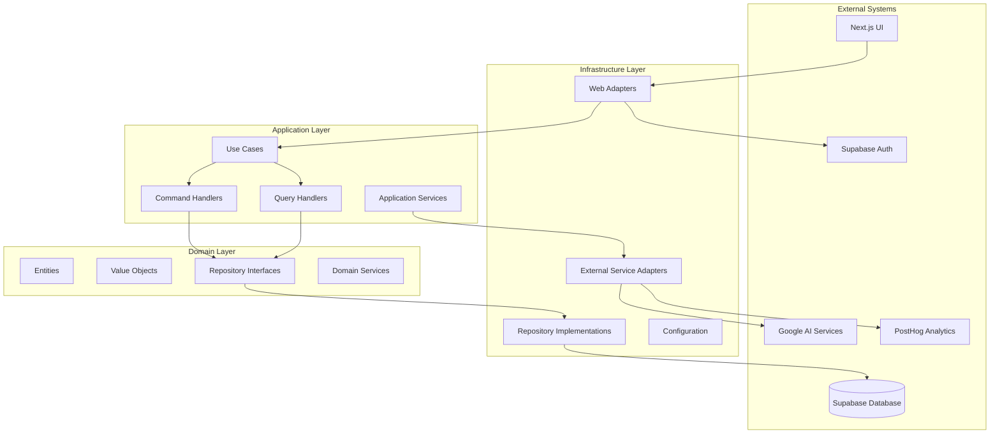
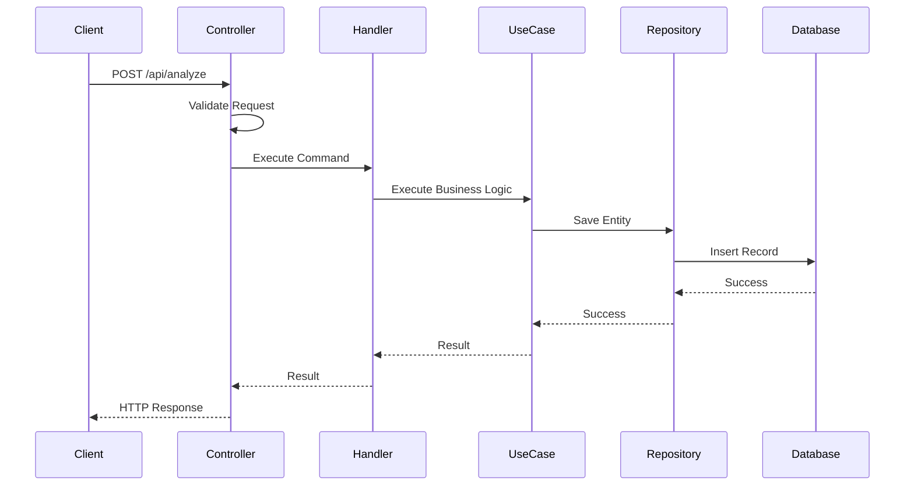
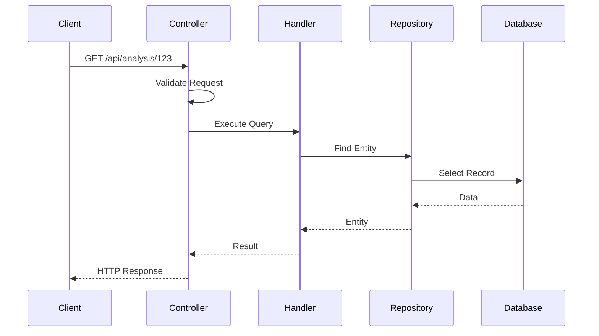
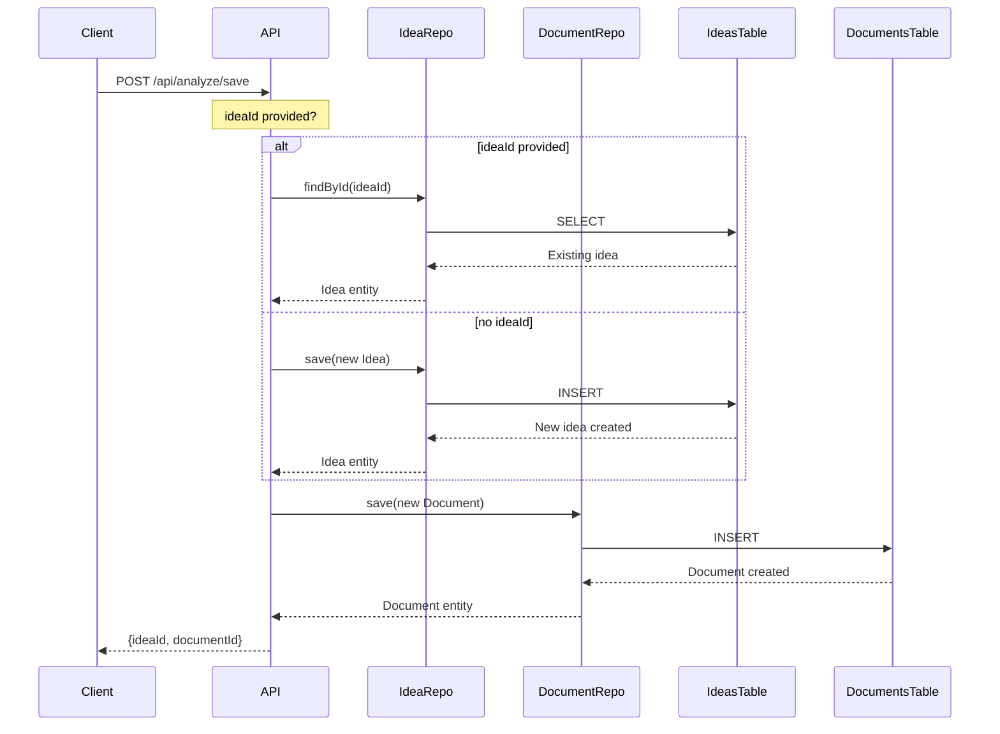
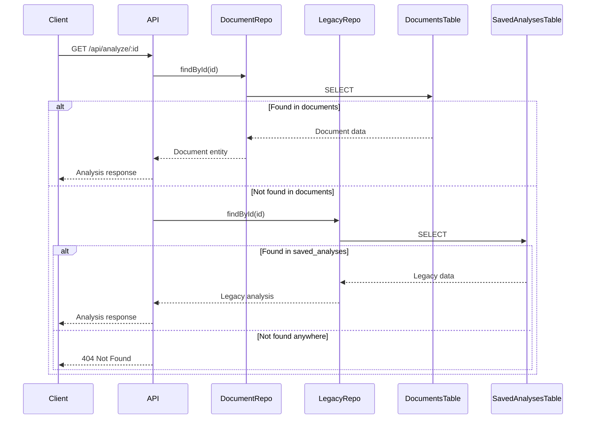
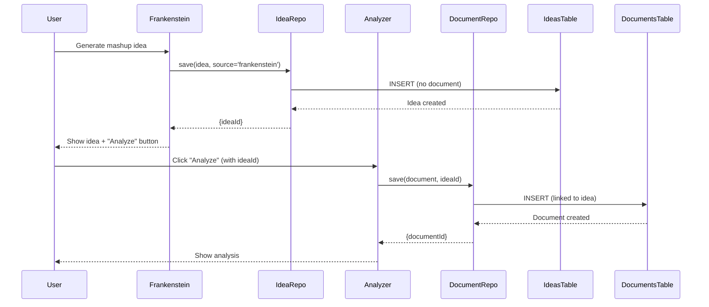
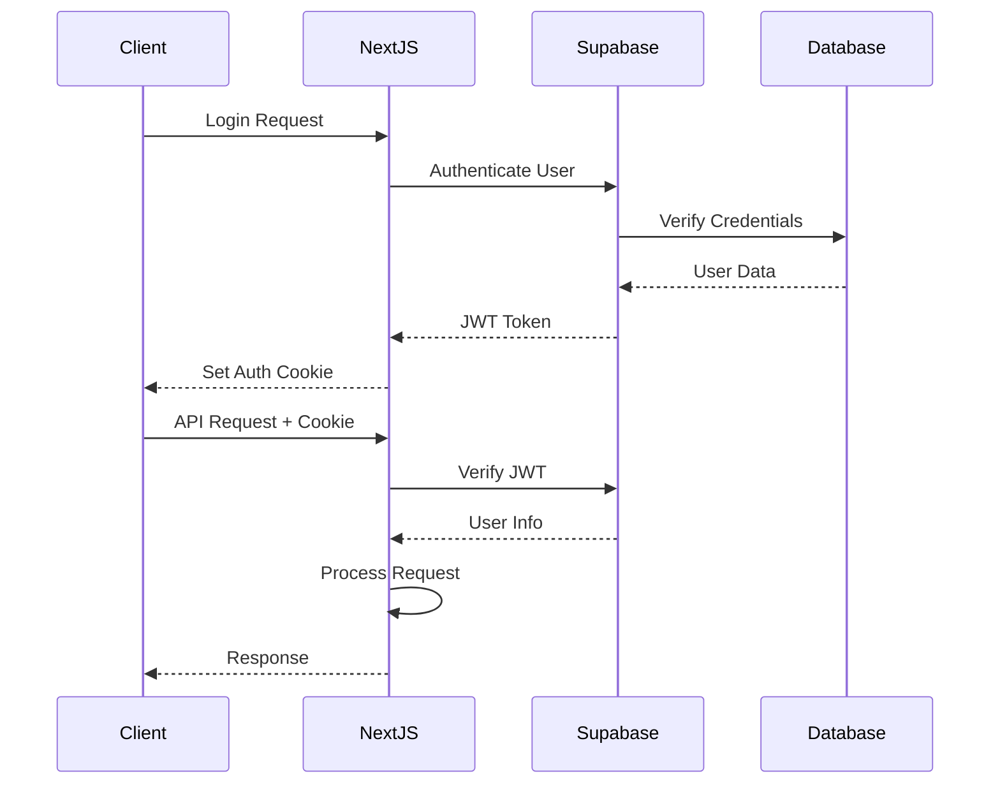

# Architecture Documentation

This document provides a comprehensive overview of the No Vibe No Code application architecture, which follows hexagonal architecture (Ports and Adapters pattern) principles.

## Table of Contents

1. [Architecture Overview](#architecture-overview)
2. [Layer Responsibilities](#layer-responsibilities)
3. [Data Flow](#data-flow)
4. [Design Patterns](#design-patterns)
5. [Technology Stack](#technology-stack)
6. [Directory Structure](#directory-structure)
7. [Integration Points](#integration-points)
8. [Security Architecture](#security-architecture)
9. [Database Architecture](#database-architecture)
10. [Performance Considerations](#performance-considerations)
11. [Scalability](#scalability)

## Architecture Overview

The application implements hexagonal architecture to achieve clean separation of concerns, testability, and maintainability. The architecture consists of three main layers:



### Core Principles

1. **Dependency Inversion**: High-level modules don't depend on low-level modules
2. **Separation of Concerns**: Each layer has distinct responsibilities
3. **Testability**: Business logic can be tested in isolation
4. **Framework Independence**: Core business logic is independent of frameworks
5. **Database Independence**: Domain logic doesn't depend on specific database technology

## Layer Responsibilities

### Domain Layer (`src/domain/`)

The innermost layer containing pure business logic and rules.

**Responsibilities:**

- Define business entities and their behavior
- Implement value objects for domain concepts
- Specify repository interfaces (ports)
- Contain domain services for complex business logic
- Define domain-specific errors and types

**Key Components:**

- **Entities**: `Analysis`, `User`, `Project`
- **Value Objects**: `AnalysisId`, `Score`, `Email`, `Locale`
- **Repository Interfaces**: `IAnalysisRepository`, `IUserRepository`
- **Domain Services**: `AnalysisValidationService`, `ScoreCalculationService`

**Dependencies:** None (pure TypeScript)

### Application Layer (`src/application/`)

Orchestrates business operations and coordinates between domain and infrastructure.

**Responsibilities:**

- Implement use cases and business workflows
- Handle commands and queries
- Coordinate domain entities and services
- Define application-specific types and errors
- Manage application services

**Key Components:**

- **Use Cases**: `AnalyzeIdeaUseCase`, `SaveAnalysisUseCase`
- **Command Handlers**: `CreateAnalysisHandler`, `UpdateAnalysisHandler`
- **Query Handlers**: `GetAnalysisHandler`, `ListAnalysesHandler`
- **Application Services**: `AIAnalysisService`, `NotificationService`

**Dependencies:** Domain layer only

### Infrastructure Layer (`src/infrastructure/`)

Implements external integrations and provides concrete implementations.

**Responsibilities:**

- Implement repository interfaces
- Provide web framework adapters
- Integrate with external services
- Handle configuration management
- Manage service composition

**Key Components:**

- **Repository Implementations**: `SupabaseAnalysisRepository`
- **Web Controllers**: `AnalysisController`, `DashboardController`
- **External Adapters**: `GoogleAIAdapter`, `PostHogAdapter`
- **Data Mappers**: `AnalysisMapper`, `UserMapper`
- **Service Factories**: `ServiceFactory`, `RepositoryFactory`

**Dependencies:** Application and Domain layers

## Data Flow

### Command Flow (Write Operations)



### Query Flow (Read Operations)



### Documents Migration Data Flow

#### Save Analysis Flow (New Data Model)



#### Load Analysis Flow (With Fallback)



#### Doctor Frankenstein Flow



## Design Patterns

### Repository Pattern

Abstracts data access operations from business logic:

```typescript
// Domain interface (port)
interface IAnalysisRepository {
  save(analysis: Analysis): Promise<void>;
  findById(id: AnalysisId): Promise<Analysis | null>;
}

// Infrastructure implementation (adapter)
class SupabaseAnalysisRepository implements IAnalysisRepository {
  // Implementation details
}
```

### Command Query Responsibility Segregation (CQRS)

Separates read and write operations:

```typescript
// Command (write)
class CreateAnalysisCommand {
  constructor(public readonly idea: string, public readonly userId: UserId) {}
}

// Query (read)
class GetAnalysisQuery {
  constructor(public readonly id: AnalysisId, public readonly userId: UserId) {}
}
```

### Factory Pattern

Creates and configures service instances:

```typescript
class ServiceFactory {
  createAnalysisService(): AnalyzeIdeaUseCase {
    const aiService = this.createAIService();
    const repository = this.createAnalysisRepository();
    return new AnalyzeIdeaUseCase(aiService, repository);
  }
}
```

### Adapter Pattern

Integrates external services:

```typescript
class GoogleAIAdapter implements IAIAnalysisService {
  async analyzeIdea(idea: string): Promise<AIResult> {
    // Adapt Google AI API to domain interface
  }
}
```

### Value Object Pattern

Encapsulates domain concepts:

```typescript
class Score {
  constructor(private readonly value: number) {
    if (value < 0 || value > 100) {
      throw new Error("Score must be between 0 and 100");
    }
  }

  get value(): number {
    return this.value;
  }
}
```

## Technology Stack

### Core Technologies

- **Runtime**: Node.js 18+
- **Framework**: Next.js 14+ with App Router
- **Language**: TypeScript with strict mode
- **Database**: Supabase (PostgreSQL)
- **Authentication**: Supabase Auth
- **AI Services**: Google Gemini AI
- **Analytics**: PostHog

### Development Tools

- **Package Manager**: npm
- **Testing**: Vitest + Jest
- **Linting**: ESLint
- **Type Checking**: TypeScript compiler
- **Build Tool**: Next.js built-in bundler

### External Services

- **Database**: Supabase PostgreSQL
- **Authentication**: Supabase Auth with JWT
- **AI Analysis**: Google Gemini AI API
- **Text-to-Speech**: Web Speech API / External TTS service
- **Analytics**: PostHog for user behavior tracking
- **File Storage**: Supabase Storage (if needed)

## Directory Structure

```
src/
├── domain/                       # Pure business logic
│   ├── entities/                 # Domain entities
│   │   ├── analysis/            # Analysis entity and related
│   │   ├── user/                # User entity and related
│   │   ├── idea/                # Idea entity (Idea Panel)
│   │   ├── document/            # Document entity (Idea Panel)
│   │   └── shared/              # Base entity classes
│   ├── value-objects/           # Immutable value objects
│   │   ├── IdeaId.ts           # Idea identifier
│   │   ├── DocumentId.ts       # Document identifier
│   │   ├── IdeaSource.ts       # Idea source (manual/frankenstein)
│   │   ├── DocumentType.ts     # Document type (startup_analysis/hackathon_analysis)
│   │   ├── ProjectStatus.ts    # Project status (idea/in_progress/completed/archived)
│   │   └── ...                 # Other value objects
│   ├── repositories/            # Repository interfaces (ports)
│   │   ├── IIdeaRepository.ts  # Idea repository interface
│   │   ├── IDocumentRepository.ts # Document repository interface
│   │   └── ...                 # Other repository interfaces
│   ├── services/                # Domain services
│   └── types/                   # Domain types and errors
├── application/                 # Use cases and orchestration
│   ├── use-cases/              # Business use cases
│   │   ├── GetIdeaWithDocumentsUseCase.ts
│   │   ├── UpdateIdeaStatusUseCase.ts
│   │   ├── SaveIdeaMetadataUseCase.ts
│   │   ├── GetUserIdeasUseCase.ts
│   │   ├── GetDocumentsByIdeaUseCase.ts
│   │   └── ...                 # Other use cases
│   ├── handlers/               # Command and query handlers
│   ├── services/               # Application services
│   └── types/                  # Application types
├── infrastructure/             # External integrations
│   ├── database/               # Database implementations
│   │   └── supabase/
│   │       ├── repositories/
│   │       │   ├── SupabaseIdeaRepository.ts
│   │       │   ├── SupabaseDocumentRepository.ts
│   │       │   └── ...
│   │       └── mappers/
│   │           ├── IdeaMapper.ts
│   │           ├── DocumentMapper.ts
│   │           └── ...
│   ├── external/               # External service adapters
│   ├── web/                    # Web framework adapters
│   │   └── controllers/
│   │       ├── IdeaPanelController.ts
│   │       └── ...
│   ├── config/                 # Configuration management
│   └── factories/              # Service factories
└── shared/                     # Shared utilities
    ├── utils/                  # Common utilities
    ├── types/                  # Shared types
    └── constants/              # Application constants

features/                       # Feature-specific UI components
├── idea-panel/                # Idea Panel feature
│   ├── components/
│   │   ├── IdeaPanelView.tsx
│   │   ├── IdeaPanelLayout.tsx
│   │   ├── IdeaDetailsSection.tsx
│   │   ├── DocumentsListSection.tsx
│   │   ├── ProjectStatusControl.tsx
│   │   ├── NotesSection.tsx
│   │   ├── TagsSection.tsx
│   │   └── AnalyzeButton.tsx
│   ├── api/
│   │   ├── getIdeaWithDocuments.ts
│   │   ├── getUserIdeas.ts
│   │   ├── updateStatus.ts
│   │   ├── saveMetadata.ts
│   │   └── getDocumentsByIdea.ts
│   └── analytics/
│       └── tracking.ts
├── analyzer/                  # Analyzer feature
├── dashboard/                 # Dashboard feature
│   └── components/
│       ├── IdeaCard.tsx      # New: displays ideas instead of analyses
│       └── ...
└── ...                       # Other features

app/                          # Next.js App Router
├── api/
│   └── v2/
│       └── ideas/           # Idea Panel API routes
│           ├── route.ts     # GET /api/v2/ideas (list)
│           └── [ideaId]/
│               ├── route.ts # GET /api/v2/ideas/[ideaId] (single)
│               ├── status/
│               │   └── route.ts # PUT /api/v2/ideas/[ideaId]/status
│               ├── metadata/
│               │   └── route.ts # PUT /api/v2/ideas/[ideaId]/metadata
│               └── documents/
│                   └── route.ts # GET /api/v2/ideas/[ideaId]/documents
└── idea/
    └── [ideaId]/
        └── page.tsx         # Idea Panel page
```

## Integration Points

### Next.js Integration

#### API Routes

```typescript
// app/api/analyze/route.ts
export async function POST(request: NextRequest) {
  const factory = ServiceFactory.getInstance();
  const controller = factory.createAnalysisController();
  return controller.createAnalysis(request);
}
```

#### Server Actions

```typescript
// app/actions/analysis.ts
export async function analyzeIdea(formData: FormData) {
  const factory = ServiceFactory.getInstance();
  const useCase = factory.createAnalyzeIdeaUseCase();

  const result = await useCase.execute(command);
  // Handle result
}
```

#### React Server Components

```typescript
// app/dashboard/page.tsx
export default async function DashboardPage() {
  const factory = ServiceFactory.getInstance();
  const handler = factory.createListAnalysesHandler();

  const result = await handler.handle(query);
  return <DashboardView analyses={result.data} />;
}
```

### Idea Panel Integration

The Idea Panel feature introduces new routes and components for managing ideas:

#### API Routes

```typescript
// Get idea with all documents
GET / api / v2 / ideas / [ideaId];

// Get all ideas for user
GET / api / v2 / ideas;

// Update idea status
PUT / api / v2 / ideas / [ideaId] / status;

// Save idea metadata (notes, tags)
PUT / api / v2 / ideas / [ideaId] / metadata;

// Get documents for idea
GET / api / v2 / ideas / [ideaId] / documents;
```

#### Page Routes

```typescript
// Idea Panel page
/idea/[ideaId];
```

#### Key Components

- **IdeaPanelView**: Main container component orchestrating the panel
- **IdeaPanelLayout**: Full-screen layout with breadcrumb navigation
- **IdeaDetailsSection**: Displays idea text, source, and creation date
- **DocumentsListSection**: Lists all analyses with expandable details
- **ProjectStatusControl**: Status dropdown with last updated timestamp
- **NotesSection**: Textarea for adding and editing notes
- **TagsSection**: Tag management with add/remove functionality
- **AnalyzeButton**: Dropdown button for creating new analyses

#### Data Model

The Idea Panel introduces a new data model that separates ideas from documents:

**Ideas Table:**

```sql
CREATE TABLE ideas (
  id UUID PRIMARY KEY,
  user_id UUID REFERENCES auth.users(id),
  idea_text TEXT NOT NULL,
  source TEXT NOT NULL CHECK (source IN ('manual', 'frankenstein')),
  project_status TEXT NOT NULL CHECK (project_status IN ('idea', 'in_progress', 'completed', 'archived')),
  notes TEXT DEFAULT '',
  tags TEXT[] DEFAULT '{}',
  created_at TIMESTAMPTZ DEFAULT NOW(),
  updated_at TIMESTAMPTZ DEFAULT NOW()
);
```

**Documents Table:**

```sql
CREATE TABLE documents (
  id UUID PRIMARY KEY,
  idea_id UUID REFERENCES ideas(id) ON DELETE CASCADE,
  user_id UUID REFERENCES auth.users(id),
  document_type TEXT NOT NULL CHECK (document_type IN ('startup_analysis', 'hackathon_analysis')),
  title TEXT,
  content JSONB NOT NULL,
  created_at TIMESTAMPTZ DEFAULT NOW(),
  updated_at TIMESTAMPTZ DEFAULT NOW()
);
```

**Relationship:**

- One idea can have multiple documents (analyses)
- Documents are linked to ideas via `idea_id` foreign key
- Backward compatible: `saved_analyses` table remains unchanged

### Database Integration

#### Supabase Configuration

```typescript
const supabaseConfig = {
  url: process.env.NEXT_PUBLIC_SUPABASE_URL!,
  anonKey: process.env.NEXT_PUBLIC_SUPABASE_ANON_KEY!,
};

export const supabase = createClient(
  supabaseConfig.url,
  supabaseConfig.anonKey
);
```

#### Repository Implementation

```typescript
class SupabaseAnalysisRepository implements IAnalysisRepository {
  constructor(
    private readonly client: SupabaseClient,
    private readonly mapper: AnalysisMapper
  ) {}

  async save(analysis: Analysis): Promise<void> {
    const dao = this.mapper.toDAO(analysis);
    await this.client.from("analyses").insert(dao);
  }
}
```

### External Service Integration

#### AI Service Integration

```typescript
class GoogleAIAdapter implements IAIAnalysisService {
  constructor(private readonly apiKey: string) {}

  async analyzeIdea(idea: string, locale: Locale): Promise<AIResult> {
    const response = await this.geminiClient.generateContent({
      contents: [{ parts: [{ text: this.buildPrompt(idea, locale) }] }],
    });

    return this.parseResponse(response);
  }
}
```

## Security Architecture

### Authentication Flow



### Critical Security: Supabase Client Management

⚠️ **IMPORTANT: Session Isolation in Server-Side Operations**

One of the most critical security considerations in this application is proper management of Supabase clients in server-side contexts.

#### The Session Leak Vulnerability

In Next.js server-side operations (Server Components, API Routes, Server Actions), each HTTP request has its own cookie store containing user-specific session tokens. **Caching the Supabase client globally creates a critical security vulnerability:**

**The Problem:**

```typescript
// ❌ DANGEROUS - DO NOT DO THIS
class BadAdapter {
  private static serverInstance: SupabaseClient | null = null;

  static getServerClient() {
    if (!this.serverInstance) {
      this.serverInstance = createServerComponentClient({ cookies });
    }
    return this.serverInstance; // Returns same instance for all users!
  }
}
```

**What Happens:**

1. User A (admin) makes first request → Client cached with admin cookies
2. User B (regular user) makes request → Gets cached client with admin cookies
3. User B now has admin access → **CRITICAL SECURITY BREACH**

**Additional Risks:**

- **Session Leaks**: User B can access User A's data and permissions
- **Stale Tokens**: Refresh tokens don't update when cookies change
- **Auth Bypass**: Unauthenticated users can inherit authenticated sessions
- **Data Exposure**: Row-level security (RLS) is bypassed

#### The Secure Solution

**Our Implementation:**

```typescript
// ✅ SAFE - Always create fresh client
class SupabaseAdapter {
  static getServerClient(): SupabaseClient {
    return createServerComponentClient({ cookies }); // New client per request
  }
}
```

**Why This Works:**

- Each request gets a fresh client with its own cookie store
- User sessions are properly isolated
- Refresh tokens update correctly
- RLS policies work as intended

#### Usage Guidelines

**Server-Side (Always Fresh):**

```typescript
// Server Component
export default async function MyServerComponent() {
  const supabase = SupabaseAdapter.getServerClient(); // Fresh client
  const { data } = await supabase.from("analyses").select();
  return <div>{data}</div>;
}

// API Route
export async function GET(request: NextRequest) {
  const supabase = SupabaseAdapter.getServerClient(); // Fresh client
  const { data } = await supabase.from("analyses").select();
  return NextResponse.json(data);
}
```

**Client-Side (Singleton Safe):**

```typescript
// Client Component
"use client";
export function MyClientComponent() {
  const supabase = SupabaseAdapter.getClientClient(); // Singleton OK
  // Browser context is isolated per user
}
```

#### Why Client-Side Singleton is Safe

- Each browser has its own JavaScript context
- Cookies are managed by the browser, not shared between users
- No risk of cross-user session leaks
- Performance benefit from reusing the same client instance

#### ServiceFactory and RepositoryFactory Security

The same session leak vulnerability applies to factory classes. We've eliminated singleton patterns:

**Secure Implementation:**

```typescript
// ServiceFactory - No singleton
export class ServiceFactory {
  static create(supabaseClient: SupabaseClient): ServiceFactory {
    return new ServiceFactory(supabaseClient); // Fresh instance per request
  }
}

// RepositoryFactory - No singleton
export class RepositoryFactory {
  static create(supabaseClient: SupabaseClient): RepositoryFactory {
    return new RepositoryFactory(supabaseClient); // Fresh instance per request
  }
}

// Usage in API route
export async function GET(request: NextRequest) {
  const supabase = SupabaseAdapter.getServerClient(); // Fresh client
  const factory = ServiceFactory.create(supabase); // Fresh factory
  const controller = factory.createAnalysisController();
  return controller.listAnalyses(request);
}
```

**Why This Matters:**

If factories were singletons, they would cache repositories that contain the first user's Supabase client, causing the same session leak vulnerability.

#### Verification and Testing

We have comprehensive tests to ensure session isolation:

```typescript
// Test that each call creates a new instance
it("should create a new client for each call", () => {
  const client1 = SupabaseAdapter.getServerClient();
  const client2 = SupabaseAdapter.getServerClient();
  expect(client1).not.toBe(client2);
});

// Test that different users are isolated
it("should not leak sessions between users", async () => {
  // Simulate User A
  const clientA = SupabaseAdapter.getServerClient();
  const { data: userA } = await clientA.auth.getUser();

  // Simulate User B
  const clientB = SupabaseAdapter.getServerClient();
  const { data: userB } = await clientB.auth.getUser();

  // Verify isolation
  expect(userA?.id).not.toBe(userB?.id);
});

// Test that factories create fresh instances
it("should create fresh factory instances", () => {
  const client = SupabaseAdapter.getServerClient();
  const factory1 = ServiceFactory.create(client);
  const factory2 = ServiceFactory.create(client);
  expect(factory1).not.toBe(factory2);
});
```

### Security Measures

1. **Authentication**: Supabase Auth with JWT tokens
2. **Authorization**: Row-level security (RLS) in database
3. **Session Isolation**: Fresh Supabase clients per server-side request
4. **Input Validation**: Zod schemas for all inputs
5. **SQL Injection Prevention**: Parameterized queries
6. **CORS**: Configured for specific origins
7. **Rate Limiting**: API endpoint rate limiting
8. **Environment Variables**: Secure configuration management

### Data Protection

- **Encryption at Rest**: Supabase handles database encryption
- **Encryption in Transit**: HTTPS for all communications
- **API Key Security**: Server-side only API keys
- **User Data Isolation**: RLS policies + proper session management ensure data separation
- **Session Security**: No caching of server-side Supabase clients prevents session leaks

## Database Architecture

### Database Tables Overview

The application uses multiple tables to manage different aspects of the system:

1. **`saved_analyses`**: Legacy unified table for backward compatibility
2. **`ideas`**: New table for managing ideas with metadata (Idea Panel feature)
3. **`documents`**: New table for storing analyses linked to ideas (Idea Panel feature)

### Unified Analysis Table (Legacy)

The application uses a unified `saved_analyses` table with a type discriminator column to store both standard idea analyses and hackathon project analyses. This table is maintained for backward compatibility while the new Idea Panel feature uses the `ideas` and `documents` tables.

#### Table Structure

```sql
CREATE TABLE public.saved_analyses (
  id UUID PRIMARY KEY DEFAULT gen_random_uuid(),
  user_id UUID NOT NULL REFERENCES auth.users(id) ON DELETE CASCADE,
  analysis_type TEXT NOT NULL DEFAULT 'idea'
    CHECK (analysis_type IN ('idea', 'hackathon')),
  idea TEXT NOT NULL,  -- Dual purpose: idea text OR project description
  analysis JSONB NOT NULL,  -- Type-specific structured data
  audio_base64 TEXT,
  created_at TIMESTAMPTZ DEFAULT NOW(),
  updated_at TIMESTAMPTZ DEFAULT NOW()
);
```

#### Type Discriminator

The `analysis_type` column identifies the type of analysis:

- `'idea'`: Standard startup idea analysis
- `'hackathon'`: Hackathon project analysis

#### JSONB Structure

The `analysis` JSONB field contains type-specific data:

**Idea Analysis**:

```json
{
  "score": 78,
  "detailedSummary": "Analysis summary...",
  "criteria": [...],
  "locale": "en"
}
```

**Hackathon Analysis**:

```json
{
  "score": 82,
  "detailedSummary": "Analysis summary...",
  "criteria": [...],
  "locale": "en",
  "selectedCategory": "frankenstein",

}
```

#### Benefits

- **Simplified Schema**: Single table instead of two separate tables
- **Reduced Code Duplication**: Unified repository and mapper logic
- **Better Query Performance**: Single table scans with optimized indexes
- **Easier Maintenance**: One schema to manage
- **Flexible**: Easy to add new analysis types

For detailed information about the database consolidation, see:

- [Database Consolidation Documentation](./DATABASE_CONSOLIDATION.md)
- [Archived Schema Definitions](./archive/OLD_SCHEMA_DEFINITIONS.md)

### Idea Panel Data Model (New)

The Idea Panel feature introduces a new data model that separates ideas from their analyses (documents). This architectural change enables:

- Ideas to exist independently of analyses
- Multiple analyses per idea (e.g., both startup and hackathon analyses)
- Better organization with status tracking, notes, and tags
- Foundation for future document types (PRDs, Design Docs, Roadmaps)

#### Ideas Table

Stores all ideas with panel management metadata:

```sql
CREATE TABLE ideas (
  id UUID PRIMARY KEY DEFAULT gen_random_uuid(),
  user_id UUID NOT NULL REFERENCES auth.users(id) ON DELETE CASCADE,
  idea_text TEXT NOT NULL,
  source TEXT NOT NULL DEFAULT 'manual'
    CHECK (source IN ('manual', 'frankenstein')),
  project_status TEXT NOT NULL DEFAULT 'idea'
    CHECK (project_status IN ('idea', 'in_progress', 'completed', 'archived')),
  notes TEXT DEFAULT '',
  tags TEXT[] DEFAULT '{}',
  created_at TIMESTAMPTZ NOT NULL DEFAULT NOW(),
  updated_at TIMESTAMPTZ NOT NULL DEFAULT NOW()
);

-- Indexes for performance
CREATE INDEX idx_ideas_user ON ideas(user_id);
CREATE INDEX idx_ideas_status ON ideas(user_id, project_status);
CREATE INDEX idx_ideas_updated ON ideas(updated_at DESC);
```

**Fields:**

- `id`: Unique identifier for the idea
- `user_id`: Owner of the idea (foreign key to auth.users)
- `idea_text`: The actual idea description
- `source`: How the idea was created ('manual' or 'frankenstein')
- `project_status`: Current status in workflow ('idea', 'in_progress', 'completed', 'archived')
- `notes`: User notes for capturing thoughts and progress
- `tags`: Array of tags for organization
- `created_at`: When the idea was created
- `updated_at`: Last modification timestamp (auto-updated via trigger)

#### Documents Table

Stores analyses and future document types linked to ideas:

```sql
CREATE TABLE documents (
  id UUID PRIMARY KEY DEFAULT gen_random_uuid(),
  idea_id UUID NOT NULL REFERENCES ideas(id) ON DELETE CASCADE,
  user_id UUID NOT NULL REFERENCES auth.users(id) ON DELETE CASCADE,
  document_type TEXT NOT NULL
    CHECK (document_type IN ('startup_analysis', 'hackathon_analysis')),
  title TEXT,
  content JSONB NOT NULL,
  created_at TIMESTAMPTZ NOT NULL DEFAULT NOW(),
  updated_at TIMESTAMPTZ NOT NULL DEFAULT NOW()
);

-- Indexes for performance
CREATE INDEX idx_documents_idea ON documents(idea_id);
CREATE INDEX idx_documents_user ON documents(user_id);
CREATE INDEX idx_documents_type ON documents(idea_id, document_type);
```

**Fields:**

- `id`: Unique identifier for the document
- `idea_id`: Link to parent idea (foreign key to ideas)
- `user_id`: Owner of the document (foreign key to auth.users)
- `document_type`: Type of document ('startup_analysis', 'hackathon_analysis', future: 'prd', 'design_doc', etc.)
- `title`: Optional title for the document
- `content`: JSONB field containing the analysis or document data
- `created_at`: When the document was created
- `updated_at`: Last modification timestamp (auto-updated via trigger)

#### Relationship Model

```
ideas (1) → (many) documents
  ├─ startup_analysis documents
  ├─ hackathon_analysis documents
  └─ future: prd, design_doc, roadmap, architecture documents

saved_analyses (UNCHANGED - backward compatibility)
```

#### Row Level Security (RLS)

Both tables have RLS enabled with policies ensuring users can only access their own data:

```sql
-- Ideas table RLS
ALTER TABLE ideas ENABLE ROW LEVEL SECURITY;

CREATE POLICY "Users can manage their own ideas"
  ON ideas FOR ALL
  USING (auth.uid() = user_id);

-- Documents table RLS
ALTER TABLE documents ENABLE ROW LEVEL SECURITY;

CREATE POLICY "Users can manage their own documents"
  ON documents FOR ALL
  USING (auth.uid() = user_id);
```

#### Auto-Update Triggers

Both tables have triggers that automatically update the `updated_at` timestamp:

```sql
-- Trigger for ideas table
CREATE OR REPLACE FUNCTION update_ideas_timestamp()
RETURNS TRIGGER AS $$
BEGIN
  NEW.updated_at = NOW();
  RETURN NEW;
END;
$$ LANGUAGE plpgsql;

CREATE TRIGGER trigger_update_ideas_timestamp
  BEFORE UPDATE ON ideas
  FOR EACH ROW
  EXECUTE FUNCTION update_ideas_timestamp();

-- Trigger for documents table
CREATE OR REPLACE FUNCTION update_documents_timestamp()
RETURNS TRIGGER AS $$
BEGIN
  NEW.updated_at = NOW();
  RETURN NEW;
END;
$$ LANGUAGE plpgsql;

CREATE TRIGGER trigger_update_documents_timestamp
  BEFORE UPDATE ON documents
  FOR EACH ROW
  EXECUTE FUNCTION update_documents_timestamp();
```

#### Migration and Backward Compatibility

The new tables were populated via migration from `saved_analyses`:

- All existing analyses were migrated to create corresponding ideas
- Analyses with actual analysis data were migrated to documents
- Doctor Frankenstein ideas (no analysis) created ideas without documents
- `saved_analyses` table remains unchanged for backward compatibility

**Migration Details:**

- Ideas count = saved_analyses count
- Documents count = saved_analyses count - frankenstein ideas (which have no analysis)
- All foreign key constraints and RLS policies verified
- No data loss during migration

**Complete Documents Migration (Current)**:

The application has completed migration to the new `ideas` + `documents` data model:

- **Write Operations**: All new analyses save to `ideas` + `documents` tables exclusively
- **Read Operations**: Try `documents` table first, fallback to `saved_analyses` for legacy data
- **Update/Delete Operations**: Try `documents` table first, fallback to `saved_analyses` for legacy data
- **Backward Compatibility**: Legacy data in `saved_analyses` remains accessible
- **No Breaking Changes**: All existing functionality continues to work

**Migration Strategy**:

1. **Phase 1**: Idea Panel MVP - Created `ideas` and `documents` tables
2. **Phase 2**: Complete Migration - Updated all save/load/update/delete operations
3. **Phase 3**: Gradual Adoption - New analyses use new tables, legacy data remains accessible
4. **Future**: Optional data migration tool for users who want to migrate legacy analyses

For detailed migration information, see:

- [Idea Panel Migration Documentation](./IDEA_PANEL_MIGRATION.md)
- [Complete Documents Migration Guide](./COMPLETE_DOCUMENTS_MIGRATION_GUIDE.md)

#### Benefits of New Data Model

- **Separation of Concerns**: Ideas and analyses are distinct concepts
- **Multiple Analyses**: One idea can have multiple types of analyses
- **Better Organization**: Status tracking, notes, and tags for project management
- **Future Extensibility**: Easy to add new document types (PRDs, Design Docs, Roadmaps)
- **Clean Architecture**: Follows domain-driven design principles
- **Backward Compatible**: Existing code continues to work with saved_analyses

## Performance Considerations

### Database Optimization

- **Indexes**: Strategic indexing on frequently queried columns
- **Connection Pooling**: Supabase handles connection management
- **Query Optimization**: Efficient queries with proper joins
- **Caching**: Application-level caching for frequently accessed data

### Application Performance

- **Server-Side Rendering**: Next.js SSR for fast initial loads
- **Code Splitting**: Automatic code splitting by Next.js
- **Image Optimization**: Next.js Image component
- **Bundle Optimization**: Tree shaking and minification

### AI Service Optimization

- **Request Batching**: Batch multiple AI requests when possible
- **Caching**: Cache AI responses for similar inputs
- **Timeout Handling**: Proper timeout configuration
- **Error Handling**: Graceful degradation on AI service failures

## Scalability

### Horizontal Scaling

- **Stateless Design**: Application is stateless and can scale horizontally
- **Database Scaling**: Supabase handles database scaling
- **CDN Integration**: Static assets served via CDN
- **Load Balancing**: Multiple application instances behind load balancer

### Vertical Scaling

- **Resource Optimization**: Efficient memory and CPU usage
- **Database Optimization**: Query optimization and indexing
- **Caching Strategies**: Multiple levels of caching
- **Background Processing**: Async processing for heavy operations

### Monitoring and Observability

- **Application Metrics**: Performance monitoring
- **Error Tracking**: Comprehensive error logging
- **Database Monitoring**: Query performance tracking
- **User Analytics**: PostHog for user behavior insights

## Future Considerations

### Potential Enhancements

1. **Microservices**: Split into domain-specific services
2. **Event Sourcing**: Implement event-driven architecture
3. **CQRS with Separate Stores**: Separate read/write databases
4. **Message Queues**: Async processing with queues
5. **API Gateway**: Centralized API management
6. **Container Orchestration**: Kubernetes deployment

### Technology Evolution

- **Database**: Consider multi-region deployment
- **AI Services**: Integration with multiple AI providers
- **Real-time Features**: WebSocket integration
- **Mobile Apps**: React Native or native mobile apps
- **Offline Support**: Progressive Web App features

## References

- [Domain Layer Documentation](../src/domain/README.md)
- [Application Layer Documentation](../src/application/README.md)
- [Infrastructure Layer Documentation](../src/infrastructure/README.md)
- [Developer Guide](./DEVELOPER_GUIDE.md)
- [API Documentation](./API.md)
- [Hexagonal Architecture Standards](../.kiro/steering/hexagonal-architecture-standards.md)
- [Idea Panel User Guide](./IDEA_PANEL_USER_GUIDE.md)
- [Idea Panel API Documentation](./IDEA_PANEL_API.md)
- [Idea Panel Migration Documentation](./IDEA_PANEL_MIGRATION.md)
