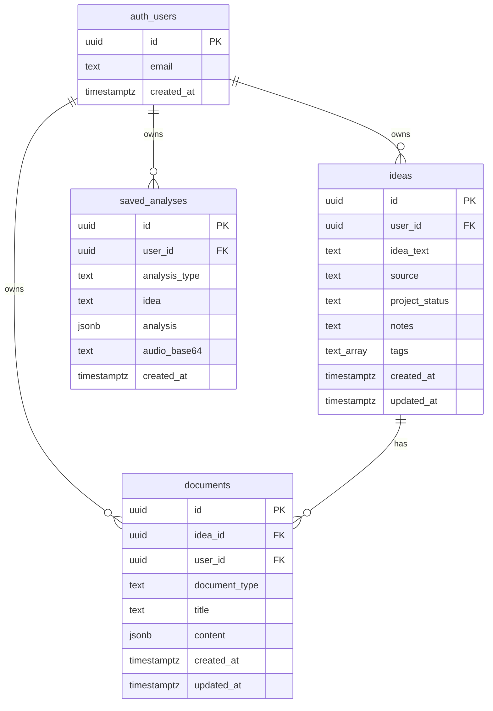

# Database Schema Documentation

## Overview

This document provides the current database schema for the No Vibe No Code application. The database uses PostgreSQL via Supabase with Row Level Security (RLS) enabled for all tables.

**Last Updated**: 2024-01-15
**Schema Version**: 2.0 (Post-consolidation)

For information about the database consolidation that unified the analysis tables, see [Database Consolidation Documentation](./DATABASE_CONSOLIDATION.md).

## Tables

### ideas

New table storing all startup ideas and project concepts. Part of the Idea Panel feature.

#### Schema

```sql
CREATE TABLE public.ideas (
  id UUID PRIMARY KEY DEFAULT gen_random_uuid(),
  user_id UUID NOT NULL REFERENCES auth.users(id) ON DELETE CASCADE,

  -- Core idea data
  idea_text TEXT NOT NULL,
  source TEXT NOT NULL DEFAULT 'manual'
    CHECK (source IN ('manual', 'frankenstein')),

  -- Panel management data
  project_status TEXT NOT NULL DEFAULT 'idea'
    CHECK (project_status IN ('idea', 'in_progress', 'completed', 'archived')),
  notes TEXT DEFAULT '',
  tags TEXT[] DEFAULT '{}',

  -- Timestamps
  created_at TIMESTAMPTZ NOT NULL DEFAULT NOW(),
  updated_at TIMESTAMPTZ NOT NULL DEFAULT NOW()
);
```

#### Columns

| Column           | Type        | Nullable | Default             | Description                                                    |
| ---------------- | ----------- | -------- | ------------------- | -------------------------------------------------------------- |
| `id`             | UUID        | NO       | `gen_random_uuid()` | Primary key                                                    |
| `user_id`        | UUID        | NO       | -                   | Foreign key to auth.users                                      |
| `idea_text`      | TEXT        | NO       | -                   | The idea description                                           |
| `source`         | TEXT        | NO       | `'manual'`          | How idea was created: 'manual' or 'frankenstein'               |
| `project_status` | TEXT        | NO       | `'idea'`            | Current status: 'idea', 'in_progress', 'completed', 'archived' |
| `notes`          | TEXT        | YES      | `''`                | User notes about the idea                                      |
| `tags`           | TEXT[]      | YES      | `'{}'`              | Array of tags for organization                                 |
| `created_at`     | TIMESTAMPTZ | YES      | `NOW()`             | Record creation timestamp                                      |
| `updated_at`     | TIMESTAMPTZ | YES      | `NOW()`             | Record last update timestamp (auto-updated)                    |

#### Indexes

```sql
-- User-based queries
CREATE INDEX idx_ideas_user
  ON public.ideas(user_id);

-- Status filtering
CREATE INDEX idx_ideas_status
  ON public.ideas(user_id, project_status);

-- Timestamp ordering
CREATE INDEX idx_ideas_updated
  ON public.ideas(updated_at DESC);
```

#### Constraints

```sql
-- Primary key
ALTER TABLE public.ideas
  ADD CONSTRAINT ideas_pkey PRIMARY KEY (id);

-- Foreign key to users
ALTER TABLE public.ideas
  ADD CONSTRAINT ideas_user_id_fkey
  FOREIGN KEY (user_id) REFERENCES auth.users(id) ON DELETE CASCADE;

-- Source check
ALTER TABLE public.ideas
  ADD CONSTRAINT ideas_source_check
  CHECK (source IN ('manual', 'frankenstein'));

-- Status check
ALTER TABLE public.ideas
  ADD CONSTRAINT ideas_project_status_check
  CHECK (project_status IN ('idea', 'in_progress', 'completed', 'archived'));
```

#### Row Level Security

```sql
-- Enable RLS
ALTER TABLE public.ideas ENABLE ROW LEVEL SECURITY;

-- Owner-only access
CREATE POLICY "Users can manage their own ideas"
  ON public.ideas
  FOR ALL
  USING (auth.uid() = user_id);
```

#### Auto-update Trigger

```sql
-- Trigger function
CREATE OR REPLACE FUNCTION update_ideas_timestamp()
RETURNS TRIGGER AS $$
BEGIN
  NEW.updated_at = NOW();
  RETURN NEW;
END;
$$ LANGUAGE plpgsql;

-- Trigger
CREATE TRIGGER trigger_update_ideas_timestamp
  BEFORE UPDATE ON public.ideas
  FOR EACH ROW
  EXECUTE FUNCTION update_ideas_timestamp();
```

### documents

New table storing analyses and generated documents linked to ideas. Part of the Idea Panel feature.

#### Schema

```sql
CREATE TABLE public.documents (
  id UUID PRIMARY KEY DEFAULT gen_random_uuid(),
  idea_id UUID NOT NULL REFERENCES ideas(id) ON DELETE CASCADE,
  user_id UUID NOT NULL REFERENCES auth.users(id) ON DELETE CASCADE,

  -- Document metadata
  document_type TEXT NOT NULL
    CHECK (document_type IN ('startup_analysis', 'hackathon_analysis')),
  title TEXT,
  content JSONB NOT NULL,

  -- Timestamps
  created_at TIMESTAMPTZ NOT NULL DEFAULT NOW(),
  updated_at TIMESTAMPTZ NOT NULL DEFAULT NOW()
);
```

#### Columns

| Column          | Type        | Nullable | Default             | Description                                      |
| --------------- | ----------- | -------- | ------------------- | ------------------------------------------------ |
| `id`            | UUID        | NO       | `gen_random_uuid()` | Primary key                                      |
| `idea_id`       | UUID        | NO       | -                   | Foreign key to ideas                             |
| `user_id`       | UUID        | NO       | -                   | Foreign key to auth.users                        |
| `document_type` | TEXT        | NO       | -                   | Type: 'startup_analysis' or 'hackathon_analysis' |
| `title`         | TEXT        | YES      | NULL                | Optional document title                          |
| `content`       | JSONB       | NO       | -                   | Document content (analysis data)                 |
| `created_at`    | TIMESTAMPTZ | YES      | `NOW()`             | Record creation timestamp                        |
| `updated_at`    | TIMESTAMPTZ | YES      | `NOW()`             | Record last update timestamp (auto-updated)      |

#### Indexes

```sql
-- Idea-based queries
CREATE INDEX idx_documents_idea
  ON public.documents(idea_id);

-- User-based queries
CREATE INDEX idx_documents_user
  ON public.documents(user_id);

-- Type filtering
CREATE INDEX idx_documents_type
  ON public.documents(idea_id, document_type);
```

#### Constraints

```sql
-- Primary key
ALTER TABLE public.documents
  ADD CONSTRAINT documents_pkey PRIMARY KEY (id);

-- Foreign key to ideas
ALTER TABLE public.documents
  ADD CONSTRAINT documents_idea_id_fkey
  FOREIGN KEY (idea_id) REFERENCES ideas(id) ON DELETE CASCADE;

-- Foreign key to users
ALTER TABLE public.documents
  ADD CONSTRAINT documents_user_id_fkey
  FOREIGN KEY (user_id) REFERENCES auth.users(id) ON DELETE CASCADE;

-- Document type check
ALTER TABLE public.documents
  ADD CONSTRAINT documents_document_type_check
  CHECK (document_type IN ('startup_analysis', 'hackathon_analysis'));
```

#### Row Level Security

```sql
-- Enable RLS
ALTER TABLE public.documents ENABLE ROW LEVEL SECURITY;

-- Owner-only access
CREATE POLICY "Users can manage their own documents"
  ON public.documents
  FOR ALL
  USING (auth.uid() = user_id);
```

#### Auto-update Trigger

```sql
-- Trigger function
CREATE OR REPLACE FUNCTION update_documents_timestamp()
RETURNS TRIGGER AS $$
BEGIN
  NEW.updated_at = NOW();
  RETURN NEW;
END;
$$ LANGUAGE plpgsql;

-- Trigger
CREATE TRIGGER trigger_update_documents_timestamp
  BEFORE UPDATE ON public.documents
  FOR EACH ROW
  EXECUTE FUNCTION update_documents_timestamp();
```

#### JSONB Structure

The `content` field stores type-specific analysis data:

**Startup Analysis Content**:

```json
{
  "score": 78,
  "detailedSummary": "This is a solid marketplace idea...",
  "criteria": [
    {
      "name": "Market Size",
      "score": 85,
      "justification": "Large and growing pet care market..."
    }
  ],
  "locale": "en"
}
```

**Hackathon Analysis Content**:

```json
{
  "score": 82,
  "detailedSummary": "Innovative approach...",
  "criteria": [...],
  "locale": "en",
  "selectedCategory": "frankenstein"
}
```

### saved_analyses

Unified table storing both standard idea analyses and hackathon project analyses. This table is maintained for backward compatibility.

#### Schema

```sql
CREATE TABLE public.saved_analyses (
  id UUID PRIMARY KEY DEFAULT gen_random_uuid(),
  user_id UUID NOT NULL REFERENCES auth.users(id) ON DELETE CASCADE,
  analysis_type TEXT NOT NULL DEFAULT 'idea'
    CHECK (analysis_type IN ('idea', 'hackathon', 'frankenstein')),
  idea TEXT NOT NULL,
  analysis JSONB NOT NULL,
  audio_base64 TEXT,
  created_at TIMESTAMPTZ DEFAULT NOW(),
  updated_at TIMESTAMPTZ DEFAULT NOW()
);
```

#### Columns

| Column          | Type        | Nullable | Default             | Description                                                         |
| --------------- | ----------- | -------- | ------------------- | ------------------------------------------------------------------- |
| `id`            | UUID        | NO       | `gen_random_uuid()` | Primary key                                                         |
| `user_id`       | UUID        | NO       | -                   | Foreign key to auth.users                                           |
| `analysis_type` | TEXT        | NO       | `'idea'`            | Type discriminator: 'idea', 'hackathon', or 'frankenstein'          |
| `idea`          | TEXT        | NO       | -                   | For 'idea': startup idea text; For 'hackathon': project description |
| `analysis`      | JSONB       | NO       | -                   | Type-specific structured analysis data                              |
| `audio_base64`  | TEXT        | YES      | NULL                | Optional base64-encoded audio data                                  |
| `created_at`    | TIMESTAMPTZ | YES      | `NOW()`             | Record creation timestamp                                           |
| `updated_at`    | TIMESTAMPTZ | YES      | `NOW()`             | Record last update timestamp                                        |

#### Indexes

```sql
-- User-based queries
CREATE INDEX idx_saved_analyses_user_id
  ON public.saved_analyses(user_id);

-- Type filtering
CREATE INDEX idx_saved_analyses_type
  ON public.saved_analyses(analysis_type);

-- Composite index for user + type queries
CREATE INDEX idx_saved_analyses_user_type
  ON public.saved_analyses(user_id, analysis_type);

-- Timestamp ordering
CREATE INDEX idx_saved_analyses_created_at
  ON public.saved_analyses(created_at DESC);
```

#### Constraints

```sql
-- Primary key
ALTER TABLE public.saved_analyses
  ADD CONSTRAINT saved_analyses_pkey PRIMARY KEY (id);

-- Foreign key to users
ALTER TABLE public.saved_analyses
  ADD CONSTRAINT saved_analyses_user_id_fkey
  FOREIGN KEY (user_id) REFERENCES auth.users(id) ON DELETE CASCADE;

-- Analysis type check
ALTER TABLE public.saved_analyses
  ADD CONSTRAINT saved_analyses_analysis_type_check
  CHECK (analysis_type IN ('idea', 'hackathon', 'frankenstein'));
```

#### Row Level Security

```sql
-- Enable RLS
ALTER TABLE public.saved_analyses ENABLE ROW LEVEL SECURITY;

-- Owner-only SELECT
CREATE POLICY "saved_analyses_select_policy"
  ON public.saved_analyses
  FOR SELECT
  USING (auth.uid() = user_id);

-- Owner-only INSERT
CREATE POLICY "saved_analyses_insert_policy"
  ON public.saved_analyses
  FOR INSERT
  WITH CHECK (auth.uid() = user_id);

-- Owner-only UPDATE
CREATE POLICY "saved_analyses_update_policy"
  ON public.saved_analyses
  FOR UPDATE
  USING (auth.uid() = user_id);

-- Owner-only DELETE
CREATE POLICY "saved_analyses_delete_policy"
  ON public.saved_analyses
  FOR DELETE
  USING (auth.uid() = user_id);
```

#### JSONB Structure

##### Idea Analysis Data

```typescript
interface IdeaAnalysisData {
  score: number;
  detailedSummary: string;
  criteria: Array<{
    name: string;
    score: number;
    justification: string;
  }>;
  locale: string;
}
```

Example:

```json
{
  "score": 78,
  "detailedSummary": "This is a solid marketplace idea with clear value proposition...",
  "criteria": [
    {
      "name": "Market Size",
      "score": 85,
      "justification": "Large and growing pet care market..."
    }
  ],
  "locale": "en"
}
```

##### Hackathon Analysis Data

```typescript
interface HackathonAnalysisData extends IdeaAnalysisData {
  selectedCategory:
    | "resurrection"
    | "frankenstein"
    | "skeleton-crew"
    | "costume-contest";
}
```

Example:

```json
{
  "score": 82,
  "detailedSummary": "Innovative approach to carbon tracking...",
  "criteria": [...],
  "locale": "en",
  "selectedCategory": "frankenstein",

}
```

## Authentication Tables

The application uses Supabase Auth, which manages the following tables in the `auth` schema:

### auth.users

Supabase-managed table for user authentication.

**Key Columns**:

- `id` (UUID): User identifier
- `email` (TEXT): User email address
- `encrypted_password` (TEXT): Hashed password
- `email_confirmed_at` (TIMESTAMPTZ): Email confirmation timestamp
- `created_at` (TIMESTAMPTZ): Account creation timestamp
- `updated_at` (TIMESTAMPTZ): Last update timestamp

**Note**: This table is managed by Supabase Auth. Do not modify directly.

## Relationships



## Query Patterns

### Idea Panel Queries

#### Get all ideas for a user

```sql
SELECT * FROM ideas
WHERE user_id = $1
ORDER BY updated_at DESC;
```

#### Get idea with document count

```sql
SELECT
  i.*,
  COUNT(d.id) as document_count
FROM ideas i
LEFT JOIN documents d ON d.idea_id = i.id
WHERE i.user_id = $1
GROUP BY i.id
ORDER BY i.updated_at DESC;
```

#### Get idea with all documents

```sql
-- Get idea
SELECT * FROM ideas
WHERE id = $1 AND user_id = $2;

-- Get documents for idea
SELECT * FROM documents
WHERE idea_id = $1
ORDER BY created_at DESC;
```

#### Filter ideas by status

```sql
SELECT * FROM ideas
WHERE user_id = $1
  AND project_status = $2
ORDER BY updated_at DESC;
```

#### Filter ideas by source

```sql
SELECT * FROM ideas
WHERE user_id = $1
  AND source = $2
ORDER BY updated_at DESC;
```

#### Search ideas by text or tags

```sql
SELECT * FROM ideas
WHERE user_id = $1
  AND (
    idea_text ILIKE '%' || $2 || '%'
    OR notes ILIKE '%' || $2 || '%'
    OR $2 = ANY(tags)
  )
ORDER BY updated_at DESC;
```

#### Get documents by type

```sql
SELECT * FROM documents
WHERE idea_id = $1
  AND document_type = $2
ORDER BY created_at DESC;
```

### Legacy saved_analyses Queries

#### Get all analyses for a user

```sql
SELECT * FROM saved_analyses
WHERE user_id = $1
ORDER BY created_at DESC;
```

#### Get analyses by type

```sql
SELECT * FROM saved_analyses
WHERE user_id = $1
  AND analysis_type = $2
ORDER BY created_at DESC;
```

#### Get analysis counts by type

```sql
SELECT
  COUNT(*) as total,
  COUNT(*) FILTER (WHERE analysis_type = 'idea') as idea_count,
  COUNT(*) FILTER (WHERE analysis_type = 'hackathon') as hackathon_count
FROM saved_analyses
WHERE user_id = $1;
```

#### Search analyses

```sql
SELECT * FROM saved_analyses
WHERE user_id = $1
  AND (
    idea ILIKE '%' || $2 || '%'
    OR analysis::text ILIKE '%' || $2 || '%'
  )
ORDER BY created_at DESC;
```

#### Get recent analyses with pagination

```sql
SELECT * FROM saved_analyses
WHERE user_id = $1
ORDER BY created_at DESC
LIMIT $2 OFFSET $3;
```

### Performance Considerations

1. **Use indexes**: All queries should leverage existing indexes
2. **Limit results**: Always use LIMIT for pagination
3. **Filter early**: Apply WHERE clauses before ORDER BY
4. **Avoid full table scans**: Use indexed columns in WHERE clauses

## Migrations

### Migration History

| Version | Date       | Description                                     |
| ------- | ---------- | ----------------------------------------------- |
| 1.0     | 2023-12-01 | Initial schema with separate tables             |
| 2.0     | 2024-01-15 | Database consolidation - unified analysis table |
| 2.1     | 2024-01-20 | Added ideas and documents tables for Idea Panel |

### Current Migration (v2.1)

The current schema includes:

1. **Database Consolidation (v2.0)**: Unified `saved_analyses` and `saved_hackathon_analyses` tables
2. **Idea Panel Tables (v2.1)**: Added `ideas` and `documents` tables with new data model

### Idea Panel Migration

The Idea Panel migration created two new tables and migrated data from `saved_analyses`:

**Migration Process**:

1. Created `ideas` table with panel management fields
2. Created `documents` table for analyses
3. Migrated all ideas from `saved_analyses` to `ideas`
4. Migrated all analyses to `documents` (linked to ideas)
5. Maintained `saved_analyses` for backward compatibility

**Data Mapping**:

- Each `saved_analyses` entry → one `ideas` entry
- Each analysis in `saved_analyses` → one `documents` entry (except frankenstein type)
- Frankenstein entries → `ideas` only (no document)

**Verification**:

- All data successfully migrated
- Foreign key constraints validated
- RLS policies applied
- Triggers created for auto-updating timestamps
- No orphaned documents

### Migration Files

**Database Consolidation**:

- `.kiro/specs/database-consolidation/`
  - `requirements.md`: Migration requirements
  - `design.md`: Migration design and architecture
  - `tasks.md`: Implementation tasks
  - `verification-results.md`: Migration verification results

**Idea Panel**:

- `.kiro/specs/idea-panel/`
  - `requirements.md`: Feature requirements
  - `design.md`: Feature design and data model
  - `tasks.md`: Implementation tasks

### Migration SQL

See the design document at `.kiro/specs/idea-panel/design.md` for the complete migration SQL.

## Backup and Recovery

### Backup Strategy

1. **Automated Backups**: Supabase provides automated daily backups
2. **Point-in-Time Recovery**: Available for the last 7 days
3. **Manual Backups**: Can be triggered before major changes

### Backup Commands

```bash
# Create manual backup
pg_dump -h <supabase-host> -U postgres -d postgres > backup_$(date +%Y%m%d).sql

# Restore from backup
psql -h <supabase-host> -U postgres -d postgres < backup_20240115.sql
```

### Recovery Procedures

See [Database Consolidation Documentation](./DATABASE_CONSOLIDATION.md#rollback-procedures) for rollback procedures.

## Monitoring

### Key Metrics

1. **Table Size**:

```sql
SELECT
  pg_size_pretty(pg_total_relation_size('saved_analyses')) as total_size,
  pg_size_pretty(pg_relation_size('saved_analyses')) as table_size,
  pg_size_pretty(pg_indexes_size('saved_analyses')) as indexes_size;
```

2. **Row Counts**:

```sql
SELECT
  analysis_type,
  COUNT(*) as count
FROM saved_analyses
GROUP BY analysis_type;
```

3. **Index Usage**:

```sql
SELECT
  schemaname,
  tablename,
  indexname,
  idx_scan,
  idx_tup_read,
  idx_tup_fetch
FROM pg_stat_user_indexes
WHERE tablename = 'saved_analyses';
```

### Performance Monitoring

Monitor these queries for performance:

- User analysis list queries
- Type-filtered queries
- Search queries
- Dashboard aggregations

## Security

### Row Level Security

All tables have RLS enabled to ensure users can only access their own data.

### Best Practices

1. **Always use RLS**: Never disable RLS on user data tables
2. **Validate input**: Use application-level validation before database operations
3. **Parameterized queries**: Always use parameterized queries to prevent SQL injection
4. **Audit access**: Monitor and log database access patterns
5. **Regular updates**: Keep Supabase and PostgreSQL updated

## Maintenance

### Regular Tasks

1. **Vacuum**: Run VACUUM ANALYZE weekly

```sql
VACUUM ANALYZE saved_analyses;
```

2. **Reindex**: Rebuild indexes monthly

```sql
REINDEX TABLE saved_analyses;
```

3. **Statistics**: Update table statistics

```sql
ANALYZE saved_analyses;
```

### Monitoring Queries

```sql
-- Check for bloat
SELECT
  schemaname,
  tablename,
  pg_size_pretty(pg_total_relation_size(schemaname||'.'||tablename)) AS size,
  n_live_tup,
  n_dead_tup,
  round(n_dead_tup * 100.0 / NULLIF(n_live_tup + n_dead_tup, 0), 2) AS dead_ratio
FROM pg_stat_user_tables
WHERE tablename = 'saved_analyses';

-- Check slow queries
SELECT
  query,
  calls,
  total_time,
  mean_time,
  max_time
FROM pg_stat_statements
WHERE query LIKE '%saved_analyses%'
ORDER BY mean_time DESC
LIMIT 10;
```

## Future Considerations

### Potential Schema Changes

1. **Partitioning**: Consider partitioning by `analysis_type` or `created_at` for very large datasets
2. **Archival**: Implement archival strategy for old analyses
3. **Additional Types**: Easy to add new analysis types by updating the CHECK constraint
4. **Materialized Views**: Create materialized views for common aggregations

### Scalability

The current schema is designed to scale horizontally:

- Indexes support efficient queries
- RLS policies work at any scale
- JSONB structure is flexible for new fields
- Type discriminator allows easy addition of new types

## References

- [Database Consolidation Documentation](./DATABASE_CONSOLIDATION.md)
- [Archived Schema Definitions](./archive/OLD_SCHEMA_DEFINITIONS.md)
- [Architecture Documentation](./ARCHITECTURE.md)
- [API Documentation](./API.md)
- [Supabase Documentation](https://supabase.com/docs)
- [PostgreSQL Documentation](https://www.postgresql.org/docs/)

## Changelog

### 2024-01-15 - Schema v2.0

- Consolidated `saved_analyses` and `saved_hackathon_analyses` into single table
- Added `analysis_type` discriminator column
- Created composite indexes for better query performance
- Updated JSONB structure to accommodate both types
- Migrated all existing data successfully

### 2023-12-01 - Schema v1.0

- Initial schema with separate tables
- Basic RLS policies
- Standard indexes
